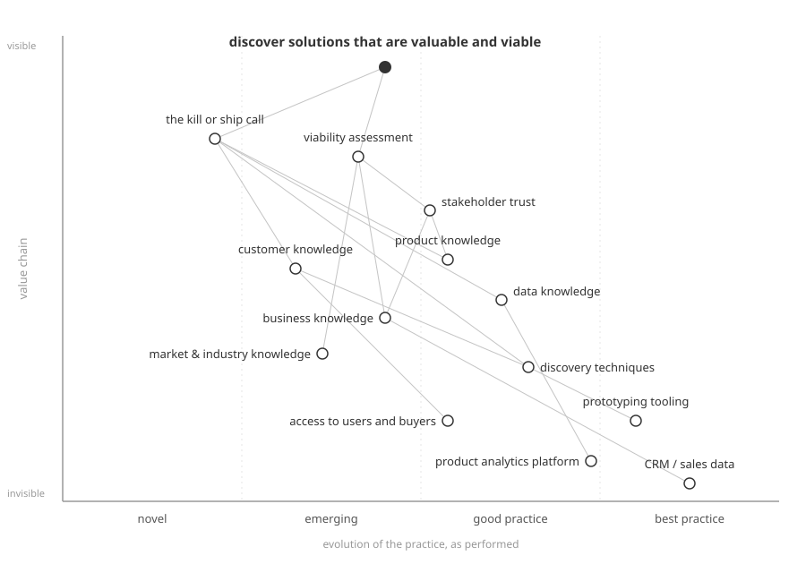
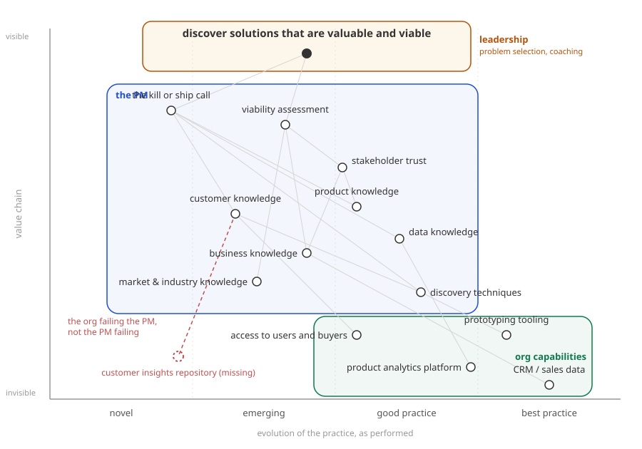
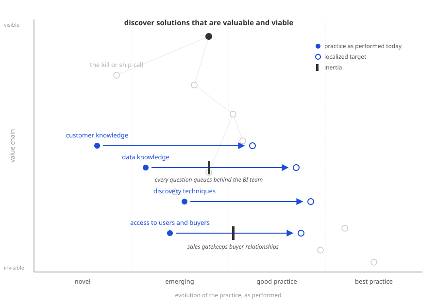
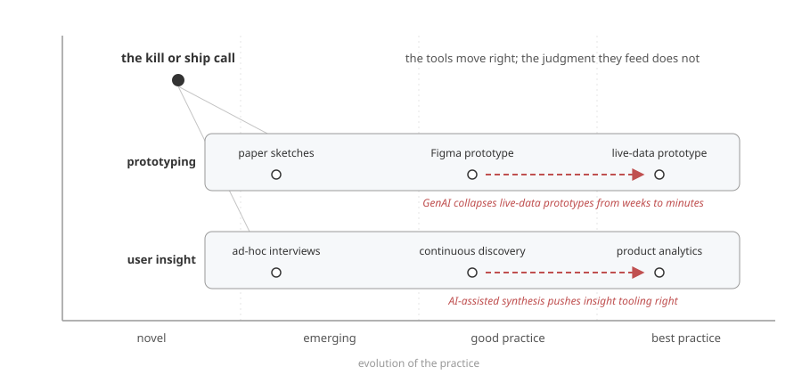

# Mapping Product Sense

> Cagan's coaching assessment rates every PM skill twice on a 1 to 10 scale: how important it is, and where the person stands. Useful, and structurally blind. It cannot show that one skill depends on another, that some gaps belong to the org rather than the person, or that a development plan is movement through a landscape. A Wardley map shows all three, and the price of admission (giving up domain-freeness) turns out to be the point.

## The list and its limits

In [Product, Design and AI](https://www.svpg.com/product-design-and-ai/), Marty Cagan and Bob Baxley inventory what a product manager must bring to an empowered product team: customer knowledge, data knowledge, market and industry knowledge, business knowledge, and product knowledge, the foundation of what they call *product sense*, plus command of the discovery techniques that put that sense to work.

The purpose of all of it is one sentence, theirs: the product manager is responsible for ensuring that the solutions the team discovers are *valuable and viable*.

Cagan also ships the coaching tool that goes with the inventory. [The Assessment](https://www.svpg.com/coaching-tools-the-assessment/) walks a manager through each skill with two ratings: importance to the role (1 to 10) and the person's current capability (1 to 10). Discovery techniques at importance 8, capability 4? There is your gap, coach there. It is honest, lightweight, and widely used, and I am not here to bury it.

I am here to point out what a scored list structurally cannot say, no matter how carefully you score it.

It cannot say that viability assessment *depends on* business knowledge, which depends on stakeholder access, so a gap in the latter silently caps the former, and coaching the top of the chain while the bottom is broken is wasted effort.

It cannot say where you are. The inventory is deliberately domain-free, and that reads as generality, but a development plan is always somewhere: this PM, this org, this market. A list can be domain-free; that is its weakness dressed as generality.

It cannot say who owns a gap. The Assessment scores the individual against the role, full stop. If the company has no product analytics platform and no way to reach buyers without a sales chaperone, the PM's "data knowledge: 3" is not a coaching item, it is an org deficiency wearing the PM's name.

And it cannot show movement. Two numbers per skill give you a static delta; they do not give you a direction of travel, the friction along the way, or what is drifting on its own.

Dependencies, situation, ownership, movement. There is a mapping tradition built on exactly those four, so let us use it.

## The move

Treat Cagan's inventory as a value chain and walk the first four steps of [Wardley Mapping](https://learnwardleymapping.com/): define the user, their needs, the capabilities that meet those needs, and the dependency links between them.

Those four steps have a name of their own. Rich Allen coined [User Needs Mapping](https://teamtopologies.com/key-concepts-content/exploring-team-and-service-boundaries-with-user-needs-mapping) for the Team Topologies community: stop just before the evolution axis and you already have a dependency tree worth arguing about. We will not stop there, but we will borrow their best move later.

The critical decision is the anchor, and the anchor is not the PM.

Anchor the map at the need Cagan himself states: **discover solutions that are valuable and viable**. Everything on the map exists to serve that need, and visibility (the vertical axis) is how directly the need consumes a component.

At the top sit the judgments other people consume directly: the kill or ship call, the viability assessment, the stakeholder's earned trust. When Cagan writes that it is not hard to write PRDs but it *is* hard to discover solutions worth building, these top-of-chain judgments are what he means.

In the middle sits the knowledge those judgments feed on: customer, product, data, business, market and industry.

And at the bottom, largely invisible to the need but load-bearing for everything above, sits infrastructure that is not the PM at all: the analytics platform, the prototyping tooling, the CRM, the very access to users and buyers.

Anchoring at the need instead of the person is what makes the org visible on the map. A map anchored at "the PM" can only ever show the PM.

## The axis

The horizontal axis is where a self-assessment map usually goes wrong, so here is the rule: position is **how evolved the practice is, as performed by this PM in this org**.

Wardley relabels the evolution axis for practices: novel, emerging, good practice, best practice. Ad-hoc customer interviews scheduled when a launch goes sideways are an emerging practice at best; a standing weekly discovery cadence with a shared insight base is best practice. Where does *this person's actual practice* sit today? That is the position.

Two tempting alternatives both break the map. Position-as-personal-proficiency ("she is new, so customer knowledge goes at novel") makes the map lie about the world; interviewing customers is not a novel practice just because you are new to it. Position-as-market-maturity makes the map true about the industry and useless about the person.

Practice-as-performed keeps Wardley's grammar intact and buys the payoff: the gap between where a practice is performed and where it should be performed is literally readable as movement, and movement on a Wardley map is strategy. Here, it is the coaching plan.

One discipline follows: map what is, never aspiration. The ideal is an overlay, and the ideal is localized. Cagan's inventory is context-free, but a target position never is; "good enough data knowledge" means something different at a two-sided marketplace than at a compliance-heavy B2B vendor. The coach's first job is localizing the target before overlaying it.

## The base map

*The base map: Cagan and Baxley's product-sense inventory as a value chain anchored at the discovery need, positioned on the practice-evolution axis.*

Read it top down.

The need consumes two judgments: the kill or ship call and the viability assessment. Both sit far left, and they should; genuine product judgment in a specific context is never a commodity, which is the map restating Cagan and Baxley's whole thesis about the GenAI era in one glance.

The judgments consume knowledge. The kill or ship call feeds on customer, product, and data knowledge and on discovery techniques; viability feeds on business and market knowledge and on stakeholder trust, which is itself built from business and product knowledge, which is why you cannot coach "stakeholder management" as a standalone soft skill. The dependency edges are the argument.

Discovery techniques sit at good practice: codified, teachable, book-shaped (Cagan cites the books himself). And the bottom row (analytics platform, prototyping tooling, CRM, research access) sits right of center because these are products and commodities you buy or stand up, not virtues you coach.

So far this is Cagan's list with dependency edges and honest x-positions. Domain-free, as promised. Now it stops being domain-free.

## Overlay one: ownership

Rich Allen's User Needs Mapping overlays Team Topologies team shapes on a value chain to find team boundaries. Susanne Kaiser's *Adaptive Systems with Wardley Mapping, DDD, and Team Topologies* made that combination canonical for architecture. Repurpose the same move for people development: overlay **ownership boundaries** instead of team shapes.

*Ownership overlay: who owns which part of the value chain. The dashed node is a capability the org never built; the gap sits below the PM's boundary, so it is the company's coaching action, not the PM's.*

Three boundaries. Leadership owns the anchor's context: problem selection, strategy, and the coaching itself (Cagan is explicit that problem discovery mostly lives with product leaders). The PM owns the judgments and the knowledge. The org owns the capabilities at the bottom that the PM's knowledge depends on.

Make it concrete and deliberately mundane: a PM at a B2B expense-management SaaS. Finance managers buy, employees suffer the receipts. The company has a CRM the sales team guards, a decent prototyping stack, and a BI team with a queue. What it does not have is any customer insights repository: every interview this PM has ever run lives in her personal notes, and when she leaves, the customer knowledge component upstream loses its foundation.

On the Assessment, that surfaces (if it surfaces at all) as her low score on customer knowledge. On the map, it is a dashed node below her boundary with a dangling dependency edge: a capability the org never built, sitting outside everything she owns. The map assigns the gap to the party that can close it. That reassignment is, in my experience, the single most valuable thing this exercise produces, and it is precisely the thing Cagan's tool does not distinguish.

## Overlay two: the coaching conversation

Now the instrument earns its name. Coach and coachee map *together*: same base map, and for each component they negotiate two positions, where the practice is performed today and where the localized target sits.

*The coaching overlay: filled circles are practice as performed today, hollow circles the localized target, arrows the development plan, black bars the inertia, each named after its owner.*

Placing yourself on an evolution axis invites vibes, so the positions need evidence anchors, per component, agreed before anyone places a dot. Customer knowledge at good practice means something like: a standing interview cadence, a named map of influencers and approvers per account, findings written where the team reads them. Not "I talk to customers a lot." Rubric levels with evidence anchors are what keep any maturity conversation honest, and a mapping session is a maturity conversation with geometry.

The negotiation is the assessment. When coach and coachee place a dot two columns apart, the argument that follows is worth more than both numbers on the Assessment sheet.

Then the arrows. Our expense-management PM and her coach place customer knowledge at novel (ad-hoc, personal-notes interviews) with a target at good practice. Data knowledge sits at emerging with a target two columns right. Discovery techniques move from "reads the books" to "runs the cadence." The arrows *are* the development plan, and unlike a scored gap, an arrow has a path: what it crosses on the way is what the plan must deal with.

Which is where inertia comes in, Wardley's bar across the path of movement. Her access to buyers runs through sales, who guard the relationships; that bar is not hers to break, it is her manager's negotiation with the sales VP. Her data questions queue behind the BI team; that bar dissolves the day the org buys self-serve analytics, an org-boundary action from overlay one. Every inertia bar gets a name and an owner, and half of them will not be the coachee. Try expressing *that* in two integers per skill.

## Pipelines, and where the golden era actually lands

Cagan and Baxley call this a golden era of product discovery: GenAI tools that produce [live-data prototypes](https://www.svpg.com/product-discovery-with-live-data-prototypes/) in minutes, discovery faster than ever. The map has a construct for exactly this claim, the pipeline: a family of components at different evolutionary stages, sliding right together.

*Two pipelines on the practice axis. GenAI moves components rightward inside both; the judgment that consumes them does not move.*

Prototyping is a pipeline running from paper sketches through Figma prototypes to live-data prototypes, and the GenAI arrow is squarely on that right end: what took an engineering sprint now takes an afternoon. User insight is a pipeline from ad-hoc interviews through continuous discovery to product analytics, with AI-assisted synthesis pushing it right as well.

Now look at where those pipelines sit on the base map: at the bottom, in org-capability territory, far from the anchor. The golden era is a commoditization event *below the visibility line*. The kill or ship call, up at the top left, does not move an inch; it just gets cheaper inputs, faster. Cagan and Baxley say the same in prose: the stronger the product sense, the quicker unworkable ideas are discarded. The map says it in geometry, and adds the warning the prose omits: if your differentiator was down in the pipeline (being the person who could get a prototype built), the tide is taking it. What stays scarce is up the chain.

This is also the map's answer to the "will AI replace product managers" discourse: wrong question. Look at which components are sliding right. None of them are the judgment components, all of them are the judgment's inputs.

## Prior art, and the claim

Mapping people-stuff with Wardley maps is not new, and pretending otherwise would be silly. Ben Mosior [teaches Wardley Mapping](https://learn.hiredthought.com/p/wardley-mapping) and has long encouraged mapping your own context; Henko's [Strategy for Self](https://www.henko.co.uk/post/strategy-for-self-personal-development-using-wardley-maps) maps personal development as a landscape; Mario Platt has [mapped personal maturity](https://medium.com/@marioplatt/on-feeling-whole-wardley-mapping-stoicism-and-maturity-for-personal-development-74d96bbad9a0) through a Stoic lens. On the other flank, PM competency wheels and skill matrices are a cottage industry, and they are all lists: sometimes lists in polar coordinates, but lists, with every structural blindness of the Assessment and less of its pedigree.

What I have not found claimed anywhere is the specific combination: a named author's PM skill inventory, anchored at the discovery need rather than the person, positioned as practice-as-performed on Wardley's practice-evolution labels, with UNM-style ownership overlays separating the individual's gaps from the org's, used as a two-person coaching instrument. Each ingredient has prior art; the dish, as far as I can tell, does not. So that is the claim: not the genre, the combination.

And the honest caveat: a map costs more than a list. The Assessment takes a manager an hour alone; the map takes a working session for two, plus evidence anchors written in advance. That cost is the feature. The list you can fill in about someone; the map you can only draw with them.

## Coda

Cagan and Baxley's article has a second half. Design sense (service design, information architecture, interaction design, visual design, industrial design) is a different inventory with a very different evolution profile; visual design systems have commoditized in a way service design has not even started to, and the GenAI arrows land in different places. The product designer's map is part two.
