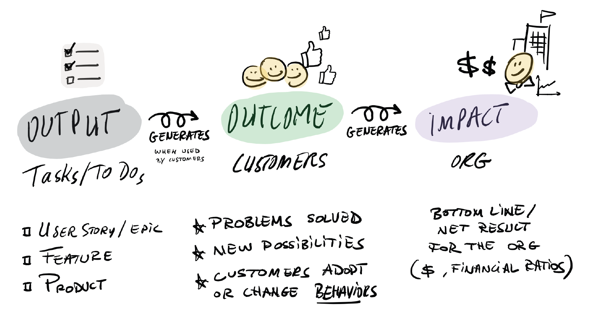

# You're Not an AI Company. Your P&L Would Know.

For five or six years I've used Henrik Kniberg's Crisp visual of output, outcome, impact.

Output is easy to grasp: tasks and to-dos, the user stories, features, products you ship. Output generates outcome when used by customers: problems solved, new possibilities, adopted or changed behaviors. Outcome generates impact: the bottom line, the net result for the org in money and financial ratios.

Now apply it to the AI-native / AI-first / AI-whatever debate. To me the labels are irrelevant. There is one test.

**You are an AI company if your financial performance is 2-5x traditional competition in your line of business.** And if you work at one, you'll know without reading the annual report: your comp and benefits are at least twice what the same role pays at a traditional company.

Tremendous output doesn't qualify you. I practice what I preach here. With AI I have extreme output: I recently built and deployed an online multi-player quiz (including content-creation pipelines), it's deployed and released, has lots of games, quite a few players. Output: check. Outcome: check, customers adopted, behavior changed, people play. Impact: negative. It cost tokens, I pay for analytics, and it cost my opportunity cost. (Making money was never the intent, but that's exactly the point.)

Output is easy. Outcome is hard. Impact is tremendously hard, and AI changes nothing about that hierarchy for traditional companies.

AI can mean building faster, AI in the product, products for AI, driving cost down. All legitimate. But unless it shows up as substantial outperformance against traditional companies, you're not AI-first, AI-native, or AI-anything. You're a company using AI.

Am I working at an AI company? Not yet. You?
