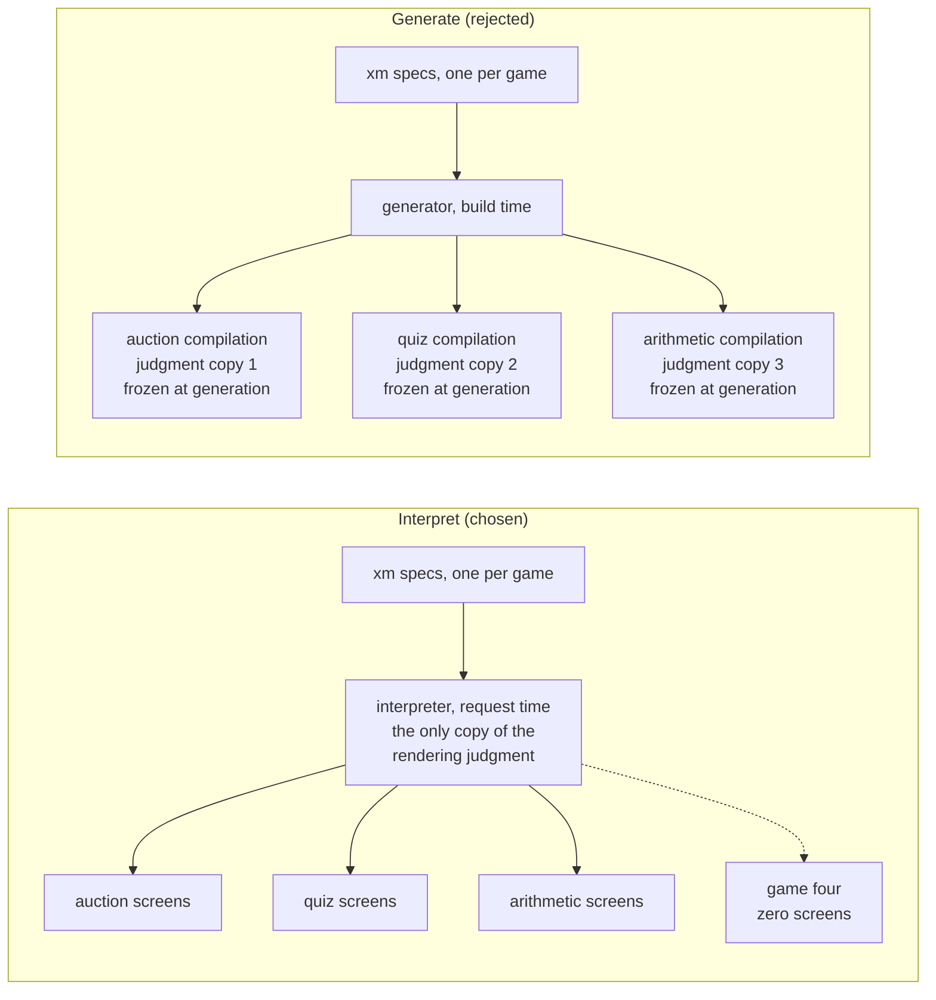

## LinkedIn DM commentary

> 1. Bounded contexts. Fully agree, and it's load-bearing in the workbench: one event-model + experience-model pair per game, no global model anywhere, and the one-way xm→em dependency is effectively the context map. But there's an asymmetry worth naming: the specs are bounded per context, while the transformers are shared across contexts. The mega-model temptation doesn't disappear, it relocates  into the transformer; and there, review-once economics can actually afford it. One rendering judgment serving every game is a  feature precisely because it's not a model.  

Note regarding transformers: the transformer itself can become the weak point, and untolerable to maintain, as you already identified: 
- If the transformer strives for too much generalization or is too abstract, and will become the "mega-model" for everything, with dozens of special cases encoded in it.
- The can be "abstraction leakage" if you are not careful, i.e. handling cases specific to lower level of abstraction ("PSM") in the transformer, just because it's easy and convenient at some point of time.

> 2. MDA. I'll take the mapping: em is CIM-ish, xm is PIM-ish. But I get off the train at th PSM, because part two's whole argument is  that the PSM should never exist. Every persisted intermediate model is an artifact that drifts, needs review, and ages from the  moment of generation; that's the rot MDA died in. Interpretation is the viewpoint hierarchy with the bottom model never materialized:  nothing between spec and screen, so nothing to drift. One caution on inferential transformations between models: an LLM there just  
reintroduces the stochastic transformer one level up (my rung 2, relocated). I want the LLM above the top model, writing specs and  residue against oracles, never between models.  

I'll give another viewpoint, playing the devil's advocate :) If those intermediate/viewpoint models (in this example, the "PIM" and "PSM" models) can be automatically generated, either deterministically (with model transformations) or inferentially (by LLM), or maybe even by combination of those, and validated automatically against your domain logic, is there any drift that must be managed? Also, would those intermediate models be actually even beneficial for traceability and explainability in the case where we have LLM agents in the process?

To me, generation and interpretation are more or less interchangeable means for propagating "intent" between abstraction levels. Of course in practice, which is better, depends on many things (performance being one).

> 3. The ⊑ contract. Conceded, for behavior; and part two runs on exactly it. The rendered HTML is never pinned; a boot-time lint, a  47-test characterization suite, and a closed six kind field vocabulary are the g(spec), and "every choice authorized by the rulebook"  is precisely what the characterization tests do: pin semantic markers, not markup. Where I'll defend ":\==" it was only ever claimed  for the provable stratum, where the transformer contains no LLM and the output has one correct form. There the harness is one  round-trip test, cheap rather than heavy, and creativity is variance, not value. So the real discipline is one contract per stratum:  equality where the transformer is frozen, conformance where it's meant to keep improving. Monoculture in either direction is the  mistake.  

"Monoculture in either direction is the mistake". Exactly. Regarding conformance, it's not only for keeping things improving. It allows us to "not care" how the actual implementation is done, as long as the behavior (e.g., in form of  Input/Output/Preconditions/Effects, or state machine, or BDD) matches the spec.  From a deep dive to formal methods I remember that the "similarity" relation between a spec and its implementation should be as loose as possible, to allow variance and behavioral refinement (evolution) in the long run.

Concretely, treating behavior and implementation through ⊑ contract gives us the opportunity to e.g. use weaker LLMs to generate well-constrained code for those pure functions, or re-generate the functions in every run. In essence, with an appropriate ⊑ contract and means to validate that (some of) the pure functions could be thrown out of the git? (An honest, provocative question here).

> 4. Oracles and shift-left. Full agreement, and I can offer receipts: the xmlang boot lint is your DSL semantic linter; the 115 generated xUnit facts are your tests-from-DSLs; and my favorite, writing the first xm surfaced that views in the event model were named Screen / Auction lobby, surface judgment colonizing the domain's naming layer. Renamed to bare data nouns once the judgment had a legitimate home. That's shift-left firing at design time: a spec defect caught before any implementation existed to be wrong.  

I actually took a look at your `xmlang` implementation. As you can imagine, when the model or the domain rules get a bit more complex (like in ChronosHub I'd imagine), manually maintaining those parsers and linters can become a full-time job. That's one reason why I personally like to use declarative rules and "real" model-based infrastructure for these purposes: you don't get that $n * m$ complexity explosion to manage by hand. It's also a reason for creating those intermediate/viewpoint models and their validators separate. 
  
> Since 2 through 4 are answered at length in part two, the draft is updated ([https://rosenlidholm.se/articles/in-spe/the-screens-left-the-repo](https://rosenlidholm.se/articles/in-spe/the-screens-left-the-repo)); I'd genuinely value your read before it ships.  
> NB. I'm a tad unfair here, because I used your feedback to improve what you hadn't read 😅

That's great :)

# Mermaid Diagrams

# Article commentary

> he doctrine that fell out is one sentence: **the experience model records judgment as data, never as geometry.** Memberships, orderings, tiers, names, and design tokens are in; coordinates, containers, and breakpoints are out.

Yes, this is the way :) And the design tokens and how they should be applied are part of your design system, the "PIM" part of your design system. Individual containers, breakpoints etc. are then part of the "PSM" level of your design system. _OBS: Just associating these things freely here, to be taken with a grain of salt._

> They were written against the hand-written screens _first_, then the interpreter was required to pass them unchanged: the old UI’s behavior became the oracle for its own replacement, and only when parity was green did the screens leave git.

Love this approach. I actually used the exact same approach when I was developing model-driven transformation chains, from the high-level models all the way to the code: create the intermediate and final artifacts first by hand, then abstract away technical details, allow variance, and encode domain knowledge appropriately into the transformations.

> So the workbench got a second spec dialect, [xmlang](https://github.com/MartinRL/xmlang), an experience-model sibling to the event-model dialect with a strictly one-way dependency: every xm element references event-model elements — surfaces compose views and commands, journeys traverse slices — and the event model never references back.

**And the event model never references back**: This is important! The abstraction levels, or viewpoints, must be **pure** in this respect. Otherwise, they get polluted. This is also probably the hardest thing to achieve when modeling systems through multiple viewpoints: how to relate things in the right way. It's also a conceptual design decision that drives your modeling work.

> That was the plan right up until it wasn’t, because presentation has a property the domain strata don’t: **one transformer’s judgment serves every game.** The rendering decisions — how a salience tier becomes disclosure, how a roster becomes a card, where commands sit relative to content — are identical across the auction game, the quiz game, and the arithmetic game, and should be identical across game four. A generator would stamp three frozen copies of that judgment into three compilations, each aging from the moment of generation. An interpreter keeps one copy, executing at request time: improve the transformer once, and every screen of every game improves at the next deploy.

The transformer encodes basically a family of applications, or games, in this case. It also encodes some design decisions, programmatically? If so, we could probably make the transformer a bit lighter by allowing LLM generation instead? And here, we would need the "conformance contract", if LLMs would be used.

> The interpreter closes the square: derivation at read time, on the _shipped_ side. Every screen a player sees is a contextual view over live game state and the spec, computed at the moment of asking. It cannot be stale, cannot drift from the spec, cannot disagree with the event model — for the same reason in every case: it has no independent existence to disagree _from_.

Regarding to my point above (about the "MDA baggage"): would generation actually be a bad thing, if we could always generate a "conformant" implementation based on the specs (models)? Of course, that would generate verification load, but given strong enough (and not stronger) oracles, that would be 100% automated. And there would be zero spec drift, by definition of the conformance contract. _OBS: Being a bit provocative here :)_

Why I'm so fond of generation? Because then we could achieve lighter transformers, as those intermediate models that have been generated would serve as inputs for other transformations (e.g. combining xm model with PIM-level design system model), as well as subjects for intermediate verification steps (shift verifcation left). Having those intermediate models allows also for stricter verification, and use declarative verification rules more easily, achieving loose coupling between the domain models, linters, and transformers.

> A spec dialect that survives being extracted from its birthplace is some evidence it was a notation and not a local convention.

Absolutely! It's evidence of attained loose coupling between a conceptual model and its implementation.

> ttA collapsed because the answers are small and declarative; ttQ collapsed with it, because a spec you can hold in your head is a spec you can cheaply interrogate — 800 lines of YAML currently carry the entire experience layer of three shipped games.

Indeed. And ttA and ttQ can be even more evident when using multi-viewpoint DSLs :)

> **Vocabulary pressure is patient too.** Six field kinds survived three games, but every future game will arrive with a lobbyist for a seventh. The vocabulary only stays closed while additions are plan-level decisions; the day a field kind lands to unblock a feature branch, the interpreter has begun its career as a UI framework, and UI frameworks do not stay at 369 lines.

Exactly. This is what I was discussing in the beginning, about the danger of "mega-models" in the transformers.

> The inner ring compiles. The second ring interprets. Two rings remain, and the rule is still walking.

Great ending :) 

