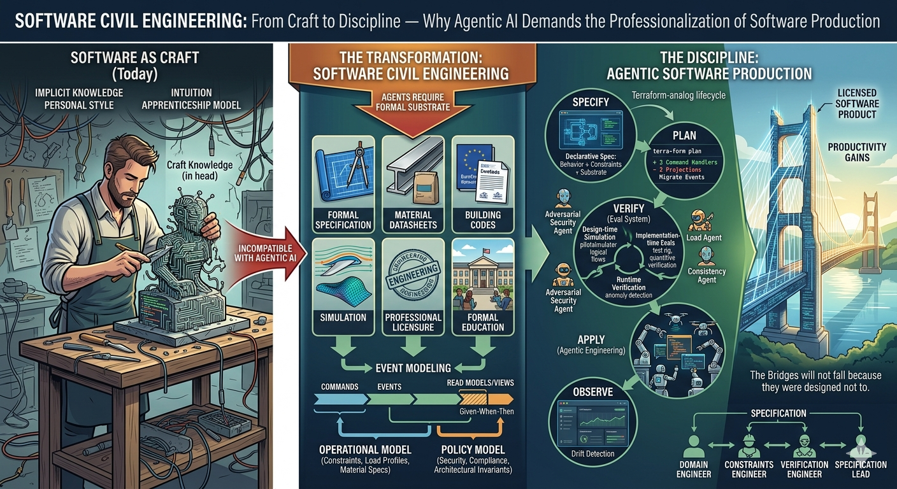

# Software Civil Engineering

## From Craft to Discipline — Why Agentic AI Demands the Professionalization of Software Production

---



---

> **Thesis:** The transition to agentic software engineering is structurally impossible without first transforming software development from a craft tradition into a formal engineering discipline. This transformation mirrors the historical professionalization of civil engineering and requires the same foundational elements: formal specification, material science, simulation, verification, and institutional accountability. Event Modeling, extended with operational and policy constraints and operationalized through a Terraform-analogous lifecycle, provides the viable path.

---

## 1. The Problem: Software as Craft in the Age of Agents

Software development today operates predominantly as a craft tradition. Individual developers carry implicit knowledge, develop personal styles, solve problems through intuition honed by experience, and transfer expertise through apprenticeship models [1]. The Software Craftsmanship movement formalized this identity explicitly — positioning software production as a practice closer to artisanship than engineering, emphasizing mastery, mentorship, and the irreducibility of human judgment [2].

This model has produced remarkable results. Much of the world's best software emerged from the deep intuition of skilled practitioners who understood their domains, their tools, and their users in ways that resist formalization.

But it is incompatible with agentic engineering.

Agentic software engineering — the delegation of implementation tasks to autonomous AI agents [3] — requires a substrate that agents can operate on: specifications that are formal enough to be unambiguous, verification criteria that are objective enough to be machine-evaluable, and architectural constraints that are explicit enough to be enforceable without human judgment. When each developer works as an artisan — with personal conventions, implicit design decisions, and craft knowledge stored in their heads rather than in artifacts — there is nothing stable for an agent to build upon.

The implication is stark: **to unlock the productivity gains of agentic engineering, organizations must first become genuinely good at software engineering** — not in the sense of writing better code, but in the sense of establishing the formalized practices, specifications, and verification mechanisms that characterize mature engineering disciplines.

This is not merely a tooling problem. It is a disciplinary transformation analogous to the one that civil engineering underwent in the 19th century — and examining that parallel reveals both the path forward and the institutional gaps that remain.

## 2. The Civil Engineering Parallel

### 2.1 What defines an engineering discipline?

Civil engineering rests on six foundational pillars that collectively distinguish it from building-as-craft [4, 5]:

1. **Formal specification and verification.** Architects produce detailed blueprints; structural engineers produce load calculations. Both are formal artifacts that can be independently verified before construction begins.

2. **Standardized material datasheets.** Steel has a known tensile strength. Concrete behaves predictably under compression. Engineers do not test every beam; they rely on certified material specifications with known properties.

3. **Building codes and norms.** EuroCode, the International Building Code, national regulations. These represent accumulated collective knowledge formalized as enforceable standards — the profession's institutional memory.

4. **Simulation and modeling.** Tools like Simulink, finite element analysis, and computational fluid dynamics allow engineers to verify designs against physical laws before a single component is manufactured. The design is proven before realization.

5. **Professional licensure and liability.** A licensed civil engineer places their personal signature on calculations. Legal accountability is assigned to named individuals. When a bridge collapses, responsibility is traceable.

6. **Formal education and examination.** Engineering degrees are standardized, accredited, and require demonstrated competence in specific knowledge domains through rigorous examination.

### 2.2 Software development's current position

Mapped against these pillars, software development's disciplinary immaturity becomes visible:

| Pillar | Civil Engineering | Software Development |
|---|---|---|
| Formal specification | Blueprints, structural calculations | Informal user stories, ad-hoc documentation |
| Material datasheets | Certified steel grades, concrete specs | No standardized performance profiles for frameworks, patterns, or infrastructure components |
| Codes and norms | EuroCode, building regulations | Fragmentary — OWASP, SOC2, but no unified engineering standard |
| Simulation | FEA, Simulink, CFD | Almost nonexistent for application logic; limited to infrastructure (load testing) |
| Professional licensure | PE license, personal liability | None — no individual accountability for engineering decisions |
| Formal education | Accredited, standardized, examined | Highly variable; no required competency demonstration |

This is not an argument that software development is *inferior* to civil engineering. It is an observation that software development lacks the institutional and methodological infrastructure that would allow autonomous agents to operate reliably within it. The craft model works for human practitioners because humans can navigate ambiguity, apply tacit knowledge, and exercise judgment in real time. AI agents cannot — they require the formalized substrate that engineering disciplines provide.

## 3. Spec-Driven Development and Event Modeling

### 3.1 The specification problem

The historical failure of formal methods in software — Z-notation, B-method, TLA+ — was not a failure of the concept but of the interface [6]. These approaches required mathematical sophistication that most practitioners lacked and produced specifications that domain experts could not read. The specification language was divorced from both the problem domain and the implementation domain.

Spec-Driven Development (SDD) addresses this by making the specification the primary artifact from which implementation flows. The specification is not documentation *about* the system; it *is* the system definition [7].

### 3.2 Event Modeling as SDD done right

Event Modeling, as developed by Adam Dymitruk, resolves the interface problem that plagued earlier formal methods [8]. It expresses system behavior in a language that domain experts, product owners, and engineers can all read: commands, events, and views arranged on a timeline. Yet it is sufficiently formal to be deterministic and verifiable.

An Event Model specifies:

- **Commands** — what actions the system accepts
- **Events** — what facts the system records (immutable, ordered)
- **Read Models / Views** — how the system presents information derived from events

Each vertical "slice" through the model constitutes a Given-When-Then specification:

- **Given** a set of prior events (system state)
- **When** a command is issued
- **Then** specific events are produced and views are updated

This is the critical property: **each slice is an independently verifiable, deterministic specification of behavior.** An AI agent implementing a slice does not need to "understand" the business logic — it needs to produce code that satisfies the Given-When-Then contract. Just as a construction worker does not need to understand why a load-bearing wall is positioned where it is — only that the blueprint says it must be there.

### 3.3 What Event Modeling provides — and what it lacks

Event Modeling solves the *behavioral specification* problem. It provides the software equivalent of an architectural blueprint — a complete, readable, verifiable description of what the system does.

But civil engineering blueprints are not the only specification artifact. They are supplemented by structural calculations, material specifications, and building code compliance documentation. Event Modeling, in isolation, specifies behavior but says nothing about:

- **Performance characteristics** — latency, throughput, scalability under load
- **Operational requirements** — resilience, failover, resource budgets
- **Security and compliance invariants** — encryption, access control, audit requirements
- **Technical substrate properties** — how specific technology choices affect system behavior at scale

These gaps must be filled for the engineering analogy to hold.

## 4. The Terraform Paradigm: Declarative Product Engineering

### 4.1 Why Terraform, not Simulink

The initial instinct is to look for software's equivalent of Simulink — a simulation engine for application behavior. But the better analogy is Terraform [9], because what we actually need is not physics-based simulation of dynamic systems but rather:

**Declarative specification → Plan → Verification → Apply → Drift Detection**

Terraform does not say "execute these 47 API calls in this order." It says: "this is the desired state; the engine determines the path." And critically, `terraform plan` shows exactly what will change before it happens — a state transition preview, not a physics simulation.

### 4.2 Lifting the abstraction level

Terraform operates at the infrastructure level: "I want 3 VMs with these network rules." This is declarative but still *technical* — it specifies resources, not behavior.

Lifting the abstraction to the product level produces something fundamentally different:

> "I want a system where a publisher can submit an article, a compliance check verifies funder mandates automatically, and a dashboard shows status in real time — with max 200ms latency, SOC2-compliant, scalable to 50,000 active publications."

This single declaration spans behavior, constraints, and operational requirements. The "engine" — whether AI agents, human developers, or a hybrid — takes this declaration and *realizes* it.

This is not Terraform for infrastructure. It is not Terraform for applications. It is **Terraform for software products.** The specification lives at the product level, not the technical level.

### 4.3 The three components Terraform has that we lack

Terraform works because it possesses three capabilities that application-level software production currently lacks:

**1. A complete state representation.**
Terraform knows exactly what exists right now (the state file). Event Modeling describes desired behavior but has no formalized representation of *current system state* to diff against. You cannot run `event-model plan` and see: "to go from the current system to this specification, we need to add 3 command handlers, modify 2 projections, and migrate events in stream X."

**2. A provider model — the abstraction of the technical substrate.**
Terraform knows that an AWS EC2 instance has specific properties, costs, constraints, and lead times. This is the *material datasheet.* In software terms: the agent implementing a slice needs to know that "a projection against PostgreSQL with this data volume has approximately this latency characteristic" or that "a Marten event store with this stream granularity has these throughput properties."

**3. Constraints as first-class objects.**
In Terraform, you can write `prevent_destroy = true` or enforce policies via Sentinel/OPA. Constraints live *within* the specification, not alongside it.

### 4.4 The unified specification model

Combining these elements produces a unified model:

```
Specification {
    EventModel      → behavior (commands, events, views)
    Providers       → technical substrate with known properties
    Constraints     → NFRs, policies, budgets
}

Plan     = diff(CurrentState, Specification)
Verify   = evaluate(Plan, against: Constraints)
Apply    = agents.implement(Plan)
Observe  = drift_detection(Production, Specification)
```

This lifecycle — **Specify → Plan → Verify → Apply → Observe** — is the operational core of Software Civil Engineering. Each phase has a clear analog in civil engineering:

| Phase | Software Civil Engineering | Civil Engineering Analog |
|---|---|---|
| Specify | Event Model + Providers + Constraints | Architectural blueprints + structural calculations + building codes |
| Plan | Diff current state against specification | Bill of materials, construction schedule |
| Verify | Evaluate plan against constraints (simulation) | Structural analysis, code compliance review |
| Apply | AI agents implement verified plan | Construction by licensed contractors |
| Observe | Drift detection in production | Building inspection, ongoing structural monitoring |

## 5. The Three Specification Layers

The unified specification requires three distinct but integrated layers, each addressing a different class of engineering concern.

### 5.1 The Event Model — behavioral specification

This is the core: what the system *does*. Commands it accepts, events it records, views it presents. Each slice is a Given-When-Then contract that is independently implementable and verifiable.

**Verification method:** Scenario simulation at design time; automated acceptance tests derived from Given-When-Then specifications at implementation time; event stream validation against the model at runtime.

**Civil engineering analog:** Architectural blueprints — the functional design of the structure.

### 5.2 The Operational Model — substrate specification

This layer describes the system's operational characteristics and the known properties of its technical substrate. It includes:

- **Load profiles** — normal and peak usage scenarios with quantified expectations
- **Failure modes** — what happens when components degrade or fail
- **Resource budgets** — memory, CPU, network, and storage constraints per component
- **Provider characteristics** — known performance profiles of the specific technology stack (database latency characteristics, message broker throughput, framework overhead)

**Verification method:** Load simulation before implementation; performance testing against budgets during implementation; anomaly detection against load profiles at runtime.

**Civil engineering analog:** Structural calculations and material datasheets — the physical properties that determine whether the design is feasible.

### 5.3 The Policy Model — invariant specification

This layer captures constraints that must hold everywhere, always, regardless of specific behavior or operational context:

- Security policies (encryption at rest, authentication requirements, access control rules)
- Compliance requirements (audit trail retention, data residency, regulatory mandates)
- Architectural invariants (no synchronous cross-boundary calls, all state changes via events, no direct database access from UI layer)

**Verification method:** Static analysis and automated policy enforcement at implementation time; adversarial testing (security scanning, penetration testing) at verification time; continuous compliance monitoring at runtime.

**Civil engineering analog:** Building codes and regulations — the non-negotiable constraints that override design preferences.

## 6. The Eval System: Software's Simulation Engine

### 6.1 Three verification loops

The Simulink analog for software is not a single tool but a system of three eval loops that operate at different phases:

**Loop 1 — Design-time simulation.**
Before any code is written (by human or agent), the Event Model is run through scenarios. "What happens if a publisher submits 10,000 articles simultaneously? What happens if a funder changes its open-access mandate mid-publication?" The flow is simulated through the event timeline to find logical errors, missing events, and inconsistent states. This is the Simulink equivalent — proving the design before realization.

**Loop 2 — Implementation-time evals.**
When an AI agent implements a slice, the generated code is executed against an eval set *derived automatically from the Event Model.* Each Given-When-Then scenario becomes an automated acceptance test. The agent "passes" only if the code satisfies the specification — not vaguely, but deterministically. Operational Model constraints add quantitative verification: the implementation must also meet latency budgets, resource limits, and resilience requirements. Policy Model constraints add invariant checks: security scanning, compliance verification, architectural conformance.

**Loop 3 — Runtime verification.**
In production, actual events are validated against the expected model. Anomaly detection identifies patterns that should never occur according to the specification. Event sourcing provides a massive advantage here — the complete, immutable event log is the ultimate audit trail and verification corpus. Drift detection — the `terraform plan` equivalent — continuously compares production behavior against the specification and flags divergence.

### 6.2 Adversarial verification

A critical extension of the eval system: rather than a single agent that builds and self-verifies, the model calls for *adversarial* AI verification — separate agents that attempt to break implementations:

- A **security agent** that probes for vulnerabilities against the Policy Model
- A **load agent** that stress-tests against the Operational Model
- A **consistency agent** that verifies behavioral correctness against the Event Model

This mirrors civil engineering practice where the structural engineer who verifies a design is independent of the architect who created it. Trust is placed in the verification system, not in the implementer's self-assessment.

## 7. The Dissolution of the Business-Technical Divide

### 7.1 Specification as strategy

A profound implication of this model: if the specification encompasses behavior (what the product does), operational characteristics (how it performs), and policy constraints (what rules it obeys), then **the specification is the product strategy expressed in formal terms.**

The historical separation between "the business side" and "the tech side" — which has generated decades of alignment problems, translation losses, and organizational friction — is not solved by better communication practices or agile ceremonies. It is dissolved by creating a **shared formal language** where product strategy and technical specification are expressed in the same model.

The product leader who defines "publishers need real-time compliance checking with sub-second response times" is simultaneously writing behavioral specification (Event Model), performance requirements (Operational Model), and compliance constraints (Policy Model). There is no translation step. The specification *is* the strategy.

### 7.2 Specification ownership as leadership function

This has organizational implications. If specification ownership determines product direction, technical feasibility, and operational characteristics simultaneously, then it is not an architecture function — it is a **leadership function.**

An architect operates within given constraints: they receive a problem and design the optimal technical solution. A leader defines the constraints: they determine which problems to solve, with what properties, and in what order.

The person or team that controls the specification controls the product. This is a strategic leadership responsibility, not a technical delegation. It requires the ability to:

- Facilitate Event Modeling to extract and formalize business behavior
- Define provider characteristics with sufficient technical understanding
- Express constraints formally with engineering judgment
- Prioritize and sequence slices with product strategic awareness

### 7.3 Scaling specification through governance

If specification ownership is a leadership function, it does not scale by hiring more architects. It scales by formalizing the specification format sufficiently that leadership can delegate *parts* of the specification work without losing coherence.

This requires a governance mechanism analogous to infrastructure-as-code change management: pull requests on the specification, not on the code. Domain teams may propose new slices in the Event Model, but constraint definitions and provider selections may require leadership validation. The specification becomes a governed artifact with access controls, review processes, and audit trails — just as building permits require review and approval before construction begins.

## 8. Implications for Roles and Organizations

### 8.1 What becomes more valuable

In a Software Civil Engineering organization, the most valuable human capabilities shift dramatically:

- **Specification skills** — the ability to extract, formalize, and verify behavioral requirements through Event Modeling becomes the core professional competency
- **Constraint engineering** — defining non-functional requirements with sufficient formality for machine verification becomes a specialized discipline
- **Provider knowledge** — understanding the properties and limitations of technical substrates (databases, frameworks, infrastructure) becomes a form of materials science
- **Verification design** — constructing eval systems that reliably catch specification violations becomes the quality function

### 8.2 What becomes less valuable

- **Individual coding virtuosity** — the ability to write elegant, performant code is subsumed by AI agents operating against formal specifications. This is a *feature*, not a loss: the quality that matters shifts from implementation craft to specification precision.
- **Implicit technical knowledge** — the senior developer who "just knows" that a certain pattern will cause problems is replaced by externalized constraint libraries and adversarial verification agents. The knowledge is preserved; the medium changes from human memory to formal artifact.

### 8.3 New role archetypes

The traditional developer/architect/tech lead taxonomy gives way to roles organized around the specification lifecycle:

- **Domain Engineers** — facilitate Event Modeling, extract behavioral specifications from stakeholders, maintain the Event Model. Evolution of business analyst + domain architect.
- **Constraints Engineers** — define operational and policy constraints, maintain provider profiles, design eval criteria. Evolution of performance engineer + security engineer + platform architect.
- **Verification Engineers** — build and maintain the eval system, design adversarial testing strategies, monitor production drift. Evolution of QA + SRE + compliance.
- **Specification Leads** — own the unified specification for a product area, govern changes, ensure coherence across behavioral, operational, and policy layers. A leadership function, not an architecture role.

## 9. Why AI Is the Catalyst, Not Catastrophe

### 9.1 The positive professionalization thesis

Civil engineering professionalized *reactively* — bridges collapsed, buildings failed, people died, regulations followed [10]. It took decades and required political will.

Software Civil Engineering has a different catalyst: **economic opportunity, not catastrophe.**

Organizations that can formalize their specifications sufficiently for AI agents to operate on them will produce software at a rate that is an order of magnitude greater than those that cannot. This competitive pressure is operating *now*. Professionalization is driven not by regulatory mandate or public disaster, but by the productivity differential between organizations that can leverage agentic engineering and those that cannot.

### 9.2 The individual organization path

This also means professionalization need not be industry-wide to begin. Individual organizations can adopt Software Civil Engineering principles without waiting for industry standards, licensing requirements, or academic consensus. First movers gain compounding advantages: each formalized specification makes the next one easier, each eval system makes agent-produced code more reliable, and each successful agent-implemented slice builds organizational confidence and capability.

The transformation is self-reinforcing: formalization enables agents, agents validate the value of formalization, and the productivity gains justify further investment in specification quality.

## 10. Open Gaps and Institutional Debt

Intellectual honesty requires acknowledging what this model does *not* address. These gaps represent significant institutional debt that the software industry has not yet begun to repay:

### 10.1 Professional licensure and liability

Civil engineering assigns personal legal liability to named engineers. Software has no equivalent. When an AI agent produces code that causes harm — data loss, security breach, financial damage — who bears responsibility? The specification author? The AI provider? The organization? Without a liability framework, Software Civil Engineering lacks the accountability mechanism that forces rigor in other engineering disciplines.

**Consequence if unresolved:** Organizations may adopt formal specification practices for productivity reasons but lack the external forcing function that prevents corners from being cut. Quality becomes optional rather than legally mandated.

### 10.2 Formal education and credentialing

Civil engineers undergo standardized, accredited education with examined competency requirements. Software engineering education is fragmented, inconsistent, and often disconnected from professional practice. If specification skills become the core competency, there is no established pathway for developing and certifying them.

**Consequence if unresolved:** Specification quality will vary wildly between organizations and individuals, with no reliable signal of competence. Hiring and team formation become guesswork.

### 10.3 Industry-wide standards and norm-setting bodies

Building codes are maintained by institutions (ISO, national standards bodies, professional associations) that aggregate knowledge across the entire profession. Software has OWASP, NIST, and various compliance frameworks, but nothing approaching a unified engineering standard for specification, verification, or professional practice.

**Consequence if unresolved:** Each organization reinvents the specification format, the constraint taxonomy, and the verification criteria. Knowledge does not accumulate at the industry level, and best practices remain siloed.

### 10.4 The emergent complexity boundary

There exists a class of technical decisions that are genuinely emergent — they arise from the interaction between domain behavior, technical substrate, and specific operational context in ways that resist formalization. "This event stream structure will create a hot partition given *our specific* usage pattern" requires understanding of all three layers simultaneously in a context-dependent way. Whether this can be fully formalized or whether it represents a permanent boundary for the model remains an open question.

**Consequence if unresolved:** Some engineering decisions may permanently require human judgment, limiting the degree of agent autonomy achievable. This is not necessarily a failure — civil engineering also requires experienced engineers for novel structures — but it bounds the model's applicability.

## 11. Conclusion: The Disciplinary Moment

Software development stands at a disciplinary inflection point comparable to civil engineering's professionalization in the 19th century. The catalyst is different — economic opportunity through AI rather than public safety through regulation — but the structural requirements are identical: formal specification, verifiable design, standardized material knowledge, simulation capability, and accountable governance.

Event Modeling, extended with Operational and Policy constraint layers and operationalized through a Terraform-analogous lifecycle (Specify → Plan → Verify → Apply → Observe), provides a viable architectural foundation for this transformation. The specification becomes the product — not documentation about the product, but the formal, verifiable, machine-executable definition of what the product is, how it must perform, and what rules it must obey.

The implications are sweeping. Individual implementation skill yields to specification precision as the primary value driver. The historical separation between business strategy and technical specification dissolves into a unified formal model. Technical leadership transforms from architecture oversight into specification governance. And AI agents become not replacements for developers but the *execution engine* of a properly specified engineering process — analogous to the construction crew that builds from verified blueprints, not the artisan who works from intuition.

The organizations that make this transition will not merely be more productive. They will be operating in a fundamentally different paradigm — one where software quality is determined upstream, at the specification level, rather than downstream, at the implementation level. Like civil engineering before it, the discipline will be defined not by the skill of its builders but by the rigor of its specifications.

The bridges will not fall because they were designed not to.

---

## References

[1] S. Mancuso, *The Software Craftsman: Professionalism, Pragmatism, Pride*, Prentice Hall, 2014. Articulates the craft model as a deliberate professional identity for software development.

[2] R.C. Martin, "Manifesto for Software Craftsmanship," 2009. Formalizes the craft values of the software development community as a complement to the Agile Manifesto.

[3] A. Karpathy, "Software in the era of AI," 2025. Describes the shift toward agentic software engineering where AI agents perform implementation tasks autonomously.

[4] H. Petroski, *To Engineer Is Human: The Role of Failure in Successful Design*, Vintage, 1992. Traces the evolution of engineering disciplines through their responses to failure.

[5] E.T. Layton Jr., *The Revolt of the Engineers: Social Responsibility and the American Engineering Profession*, Johns Hopkins University Press, 1986. Examines the professionalization of engineering as a social and institutional process.

[6] J. Woodcock, P.G. Larsen, J. Bicarregui, J. Fitzgerald, "Formal methods: Practice and experience," *ACM Computing Surveys*, vol. 41, no. 4, 2009. Reviews the adoption challenges of formal methods in industrial software development.

[7] Spec-Driven Development as a methodology emphasizes specification as the primary development artifact from which implementation derives. Various formulations exist across API-first development, contract-first design, and formal specification approaches.

[8] A. Dymitruk, "Event Modeling," eventmodeling.org, 2019-present. Defines the Event Modeling methodology for specifying information systems through commands, events, and views on a timeline.

[9] HashiCorp, "Terraform: Infrastructure as Code," terraform.io. Declarative infrastructure provisioning using the Specify → Plan → Apply → Observe lifecycle.

[10] H. Petroski, *Design Paradigms: Case Histories of Error and Judgment in Engineering*, Cambridge University Press, 1994. Documents how engineering failures have driven professionalization and the development of formal standards.
