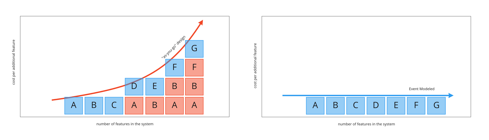

# Event Modeling

 🟦 🟧 🟩 🪟 ⚙️ 

<!-- todo: bg img -->
---
# Why Event Modeling?

## 📐 The Missing Blueprint in Enterprise Software

**🤯 The Problem:** Most organizations lack a shared understanding. Each team develops its own vocabulary and scattered documentation, leading to siloed contexts and "lossy handovers".

**🧘 The Solution:** Adopt a ubiquitous language grounded in the business domain (not implementation technology). Create event model blueprints in workshops, capturing the business processes visually on a timeline that all stakeholders can understand.

**🎯 Key Takeaway:** Without solving the language and shared understanding problem first, no amount of new tools or technology will fix information system value creation.

---
# Why Event Modeling?

         

## Keeping the Veocity as Features are Added

---
# What is Event Modeling?
- Five elements
- Four patterns
- Two tests

👆🏻 … that can model ANY information system!

- A workshop format

---
# The Five Elements of Event Modeling

- 🟦 **Command** (blue sticky notes) - instructions to update the state of the system
- 🟧 **Event** (orange sticky notes) - fact about a state change in the system
- 🟩 **Read Model** (green sticky notes) - query/projection of stored facts (i.e. events)
- 🪟 **Screen** (yellow sticky notes) - GUI
- ⚙️ **Processor** (gear symbol) - unattended automation or translation

There are three dimensions of time; future (command), present (read model), past (event).

---
# The Four Patterns of Event Modeling

- 🟧 **State Change** - commands being accepted yielding events
- 🪟 **State View** - query information from stored events
- ⚙️ **Automation** - processe triggered automatically, e.g. by event or schedule
- ⚙️ **Translation** - ingesting and translating external events

---
# The Two Tests of Event Modeling

- 📝 **Given/When/Then (GWT)** - Business rules for State Changes
- 📋 **Given/Then (GT)** - Projection rules for State Views
 
✅ **Information Completeness Check** - all data has a command source, is persisted, otherwise it can't be viewed

---
# The Workshop Format of Event Modeling

1. 🧠 **Brain Storm**: Envision the system; identify all state-changing events
2. 📖 **The Plot**: Arrange events chronologically on a timeline
3. 🖼️ **Story Board**: Add wireframes; trace every field's origin and destination
4. 🟦 **Identify Inputs**: Attach commands showing user intent to change state
5. 🟩 **Identify Outputs**: Add views showing how event data flows back to UI
6. 🏢 **Conway's Law**: Organize into swimlanes by team/domain ownership
7. 📝 **Elaborate Scenarios**: Write GWT/GT specifications per slice

---
# What is Event Modeling NOT?
- An Architecure
  - … but the community is heavily biased towards VSA (Vertical Slice Architecture)
- Event Sourcing
  - … but the two goes hand in hand, and the community is ES heavy
- Event Streaming
  - … is rather records, than business events, carrying information from A to B
- Functional Programming
  - … but the community is moving away from DDD «Aggregate» to «Decider»
- A Tool or Framework
  - … but tools and frameworks exist

---
# AI? 🤖

> Event Models are candy for the AI.

— Martin Dilger

- **Minimal Context**: Each slice fits the LLM context window
- **Formulaic Patterns**: Command→Event→View scaffolding is repeatable
- **Built-in Verification**: GWT/GT scenarios are executable specs AI can test against
- **Traceable Completeness**: "Information complete" ensures nothing is missing

<!--  Sources

 - https://www.linkedin.com/posts/eventmodeling_ai-eventmodeling-mvp-activi 
 ty-7098705726755282944-O7Lt
 - https://www.infoq.com/news/2020/09/adameventmodeling/
 - https://semaphore.io/blog/adam-dymitruk-event-modeling
 - https://www.qlerify.com/ai-generated-code
 - https://www.thoughtworks.com/en-us/insights/blog/agile-engineering-pract 
 ices/spec-driven-development-unpacking-2025-new-engineering-practices      
 - https://bmsdd.com/ -->

---
# Learning

- [Event Modeling: What is it? (the OG) by Adam Dymitruk](https://eventmodeling.org/posts/what-is-event-modeling/)
- [The Big Book by Martin Dilger](https://leanpub.com/eventmodeling-and-eventsourcing)
- [The Small (free) Book by Martin Dilger]()
- [Event Sourcing & Event Modeling @ Udemy](https://www.udemy.com/course/event-sourcing-event-modeling-getting-started/)
- [Practical Event Modeling (free) @ Confluent](https://developer.confluent.io/courses/event-modeling/intro/)
- [The Event Modeling podcast w/ Adam & Martin](https://podcast.eventmodeling.org/)
- [Discussions @ Discord](https://newsletter.nebulit.de/)

<!-- todo: bg img -->

---
# Tooling

- [Axoniq](https://www.axoniq.io/concepts/event-modeling)
- [Miro Event Modeling Toolkit](https://www.eventmodelers.de/docs/event-modeling/)
- [Qlerify](https://www.qlerify.com/)
- [On Auto](https://on.auto/) w/ the consultancy [xolvio](https://xolv.io/)
- [BMSDD (Business Modelling Spec Driven Development) Framework](https://bmsdd.com/)
- …

---
# Extras

---
# VSA (Vertical Slice Architecture)

The term “Vertical Slice Architecture” was mainly coined by Jimmy Bogard in a series of articles around 2019. The main statement is: 
> Minimize coupling between slices, and maximize coupling within a slice.

The leading Principle here is the well-known “Open-Closed-Principle” (OCP) first defined by Bertrand Meyer in 1988. The Open-Closed-Principle basically states, that 
> Any part of the system should be open for extension, but closed for modification. 
When we extend the system, we typically do not modify existing code if possible.

<!-- todo: jimmy's og img as bg -->

---
# «Decider»

---
# Event Modeling Traditional Systems

---
# The BMSDD Process from Spec. to Impl.

---
# Functional Core, Imperative Shell