# Event Modeling

 🟦 🟧 🟩 🪟 ⚙️ 

<!-- todo: bg img -->
---
# Why Event Modeling?

## 📐 The Missing Blueprint in Enterprise Software

**🤯 The Problem:** Most organizations lack a shared understanding. Each team develops its own vocabulary and scattered documentation, leading to siloed contexts and "lossy handovers".

**🧘 The Solution:** Adopt a ubiquitous language grounded in the business domain (not implementation technology). Create event model blueprints in workshops, capturing the business processes visually on a timeline that all stakeholders can understand.

**🎯 Key Takeaway:** Without solving the language and shared understanding problem first, no amount of new tools or technology will fix information system value creation.

<!-- "the translation tax" cf. https://bmsdd.com/ -->

---
# Why 
# Event 
# Modeling?
## The 
## Translation
## Tax
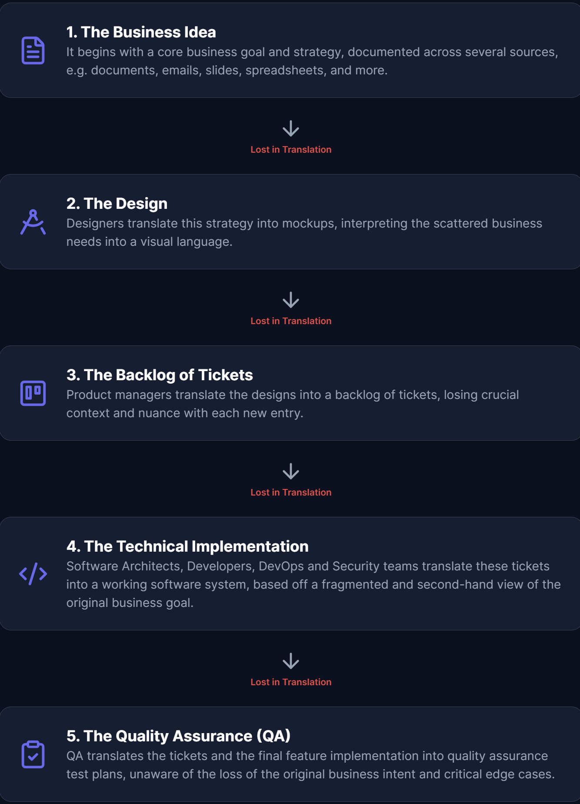

---
# Why Event Modeling?

         

## Keeping the Velocity as Features are Added

---
# What is Event Modeling?
- Five elements
- Four patterns
- Two tests

👆🏻 … that can model ANY information system!

- A workshop/process

---
# The Five Elements of Event Modeling

- 🟦 **Command** (blue sticky notes) - instructions to update the state of the system
- 🟧 **Event** (orange sticky notes) - fact about a state change in the system
- 🟩 **Read Model** (green sticky notes) - query/projection of stored facts (i.e. events)
- 🪟 **Screen** (e.g. wireframe) - GUI
- ⚙️ **Processor** (gear symbol) - unattended automation or translation

There are three dimensions of time; future (command), present (read model), past (event).

---
# The Four Patterns of Event Modeling

- 🟧 **State Change** - commands being accepted yielding events
- 🪟 **State View** - query information from stored events
- ⚙️ **Automation** - process triggered automatically, e.g. by event or schedule
- ⚙️ **Translation** - ingesting and translating external events

---
# The Two Tests of Event Modeling

- 📝 **Given/When/Then (GWT)** - Business rules for State Changes
- 📋 **Given/Then (GT)** - Projection rules for State Views
## ➕ a Huge Bonus
✅ **Information Completeness Check** - all data has a command source, is persisted, otherwise it can't be viewed

---

# The Workshop/Process of Event Modeling

1. 🟧 **Identify Events**: Find businesswise meaningful state changes, i.e. events
2. 📖 **Create Timeline**: Arrange events chronologically into a story
3. 🖼️ **Storyboarding**: Add user swimlanes at top with wireframes
4. 🟦 **Identify Commands**: Map inputs/buttons to system commands
5. 🟩 **Identify Read-models/State**: Define what users/automations need to make decisions
6. 📦 **Group Components**: Organize events into component swimlanes
7. 🍕 **Identify Slice Patterns**: Recognize State Change, State View, Automation, Translation
8. 📝 **Define BDD Examples**: For each slice, define GWT/GT acceptance criteria

 

---

# Step 1: Identify Events
## Find businesswise meaningful state changes, i.e. events
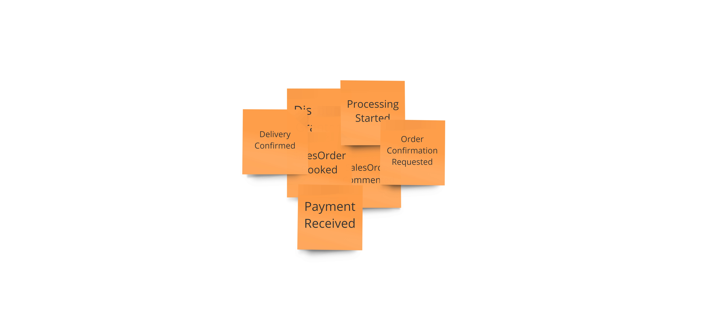

---
# Step 2: Create Timeline

       

## Arrange events chronologically into a story
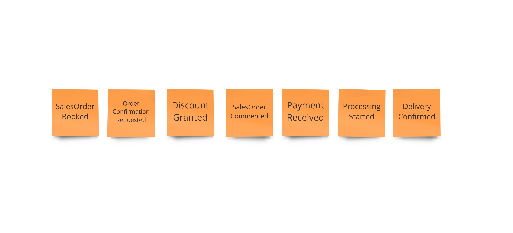

---

# Step 3: Storyboarding

          

## Add user swimlanes at top with wireframes
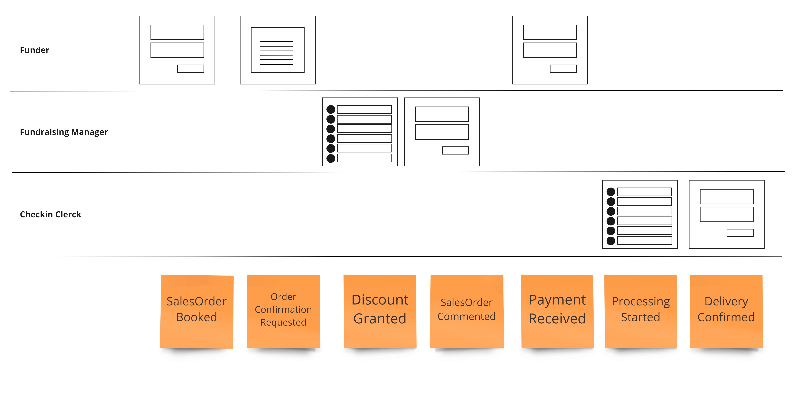

---

# Step 4: Identify Commands

          

## Map inputs/buttons to system commands
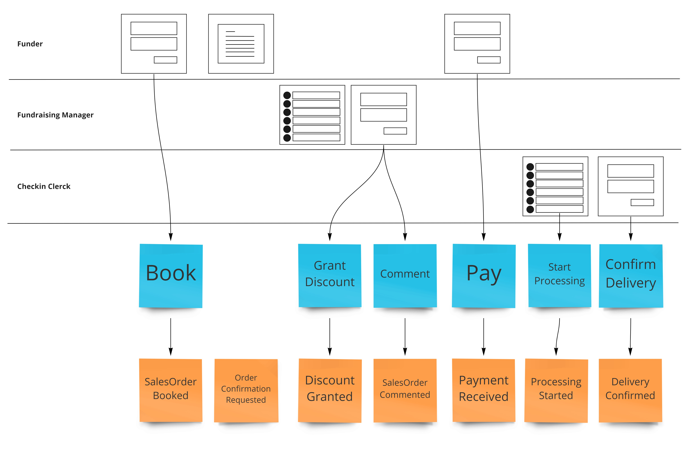

---

# Step 5: Identify Read-models/State

          

## Define what users/automations need to make decisions
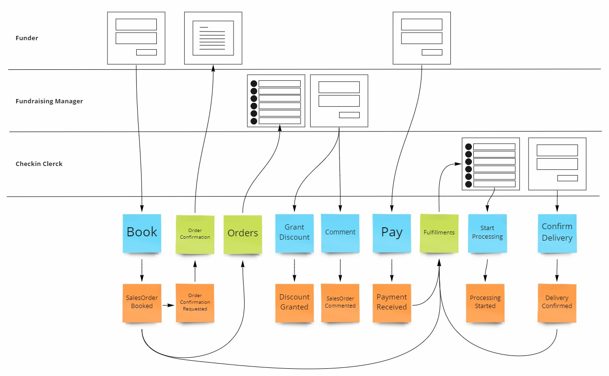

---

# Step 6: Group Components

        

## Organize events into component swimlanes

Avoid grouping by noun (a very common mistake); group by autonomy and have as little dependencies between the components as possible.

---
# Step 7: Identify Slice Patterns

<table style="width: 100%; margin-top: 1rem;">
<tr>
  <th style="text-align: center; width: 25%;">State Change</th>
  <th style="text-align: center; width: 25%;">State View</th>
  <th style="text-align: center; width: 25%;">Automation</th>
  <th style="text-align: center; width: 25%;">Translation</th>
</tr>
<tr>
  <td style="text-align: center; width: 25%;">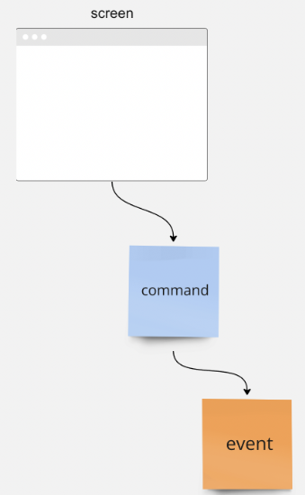</td>
  <td style="text-align: center; width: 25%;">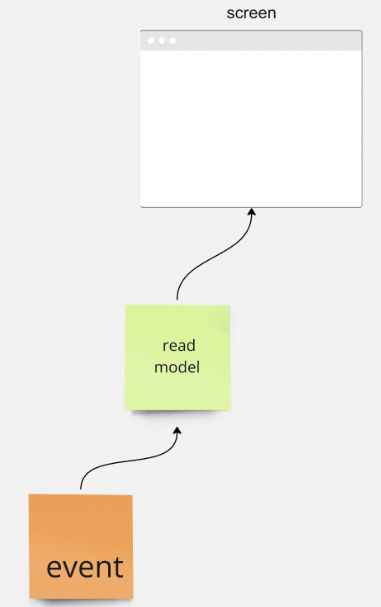</td>
  <td style="text-align: center; width: 25%;">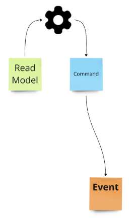</td>
  <td style="text-align: center; width: 25%;">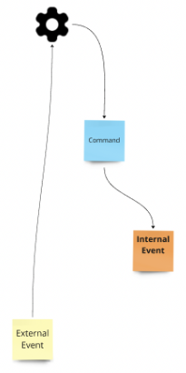</td>
</tr>
</table>

---

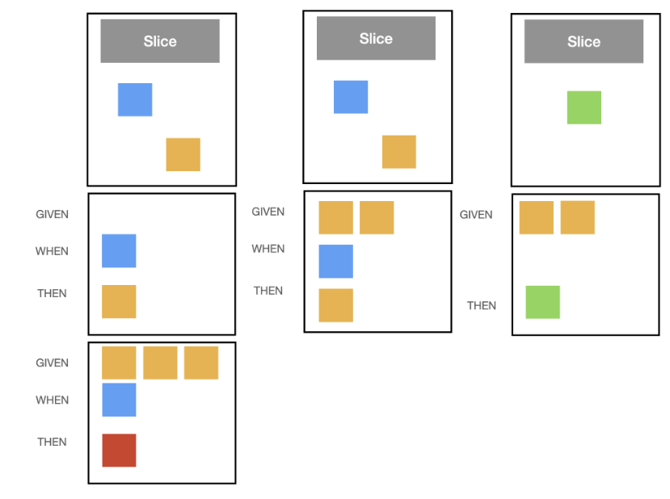

           

# Step 8: Define BDD Examples
## For each slice, define GWT/GT acceptance criteria

---
# What is Event Modeling NOT? ❌
- An Architecure
  - … but the community is heavily biased towards VSA (Vertical Slice Architecture)
- Event Sourcing
  - … but the two goes hand in hand, and the community is ES heavy
- Event Streaming
  - … is rather records, than business events, carrying information from A to B
- Functional Programming
  - … but the community is moving away from DDD «Aggregate» to «Decider»
- A Tool or Framework
  - … but tools and frameworks exist

---
# AI? 🤖

> Event Models are candy for the AI.

— Martin Dilger

 

- **Minimal Context**: Each slice fits the LLM context window
- **Formulaic Patterns**: Command→Event→View scaffolding is repeatable
- **Built-in Verification**: GWT/GT scenarios are executable specs AI can test against
- **Traceable Completeness**: "Information complete" ensures nothing is missing

<!--  Sources

 - https://www.linkedin.com/posts/eventmodeling_ai-eventmodeling-mvp-activi 
 ty-7098705726755282944-O7Lt
 - https://www.infoq.com/news/2020/09/adameventmodeling/
 - https://semaphore.io/blog/adam-dymitruk-event-modeling
 - https://www.qlerify.com/ai-generated-code
 - https://www.thoughtworks.com/en-us/insights/blog/agile-engineering-pract 
 ices/spec-driven-development-unpacking-2025-new-engineering-practices      
 - https://bmsdd.com/ -->

---
# Learning 📚 📺 🎧

- [Event Modeling: What is it? (the OG) by Adam Dymitruk](https://eventmodeling.org/posts/what-is-event-modeling/)
- [What is Event Modeling? (with example) by Yves Goeleven](https://www.goeleven.com/blog/event-modeling/)
- [The Big Book by Martin Dilger](https://leanpub.com/eventmodeling-and-eventsourcing)
- [The Small (free) Book by Martin Dilger]()
- [Event Sourcing & Event Modeling @ Udemy](https://www.udemy.com/course/event-sourcing-event-modeling-getting-started/)
- [Practical Event Modeling (free) @ Confluent](https://developer.confluent.io/courses/event-modeling/intro/)
- [The Event Modeling podcast w/ Adam & Martin](https://podcast.eventmodeling.org/)
- [Discussions @ Discord](https://newsletter.nebulit.de/)

<!-- todo: bg img -->

---
# Tooling

- [Axoniq](https://www.axoniq.io/concepts/event-modeling)
- [Miro Event Modeling Toolkit](https://www.eventmodelers.de/docs/event-modeling/)
- [Qlerify](https://www.qlerify.com/)
- [On Auto](https://on.auto/) w/ the consultancy [xolvio](https://xolv.io/)
- [BMSDD (Business Modelling Spec Driven Development) Framework](https://bmsdd.com/)
- …

---
# Examples

---
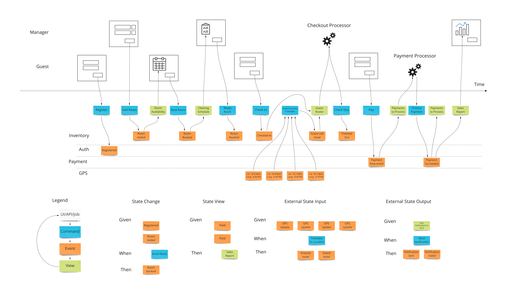

<!-- Adam's OG -->

---
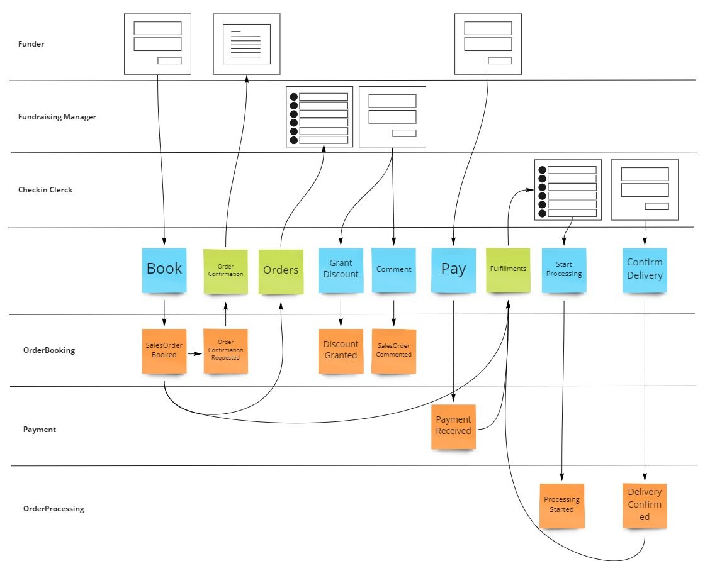

<!-- Yves' -->

---
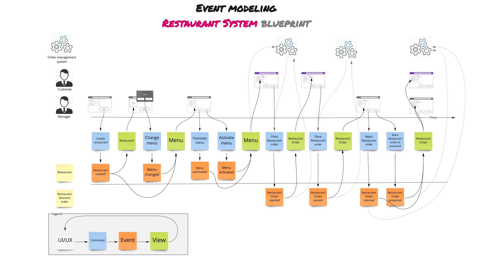

---
# Extras

---
# Anti-Patterns
<!-- https://www.linkedin.com/posts/martindilger_eventmodeling-activity-7400049747954122753-e-k1/ -->

---
# Vertical Slice Architecture (VSA) 🍕 

The term “Vertical Slice Architecture” was mainly coined by Jimmy Bogard in a series of articles around 2019. The main statement is: 
> Minimize coupling between slices, and maximize coupling within a slice.

The leading Principle here is the well-known “Open-Closed-Principle” (OCP) first defined by Bertrand Meyer in 1988. The Open-Closed-Principle basically states, that 
> Any part of the system should be open for extension, but closed for modification. 
When we extend the system, we typically do not modify existing code if possible.

<!-- todo: jimmy's og img as bg -->

---
# «Decider»

A minimal **functional pattern** by Jérémie Chassaing that replaces the mutable DDD Aggregate with three pure functions:

> **decide**(command, state) → events
> **evolve**(state, event) → state'
> **initialState** → state

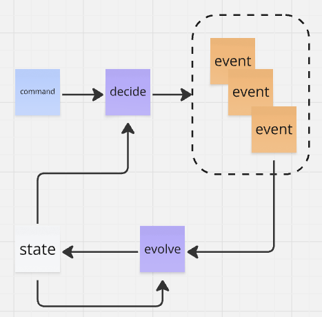

Maps directly to Event Modeling's **State Change** pattern and to **Given/When/Then** testing (state = given, command = when, events = then).

<!-- https://thinkbeforecoding.com/post/2021/12/17/functional-event-sourcing-decider -->

---
# Event Modeling Traditional Systems

---
# The BMSDD Process from Spec. to Impl.

<!-- https://bmsdd.com/#about -->

---
# Functional Core, Imperative Shell

---
# Dynamic Consistency Boundary (DCB)

Aggregates enforce **fixed** transactional boundaries — cross-aggregate invariants (e.g., "a student can't join more than 10 courses") require sagas or eventual consistency. DCB flips this:

> The consistency boundary should be **dynamic**, determined by the operation's query at runtime — not hardwired into stream structure.

**How it works:** Events are **tagged** (e.g., `student:s1`, `course:c1`). A **Decision Model** composes projections filtered by those tags. Writing uses **conditional append** — optimistic locking on the query result, not on a stream revision.

**Key benefit:** One event can enforce constraints across multiple entities atomically — no sagas, no duplicate events.

*Sara Pellegrini ("Killing the Aggregate") & Bastian Waidelich*

<!-- https://dcb.events/ -->

---
# TODO List Pattern (Saga)
