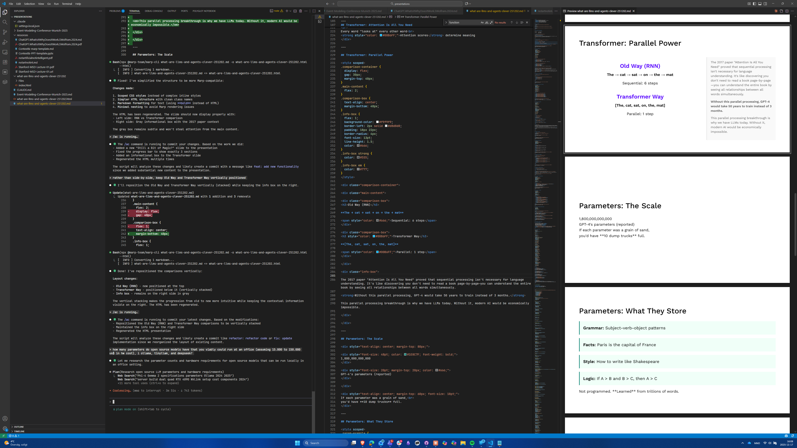
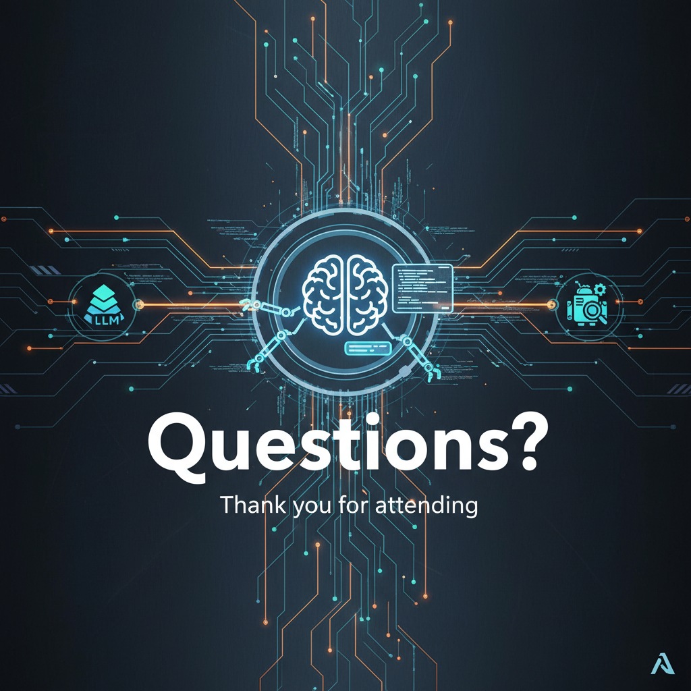

<!-- _class: title -->


# LLMs & Agents

What are they, and why can they `code`?

Clever, 2 December 2025

---


## Purpose: From Magic to Math

> Any sufficiently advanced technology is indistinguishable from magic.
>
> — Arthur C. Clarke


---


## Understanding LLMs: Six Core Concepts

<style scoped>
li:nth-child(1) strong { color: #5500FF; }  /* Tokens - purple */
li:nth-child(2) strong { color: #00B4D8; }  /* Transformers - sky blue */
li:nth-child(3) strong { color: #1E8C7F; }  /* Neural Networks - green */
li:nth-child(4) strong { color: #FF922D; }  /* Training - orange */
li:nth-child(5) strong { color: #043F9C; }  /* Hallucinations - dark blue */
li:nth-child(6) strong { color: #6B7280; }  /* Agents - dark grey */
li { margin-bottom: 12px; }
</style>

- <strong>Tokens</strong> → How LLMs process text
- <strong>Transformers</strong> → Why parallel attention enables modern AI
- <strong>Neural Networks</strong> → How weighted connections create "intelligence"
- <strong>Training</strong> → How raw models become helpful assistants
- <strong>Hallucinations</strong> → Why LLMs confidently generate false information
- <strong>Agents</strong> → How LLMs solve complex tasks with tools

---

## The Foundation: It's All Neural Networks

<div style="margin-top: 60px; font-size: 18pt; line-height: 1.8;">

Before we dive into specifics, know this: **LLMs are neural networks** - mathematical structures inspired by brains.

</div>

<div style="display: grid; grid-template-columns: 1fr 1fr; gap: 30px; margin-top: 40px; font-size: 15pt;">

<div style="padding: 20px; background: var(--color-bg-green-light); border-left: 4px solid var(--color-green); border-radius: 6px;">
<strong style="color: var(--color-green); font-size: 16pt;">Neurons</strong><br>
Simple units that receive inputs, multiply by weights, output values
</div>

<div style="padding: 20px; background: var(--color-bg-green-light); border-left: 4px solid var(--color-green); border-radius: 6px;">
<strong style="color: var(--color-green); font-size: 16pt;">Layers</strong><br>
Stacked neurons (transformers have ~100 layers)
</div>

<div style="padding: 20px; background: var(--color-bg-green-light); border-left: 4px solid var(--color-green); border-radius: 6px;">
<strong style="color: var(--color-green); font-size: 16pt;">Weights</strong><br>
The millions/billions/trillions of numbers that define the model
</div>

<div style="padding: 20px; background: var(--color-bg-green-light); border-left: 4px solid var(--color-green); border-radius: 6px;">
<strong style="color: var(--color-green); font-size: 16pt;">Learning</strong><br>
Adjusting these weights until the network predicts correctly
</div>

</div>

<div style="margin-top: 50px; padding: 20px; background: var(--color-bg-purple-tint); border-left: 4px solid var(--color-primary-purple); border-radius: 4px; font-size: 16pt; text-align: center;">
Everything that follows happens within this neural network structure.
</div>

---

## Tokens: The 🍓 Puzzle

<div style="font-size: 36pt; text-align: center; margin-top: 80px;">
"strawberry"
</div>

<div style="font-size: 24pt; text-align: center; margin-top: 40px; color: var(--color-text-secondary);">
How many 'r's?
</div>
</br>
<div style="font-size: 48pt; text-align: center; margin-top: 40px; color: var(--color-primary-purple);">
LLM says: 2
</div>

---

## Tokens: What's Really Happening

```
Human sees:     s-t-r-a-w-b-e-r-r-y

LLM sees:       [31552] [19685]
                "straw"  "berry"
```

<div style="margin-top: 40px; font-size: 20pt;">

The LLM never sees individual letters.
It sees <strong style="color: var(--color-primary-purple);">convenient linguistic units</strong>.

That's why it can't count the 'r's in strawberry—it literally never processes 's-t-r-a-w-b-e-r-r-y', only [31552][19685], where the letter boundaries are lost inside the tokens.

</div>
</br>
<div style="margin-top: 30px; padding: 15px 20px; background: var(--color-bg-purple-tint); border-left: 3px solid var(--color-primary-purple); border-radius: 4px; font-size: 15pt; color: var(--color-text-secondary);">
💡 <strong style="color: var(--color-primary-purple);">Byte Pair Encoding (BPE)</strong> - Think Huffman coding, but for subwords instead of characters. Like Huffman assigns short codes to frequent letters, BPE creates tokens for frequent character sequences.
</div>

---

## Tokens: Not Just Words

<div style="margin-top: 60px; font-size: 20pt; line-height: 1.8;">

<span style="color: var(--color-primary-purple); font-weight: 600;">Whole words:</span> `"hello"` → [15339]

<span style="color: var(--color-primary-purple); font-weight: 600;">Word parts:</span> `"understanding"` → [8154, 2259]
&nbsp;&nbsp;&nbsp;&nbsp;&nbsp;&nbsp;&nbsp;&nbsp;&nbsp;&nbsp;&nbsp;&nbsp;&nbsp;&nbsp;&nbsp;&nbsp;&nbsp;&nbsp;&nbsp;&nbsp;&nbsp;&nbsp;`"under"` + `"standing"`

<span style="color: var(--color-primary-purple); font-weight: 600;">Prefixes/Suffixes:</span> `"preprocessing"` → [1762, 29986]
&nbsp;&nbsp;&nbsp;&nbsp;&nbsp;&nbsp;&nbsp;&nbsp;&nbsp;&nbsp;&nbsp;&nbsp;&nbsp;&nbsp;&nbsp;&nbsp;&nbsp;&nbsp;&nbsp;&nbsp;&nbsp;&nbsp;&nbsp;&nbsp;&nbsp;&nbsp;&nbsp;&nbsp;&nbsp;&nbsp;&nbsp;`"pre"` + `"processing"`

</div>
</br>
<div style="margin-top: 40px; padding: 15px 20px; background: var(--color-bg-purple-tint); border-left: 3px solid var(--color-primary-purple); border-radius: 4px; font-size: 15pt; color: var(--color-text-secondary); max-width: 90%; margin-left: auto; margin-right: auto;">
💡 <strong style="color: var(--color-primary-purple);">Compositional Understanding</strong> - This is why LLMs can handle rare words, compound words, and even <strong style="color: var(--color-primary-purple);">invent new words</strong> by combining parts. Each token carries meaning that can be assembled like LEGO blocks.
</div>

---

## Tokens: The Numbers Game

<style scoped>
.token-box {
  display: inline-block;
  padding: 10px 20px;
  margin: 10px;
  border: 2px solid var(--color-primary-purple);
  border-radius: 8px;
  font-family: monospace;
  font-size: 18pt;
}
.arrow {
  color: var(--color-primary-purple);
  font-size: 24pt;
  margin: 0 20px;
}
.text-gray {
  color: var(--color-text-light);
}
.text-black {
  color: var(--color-black);
}
</style>

<div style="text-align: center; margin-top: 60px;">

<div class="token-box">Hello world</div>
<span class="arrow">→</span>
<div class="token-box">[15496]</div>
<div class="token-box">[1917]</div>
<span style="margin-left: 20px; color: var(--color-text-secondary);">"Hello" + " world"</span>

</div>

<div style="text-align: center; margin-top: 40px;">

<div class="token-box">unforgettable</div>
<span class="arrow">→</span>
<div class="token-box">[359]</div>
<div class="token-box">[41119]</div>
<div class="token-box">[2048]</div>
<span style="margin-left: 20px; color: var(--color-text-secondary);">"un" + "forget" + "table"</span>

</div>

<div style="margin-top: 60px; text-align: center; font-size: 18pt; color: var(--color-text-secondary);">
<br>
~200,000 tokens in vocabulary = ~200,000 entries in a compression dictionary<br>
<span class="text-gray" style="font-size: 16pt;">Traditional compression (Huffman): 'e' → short code. Modern NLP (BPE): 'the' → single token.<br>Both compress frequency, but BPE captures meaning.</span><br>
<br>
<span class="text-black" style="font-size: 16pt;">Frequent code patterns get single tokens: `void`, `async`, `const`, `=>`, `()`, `{}`</span><br>
<span class="text-gray" style="font-size: 16pt;">That's why LLMs can write code—syntax appeared billions of times in training data.</span>
</div>
</br>
<div style="margin-top: 50px; padding: 15px 20px; background: var(--color-bg-purple-tint); border-left: 3px solid var(--color-primary-purple); border-radius: 4px; font-size: 15pt; color: var(--color-text-secondary); max-width: 90%; margin-left: auto; margin-right: auto;">
💡 <strong style="color: #5500FF;">Why LLMs Excel at Code</strong> - Programming syntax gets compressed into single tokens (`async`, `=>`, `{}`). Code's repetitive structure means these patterns appeared billions of times, making code easier to "predict" than natural language.
</div>

---

## Transformer: The Context Problem

<div style="font-size: 28pt; margin-top: 80px; text-align: center;">

"I went to the <strong style="color: var(--color-primary-purple);">bank</strong> to deposit money"

</div>

<div style="display: flex; justify-content: center; gap: 100px; margin-top: 60px;">
  <div style="text-align: center;">
    <div>Financial institution? 🏦</div>
  </div>
  <div style="text-align: center;">
    <div>River's edge? 🏞️</div>
  </div>
</div>

<br>
<br>

<div style="text-align: center; font-size: 20pt; color: var(--color-text-secondary);">
How does AI know which bank?
</div>

---

## Transformer: Attention Is All You Need

<style scoped>
.attention-word {
  display: inline-block;
  padding: 8px 16px;
  margin: 5px;
  border-radius: 6px;
  font-size: 20pt;
}
.high-attention {
  background: var(--color-sky-blue);
  color: white;
  font-weight: bold;
}
.low-attention {
  background: var(--color-bg-blue-tint);
  color: var(--color-text-secondary);
}
.cyan-text {
  color: var(--color-sky-blue) !important;
  font-weight: bold;
}
.gray-text {
  color: var(--color-text-secondary) !important;
}
.light-gray-text {
  color: var(--color-text-muted) !important;
}
</style>

<div style="text-align: center; margin-top: 60px;">

<div class="attention-word low-attention">I</div>
<div class="attention-word low-attention">went</div>
<div class="attention-word low-attention">to</div>
<div class="attention-word low-attention">the</div>
<div class="attention-word high-attention">bank</div>
<div class="attention-word low-attention">to</div>
<div class="attention-word high-attention">deposit</div>
<div class="attention-word high-attention">money</div>

</div>

<div style="margin-top: 35px;">
</br>
<div style="text-align: center; font-size: 14pt; margin-bottom: 20px;" class="gray-text">
How the model decides what "bank" means:
</div>

<div style="display: grid; grid-template-columns: 1fr 1fr; gap: 25px; margin-top: 15px;">

<div style="padding: 18px 22px; background: var(--color-bg-blue-tint); border-radius: 8px;">
<div style="font-size: 15pt; margin-bottom: 10px;"><strong class="cyan-text">Step 1: Ask Everyone</strong></div>
<div style="font-size: 13pt; line-height: 1.5;" class="gray-text">
<strong class="cyan-text">Bank</strong> asks all other words:<br>
<em class="light-gray-text">"How relevant are you to my meaning?"</em>
</div>
</div>

<div style="padding: 18px 22px; background: var(--color-bg-blue-tint); border-radius: 8px;">
<div style="font-size: 15pt; margin-bottom: 10px;"><strong class="cyan-text">Step 2: Weighted Votes</strong></div>
<div style="font-size: 13pt; line-height: 1.6;" class="gray-text">
• <strong class="cyan-text">deposit</strong> → <strong class="cyan-text">90%</strong> vote<br>
• <strong class="cyan-text">money</strong> → <strong class="cyan-text">85%</strong> vote<br>
• <span class="light-gray-text">"the"</span> → <span class="light-gray-text">2%</span> vote
</div>
</div>

</div>

<div style="margin-top: 25px; padding: 18px 22px; background: var(--color-bg-blue-tint); border-left: 4px solid var(--color-sky-blue); border-radius: 8px;">
</br>
<div style="font-size: 13pt; line-height: 1.6;" class="gray-text">
<strong class="cyan-text">Result: Bank</strong> combines information from all words, but weights <strong class="cyan-text">deposit</strong> and <strong class="cyan-text">money</strong> heavily → understands it's a <strong>financial institution</strong>, not a riverbank
</div>
</div>

</div>

<div style="text-align: center; margin-top: 30px; font-size: 12pt; line-height: 1.6;" class="light-gray-text">
Every word does this simultaneously for every other word<br>
<strong class="cyan-text">Attention scores</strong> = how much each word "votes" on meaning
</div>

---

## Transformer: Parallel Power

<style scoped>
.comparison-container {
  display: flex;
  gap: 30px;
  margin-top: 40px;
}
.main-content {
  flex: 2;
}
.comparison-box {
  text-align: center;
  margin-bottom: 40px;
}
.info-box {
  flex: 1;
  background-color: var(--color-gray-50);
  border-left: 2px solid var(--color-gray-200);
  padding: 18px 22px;
  border-radius: 4px;
  font-size: 13pt;
  line-height: 1.5;
  color: var(--color-text-secondary);
}
.info-box strong {
  color: var(--color-text-dark);
}
.info-box em {
  color: var(--color-gray-700);
}
</style>

<div class="comparison-container">

<div class="main-content">

<div class="comparison-box">
<h3>Old Way (RNN)</h3>

<strong>The → cat → sat → on → the → mat</strong>

<span style="color: var(--color-text-secondary);">Sequential: 6 steps</span>
</div>

<div class="comparison-box">
<h3 style="color: var(--color-sky-blue);">Transformer Way</h3>

<strong>[The, cat, sat, on, the, mat]</strong>

<span style="color: var(--color-sky-blue);">Parallel: 1 step</span>
</div>

</div>

<div class="info-box">

The 2017 paper "Attention Is All You Need" proved that sequential processing isn't necessary for language understanding. It's like discovering you don't need to read a book page-by-page—you can understand the entire book by seeing all relationships between all words simultaneously.

💡 <strong>The Economics of Parallelism</strong> - Without transformer parallelism, GPT-4 would take 50 years to train instead of 3 months. This breakthrough is the ONLY reason modern AI exists—sequential training would be economically impossible.

</div>

</div>

---

## Neural Networks: The Scale

<style scoped>
.params-container {
  display: flex;
  gap: 40px;
  margin-top: 40px;
}
.cloud-models, .local-models {
  flex: 1;
  text-align: center;
}
.local-models {
  background: var(--color-bg-green-light);
  border: 2px solid var(--color-stage-rlhf);
  border-radius: 8px;
  padding: 15px 20px;
}
h3 {
  color: var(--color-green);
  font-size: 20pt;
  margin: 0 0 15px 0;
}
.param-count {
  font-size: 32pt;
  color: var(--color-green);
  font-weight: bold;
  margin: 6px 0 2px 0;
  letter-spacing: -0.5px;
}
.model-name {
  font-size: 13pt;
  color: var(--color-text-muted);
  margin: 0 0 18px 0;
}
.quantization-tip {
  margin-top: 15px;
  padding-top: 12px;
  border-top: 1px solid var(--color-border-cyan);
  font-size: 13pt;
  color: var(--color-text-secondary);
}
</style>

<div class="params-container">

<div class="cloud-models">
<h3>Cloud Models (2025)</h3>

<div class="param-count">2T</div>
<div class="model-name">GPT-5 (estimated)</div>

<div class="param-count">1.8T</div>
<div class="model-name">GPT-4</div>

<div class="param-count">~1T</div>
<div class="model-name">Claude Opus 4.1</div>

<div class="param-count">~500B</div>
<div class="model-name">Claude Sonnet 4.5</div>
</div>

<div class="local-models">
<h3>Office Models ($15-50K)</h3>

<div class="param-count">70B</div>
<div class="model-name">Llama 3.3 (Dual RTX 4090)</div>

<div class="param-count">32B</div>
<div class="model-name">Qwen Coder (Single RTX 4090)</div>

<div class="param-count">14B</div>
<div class="model-name">Phi-4 (Consumer GPU)</div>

<div class="quantization-tip">
<strong>🔧 Quantization = Model Compression:</strong> Reduce memory by 75% • ~2-5% quality trade-off<br/>
<div style="margin-top: 8px; font-size: 0.85em; color: var(--color-text-secondary);">
<strong>Enables:</strong> On-prem deployment • Privacy-first AI
</div>
</div>
</div>

</div>

<div style="text-align: center; margin-top: 45px; font-size: 10pt; color: var(--color-text-light);">
<strong>💡 Scale:</strong> GPT-5's 2T = Empire State Building, Office 70B = 5-story building (but still very capable!)
</div>

---

## Neural Networks: What They Learn

<style scoped>
.param-example {
  background: var(--color-bg-green-lighter);
  border-left: 4px solid var(--color-green);
  padding: 20px;
  margin: 20px 0;
  font-size: 18pt;
}
</style>

<div class="param-example">
<strong>Grammar:</strong> Subject-verb-object patterns
</div>

<div class="param-example">
<strong>Facts:</strong> Paris is the capital of France
</div>

<div class="param-example">
<strong>Style:</strong> How to write like Shakespeare
</div>

<div class="param-example">
<strong>Logic:</strong> If A > B and B > C, then A > C
</div>

<div style="margin-top: 40px; padding: 15px 20px; background: var(--color-bg-purple-tint); border-left: 3px solid var(--color-primary-purple); border-radius: 4px; font-size: 15pt; color: var(--color-text-secondary); max-width: 90%; margin-left: auto; margin-right: auto;">
💡 <strong style="color: var(--color-primary-purple);">Discovered, Not Designed</strong> - Traditional programs are like recipes we write step-by-step. LLMs are like chefs who learned by tasting millions of dishes—they never saw the recipe, but absorbed the essence of cooking. No if-statements, no loops, just 1.8 trillion learned patterns from reading the internet.
</div>

---

## How LLMs Learn: The Three Stages

<style scoped>
.stages-container {
  margin-top: 15px;
}

.stage {
  background: var(--color-bg-purple-tint);
  border-left: 4px solid var(--color-primary-purple);
  padding: 12px 15px;
  margin: 8px 0;
  border-radius: 6px;
}

.stage h3 {
  color: var(--color-primary-purple);
  font-size: 19pt;
  margin: 0 0 5px 0;
}

.stage .details {
  font-size: 13pt;
  line-height: 1.4;
  margin: 4px 0;
}

.stage .result {
  margin-top: 6px;
  padding: 7px 10px;
  border-radius: 4px;
  font-weight: 600;
  font-size: 14pt;
}

.result-pretraining {
  background: rgba(255, 107, 107, 0.1);
}

.result-sft {
  background: rgba(255, 146, 45, 0.1);
}

.result-rlhf {
  background: rgba(30, 140, 127, 0.1);
}

.why-matters {
  background: var(--color-bg-orange-tint);
  border-left: 4px solid var(--color-orange);
  padding: 12px 15px;
  margin: 15px 0 0 0;
  font-size: 14pt;
  line-height: 1.4;
}
</style>

<div class="stages-container">

<div class="stage">
<h3>1️⃣ Pre-training</h3>
<div class="details">
• Learn language patterns from trillions of tokens<br>
• Duration: Months | Cost: $50M - $100M+<br>
• Training data: Web pages, books, code repositories
</div>
<div class="result result-pretraining">
Result: Can predict text, but not helpful yet
</div>
</div>

<div class="stage">
<h3>2️⃣ Supervised Fine-Tuning (SFT)</h3>
<div class="details">
• Train on human-written instruction-response pairs<br>
• Duration: Weeks | Cost: ~$1M<br>
• Examples: "Write a poem about cats" → [human-written poem]
</div>
<div class="result result-sft">
Result: Learns to follow instructions and answer questions
</div>
</div>

<div class="stage">
<h3>3️⃣ Reinforcement Learning from Human Feedback (RLHF)</h3>
<div class="details">
• Humans rank multiple responses: which is better?<br>
• Duration: Weeks | Cost: ~$1M<br>
• Model learns preferences, safety, helpfulness
</div>
<div class="result result-rlhf">
Result: Learns to be helpful, harmless, and honest
</div>
</div>

</div>

---

## From Raw Model to Helpful Assistant

<style scoped>
.evolution-container {
  display: flex;
  justify-content: center;
  gap: 30px;
  margin-top: 30px;
  align-items: stretch;
}

.evolution-stage {
  flex: 1;
  padding: 15px;
  border-radius: 8px;
  text-align: center;
}

.stage-pretraining {
  background: var(--color-bg-red-tint);
  border: 2px solid var(--color-stage-pretraining);
}

.stage-sft {
  background: var(--color-bg-orange-tint);
  border: 2px solid var(--color-stage-sft);
}

.stage-rlhf {
  background: var(--color-bg-green-tint);
  border: 2px solid var(--color-stage-rlhf);
}

.evolution-stage h4 {
  font-size: 16pt;
  margin: 0 0 10px 0;
}

.evolution-stage .prompt {
  background: white;
  padding: 10px;
  border-radius: 6px;
  margin: 8px 0;
  font-size: 13pt;
  font-weight: 600;
}

.evolution-stage .response {
  padding: 10px;
  border-radius: 6px;
  margin: 8px 0;
  font-size: 12pt;
  line-height: 1.4;
  min-height: 95px;
}

.arrow {
  font-size: 40pt;
  color: var(--color-primary-purple);
  align-self: center;
  margin: 0 -10px;
}
</style>

<div class="evolution-container">

<div class="evolution-stage stage-pretraining">
<h4>Pre-training Only</h4>
<div class="prompt">"Write a poem about cats"</div>
<div class="response">
Write a poem about cats and dogs. Write a poem about cats in Spanish. Cat poem generator. Best cat poems 2023...
</div>
<div style="font-size: 11pt; color: var(--color-text-secondary); margin-top: 6px;">
Just predicts next likely token
</div>
</div>

<div class="arrow">→</div>

<div class="evolution-stage stage-sft">
<h4>+ Supervised Fine-Tuning</h4>
<div class="prompt">"Write a poem about cats"</div>
<div class="response">
Whiskers twitching in the night<br>
Paws so soft and eyes so bright<br>
Silent hunters, graceful, free<br>
Cats embody mystery
</div>
<div style="font-size: 11pt; color: var(--color-text-secondary); margin-top: 6px;">
Follows instructions properly
</div>
</div>

<div class="arrow">→</div>

<div class="evolution-stage stage-rlhf">
<h4>+ RLHF</h4>
<div class="prompt">"Write a poem about cats"</div>
<div class="response">
I'd be happy to write a poem about cats!<br><br>
Whiskers twitching in the night<br>
Eyes gleaming with delight<br>
Graceful hunters, soft and free<br>
Perfect companions, you and me
</div>
<div style="font-size: 11pt; color: var(--color-text-secondary); margin-top: 6px;">
Helpful, engaging, natural
</div>
</div>

</div>
</br>
<div style="margin-top: 25px; padding: 15px 20px; background: var(--color-bg-purple-tint); border-left: 3px solid var(--color-primary-purple); border-radius: 4px; font-size: 15pt; color: var(--color-text-secondary); max-width: 90%; margin-left: auto; margin-right: auto;">
💡 <strong style="color: #5500FF;">Why ChatGPT Feels Human</strong> - This three-stage pipeline transforms autocomplete into dialogue. Pre-training learns language patterns. SFT learns to follow instructions. RLHF learns conversation style. This is why it feels like talking to someone, not just completing text.
</div>

---

## Probabilistic: Not a Database

<style scoped>
.probability-container {
  text-align: center;
  margin-top: 60px;
}

.prompt {
  font-size: 24pt;
  margin: 40px 0;
  color: var(--color-text-secondary);
}

.options {
  display: flex;
  justify-content: center;
  align-items: center;
  gap: 20px;
}

.option {
  border-radius: 12px;
  border: 2px solid var(--color-primary-purple);
  box-shadow: 0 2px 8px rgba(85, 0, 255, 0.15);
  transition: transform 0.2s;
}

.option .percentage {
  font-size: 28pt;
  font-weight: 700;
  margin-bottom: 8px;
}

/* High probability: strong visual presence */
.option:nth-child(1) {
  padding: 30px 40px;
  min-width: 150px;
  background: var(--color-primary-purple);
  color: var(--color-white);
}

/* Medium probability: lighter purple */
.option:nth-child(2) {
  padding: 20px 30px;
  min-width: 120px;
  background: rgba(85, 0, 255, 0.15);
  color: var(--color-black);
}

.option:nth-child(2) .percentage {
  color: var(--color-primary-purple);
}

/* Low probability: faint purple */
.option:nth-child(3) {
  padding: 15px 20px;
  min-width: 100px;
  background: rgba(85, 0, 255, 0.05);
  color: var(--color-text-secondary);
}

.option:nth-child(3) .percentage {
  color: var(--color-text-muted);
}

.footer-text {
  text-align: center;
  margin-top: 60px;
  font-size: 18pt;
  color: var(--color-text-secondary);
}

.footer-text em:first-of-type {
  color: var(--color-text-muted);
  text-decoration: line-through;
  text-decoration-thickness: 1px;
}

.footer-text em:last-of-type {
  color: var(--color-primary-purple);
  font-weight: 600;
}
</style>

<div class="probability-container">

<div class="prompt">
"The capital of France is..."
</div>

<div class="options">
  <div class="option">
    <div class="percentage">95%</div>
    <div>Paris</div>
  </div>
  <div class="option">
    <div class="percentage">3%</div>
    <div>Lyon</div>
  </div>
  <div class="option">
    <div class="percentage">2%</div>
    <div>...</div>
  </div>
</div>

</div>

<div class="footer-text">
It's not <em style="color: var(--color-primary-purple); font-style: normal; font-weight: 600;">remembering</em>. It's <em style="color: var(--color-primary-purple); font-style: normal; font-weight: 600;">predicting</em>.
</div>
</br>
<div style="margin-top: 25px; padding: 15px 20px; background: var(--color-bg-purple-tint); border-left: 3px solid var(--color-orange); border-radius: 4px; font-size: 15pt; color: var(--color-text-secondary); max-width: 90%; margin-left: auto; margin-right: auto;">
💡 <strong style="color: var(--color-orange);">No Database, Only Patterns</strong> - LLMs predict statistically likely continuations, not look up facts. The model learned "capital of France is" → "Paris" from training patterns.
</div>

---

## Probabilistic: The Hallucination Problem

<style scoped>
.warning-text {
  text-align: center;
  margin-top: 40px;
  font-size: 20pt;
  color: var(--color-warning);
  font-weight: 600;
}
</style>

<div style="margin-top: 60px; font-size: 20pt;">

<span style="color: var(--color-text-muted); font-weight: 600;">You:</span> "What year did Google buy Twitter?"

<span style="color: var(--color-text-muted); font-weight: 600;">LLM:</span> "Google acquired Twitter in 2016 for $44 billion."

</div>

<div style="margin-top: 40px; padding: 20px; background: var(--color-bg-orange-light); border-left: 4px solid var(--color-orange); font-size: 18pt;">
<strong>Reality:</strong> Google never bought Twitter.<br>
The LLM sounds completely confident—and completely wrong.
</div>

<div class="warning-text">
⚠️ High confidence ≠ High accuracy
</div>
</br></br>
<div style="text-align: center; margin-top: 50px; font-size: 18pt; color: var(--color-text-secondary); line-height: 1.6;">
When LLMs generate false information with confidence, we call this a <strong style="color: var(--color-warning);">"hallucination"</strong>
</div>

---

## Hallucinations: Why They Happen & What Helps

<style scoped>
.two-column {
  display: flex;
  gap: 40px;
  margin-top: 50px;
  justify-content: center;
}

.column {
  flex: 1;
  max-width: 450px;
}

.column-header {
  font-size: 22pt;
  font-weight: 600;
  margin-bottom: 20px;
  padding-bottom: 10px;
  border-bottom: 3px solid;
}

.why-header {
  color: var(--color-warning);
  border-color: var(--color-warning);
}

.what-header {
  color: var(--color-green);
  border-color: var(--color-green);
}

.column ul {
  font-size: 16pt;
  line-height: 1.7;
  list-style: none;
  padding: 0;
}

.column ul li {
  margin-bottom: 15px;
  padding-left: 10px;
}

.column ul li strong {
  font-weight: 600;
}

.why-column ul li:before {
  content: "•";
  color: var(--color-warning);
  font-weight: bold;
  font-size: 20pt;
  margin-right: 10px;
}

.what-column ul li:before {
  content: "✓";
  color: var(--color-green);
  font-weight: bold;
  font-size: 16pt;
  margin-right: 10px;
}
</style>

<div class="two-column">

<div class="column why-column">
<div class="column-header why-header">🔍 Why It Happens</div>
<ul>
<li><strong>No truth database</strong><br>Can't fact-check during generation</li>
<li><strong>Pure pattern matching</strong><br>"Google" + "acquired" + "Twitter" seem plausible together</li>
<li><strong>Training ≠ memorization</strong><br>Learned relationships, not searchable facts</li>
</ul>
</div>

<div class="column what-column">
<div class="column-header what-header">⚡ What Helps</div>
<ul>
<li><strong>RAG</strong><br>Ground answers in real data</li>
<li><strong>Human verification</strong><br>Check critical information</li>
<li><strong>Lower temperature</strong><br>Less creative = fewer hallucinations</li>
<li><strong>Prompt engineering</strong><br>"Say 'I don't know' if uncertain"</li>
</ul>
</div>

</div>

<div style="margin-top: 50px; padding: 20px 30px; background: var(--color-bg-purple-tint); border-left: 4px solid var(--color-primary-purple); border-radius: 4px; font-size: 16pt; color: var(--color-text-secondary); max-width: 90%; margin-left: auto; margin-right: auto; text-align: center;">
💡 Hallucinations aren't bugs—they're the fundamental nature of pattern-based prediction. The same creativity that enables useful responses also enables convincing fiction.
</div>

---

## Context Window: The Goldfish Memory

<style scoped>
.memory-box {
  background: var(--color-bg-blue-light);
  border: 2px solid var(--color-dark-blue);
  border-radius: 8px;
  padding: 20px;
  margin: 20px auto;
  width: 80%;
  text-align: center;
}
.forgotten {
  opacity: 0.3;
  text-decoration: line-through;
}
</style>

<div class="memory-box">
<div style="font-size: 20pt; color: var(--color-dark-blue); margin-bottom: 20px;">128K Token Window</div>
<div class="forgotten"><strong>👩 (msg 1):</strong> "My account email is alice@company.com"</div>
<div class="forgotten"><strong>🤖 (msg 2):</strong> "Thanks Alice! How can I help?"</div>
<div class="forgotten"><strong>👩 (msg 3):</strong> "I'm locked out of the dashboard"</div>
<div style="margin: 10px 0;">⋮ <em style="font-size: 14pt;">(many messages discussing troubleshooting)</em> ⋮</div>
<div><strong>🤖 (msg 97):</strong> "Issue resolved! Anything else?"</div>
<div><strong>👩 (msg 98):</strong> "Yes, send the summary to my email"</div>
<div style="color: var(--color-error-red);"><strong>🤖 (msg 99):</strong> "I don't have your email address. Could you provide it?"</div>
</div>

<div style="text-align: center; margin-top: 40px; font-size: 18pt;">
Once full, oldest messages disappear. <em style="color: var(--color-primary-purple); font-style: normal; font-weight: 600;">No long-term memory.</em>
</div>
</br>
<div style="margin-top: 25px; padding: 15px 20px; background: var(--color-bg-orange-tint); border-left: 3px solid var(--color-orange); border-radius: 4px; font-size: 15pt; color: var(--color-text-secondary); max-width: 90%; margin-left: auto; margin-right: auto;">
💡 <strong style="color: #FF922D;">The Goldfish Problem</strong> - Every conversation is like meeting someone for the first time. The model can't learn from past chats or remember you between sessions. This isn't a bug—it's the fundamental architecture. RAG and vector databases are workarounds, not solutions.
</div>

<!--
## Q&A: But ChatGPT and Claude Have "Memory" Features?

### Short Answer
Memory features are **application-level workarounds**, not model capabilities. It's like giving a goldfish a waterproof notepad—the goldfish still has a goldfish brain, but now has notes to reference.

### Technical Implementation

**ChatGPT Memory (launched Sept 2024):**
- Uses RAG (Retrieval Augmented Generation) with vector database
- Stores user preferences/facts as embeddings on OpenAI servers
- Retrieves relevant memories via semantic search at conversation start
- Injects them into system prompt as "Model Set Context"
- Limit: ~1,200-1,400 words of saved memories
- Privacy: 30-day retention after deletion; opt-out available for training

**Claude Memory:**
1. **CLAUDE.md files** (local filesystem)
   - Plain markdown files you control
   - Claude recursively reads them from working directory
   - No vector database needed—just text files

2. **Claude Memory feature** (Anthropic servers, Oct 2024+)
   - Project-scoped memory
   - Users can view/edit what's remembered
   - 30-day retention (no training) or 5-year (with training)

3. **MCP Servers** (Model Context Protocol, Nov 2024)
   - Third-party extensions: SQLite with FTS5, memory.json, cloud sync
   - Enables semantic search and autonomous consolidation

### Why This Doesn't Contradict "Goldfish Memory"

**The model itself remains stateless:**
- LLMs are stateless functions—no retention between calls
- Each inference rereads everything from scratch
- After responding, model forgets immediately

**Memory features are prompt injection:**
1. Application stores facts externally (DB/files)
2. At conversation start, retrieves relevant notes
3. Pastes them into prompt before user's message
4. Model reads injected text like any other input
5. **Model isn't "remembering"—it's reading notes**

### The Analogy
Like a person with severe amnesia carrying a notebook:
- **Context window** = Last few minutes of working memory
- **Memory feature** = Notebook with important facts
- Every conversation, they read the notebook to "remember" you
- But they're not actually remembering—they're reading notes

### Key Limitations
- All retrieved memories must fit within context window
- RAG retrieval may miss relevant information
- Long contexts degrade performance ("lost in the middle")
- Expensive: Each injected memory increases token cost
- Security: Vulnerable to prompt injection attacks
- No true understanding or consolidation like human memory

### Storage & Privacy Summary

| Feature | ChatGPT | Claude (CLAUDE.md) | Claude Memory |
|---------|---------|-------------------|---------------|
| Storage | OpenAI servers | Local filesystem | Anthropic servers |
| Retention | Indefinite (30 days after deletion) | User-controlled | 30 days / 5 years |
| Training Use | Yes (opt-out) for Free/Plus; No for Enterprise | Never | Opt-in (default: ON) |
| User Control | Can delete memories | Full control (it's your file) | Can delete/edit |

### Bottom Line
Memory features are clever engineering—not AI breakthroughs. The goldfish still has goldfish memory. We just gave it really good note-taking software.
-->

---

## Context Window: The Numbers

<style scoped>
.size-comparison {
  display: flex;
  justify-content: center;
  align-items: center;
  gap: 25px;
  margin-top: 40px;
  max-height: 380px;
}

.size-box {
  text-align: center;
  border-radius: 12px;
  border: 2px solid var(--color-dark-blue);
  box-shadow: 0 2px 8px rgba(4, 63, 156, 0.1);
}

.model-name {
  font-size: 20pt;
  color: var(--color-dark-blue);
  font-weight: 600;
  margin-bottom: 8px;
}

.context-size {
  font-weight: 700;
  color: var(--color-dark-blue);
  margin: 8px 0;
}

.description {
  font-size: 13pt;
  color: var(--color-text-secondary);
  margin: 8px 0;
  line-height: 1.3;
}

.indicators {
  font-size: 12pt;
  margin-top: 12px;
  padding-top: 12px;
  border-top: 1px solid rgba(4, 63, 156, 0.2);
  color: var(--color-text-muted);
}

/* Progressive sizing without transform */
.size-box:nth-child(1) {
  min-height: 180px;
  padding: 20px 25px;
  background: rgba(4, 63, 156, 0.05);
}

.size-box:nth-child(1) .context-size {
  font-size: 30pt;
}

.size-box:nth-child(2) {
  min-height: 210px;
  padding: 25px 35px;
  background: rgba(4, 63, 156, 0.1);
  border-width: 3px;
}

.size-box:nth-child(2) .context-size {
  font-size: 34pt;
}

.size-box:nth-child(3) {
  min-height: 240px;
  padding: 30px 45px;
  background: rgba(4, 63, 156, 0.15);
  border-width: 4px;
  box-shadow: 0 4px 16px rgba(4, 63, 156, 0.2);
}

.size-box:nth-child(3) .context-size {
  font-size: 38pt;
}
</style>

<div class="size-comparison">
  <div class="size-box">
    <div class="model-name">🪟 GPT-3.5</div>
    <div class="context-size">4K</div>
    <div class="description">~500 lines of code</div>
    <div class="indicators">💲 Low · ⚡⚡⚡ Fast</div>
  </div>

  <div class="size-box">
    <div class="model-name">🪟🪟 GPT-4</div>
    <div class="context-size">128K</div>
    <div class="description">~16K lines (React codebase)</div>
    <div class="indicators">💲💲 Medium · ⚡⚡ Medium</div>
  </div>

  <div class="size-box">
    <div class="model-name">🪟🪟🪟 Claude 3</div>
    <div class="context-size">1M</div>
    <div class="description">~125K lines (Linux kernel)</div>
    <div class="indicators">💲💲💲 High · ⚡ Slow</div>
  </div>
</div>
</br></br>
<div style="margin-top: 30px; padding: 15px 25px; background: var(--color-bg-blue-light); border-left: 4px solid var(--color-dark-blue); border-radius: 4px; font-size: 15pt; color: var(--color-text-secondary); max-width: 90%; margin-left: auto; margin-right: auto;">
💡 <strong style="color: var(--color-dark-blue);">Context Trade-off</strong> - Larger windows = higher cost 💲 & slower response ⚡. Most tasks need < 4K.
</div>

---

<!--
## Q&A: How Do Context Windows Actually Work?

### Technical Deep Dive

#### What is a Context Window Exactly?

From an **attention mechanism perspective**, the context window is the maximum number of tokens that can participate in the self-attention computation at once.

- Each token can "attend to" (look at and be influenced by) every other token in the context
- The attention mechanism computes relationships between all token pairs using Query, Key, and Value matrices
- This creates an **attention matrix** of size N×N where N is the number of tokens

**Example**: If you have 1,000 tokens in your context, each token needs to calculate its relationship with all 999 other tokens plus itself.

#### Why There's a Hard Limit

The hard limit exists due to **computational complexity**:

1. **Memory Requirements**: The attention matrix requires O(N²) memory
   - 4K context = 16M attention scores to store
   - 128K context = 16.4B attention scores
   - 1M context = 1T attention scores (!)

2. **Computational Cost**: Computing attention requires O(N²) operations
   - Each doubling of context length quadruples the computation
   - Going from 4K to 128K tokens (32x increase) requires 1,024x more compute

3. **Hardware Constraints**: GPUs have limited VRAM
   - A single A100 GPU has 40-80GB of memory
   - Must fit model weights, activations, AND attention matrices

#### What Happens When Context Gets Full

**FIFO (First In, First Out) Mechanism**:
- Oldest tokens are dropped from the beginning
- New tokens added at the end
- Like a conveyor belt with fixed length

**Example**:
```
Initial: [A B C D E F G H] (window size = 8)
Add "I J": [C D E F G H I J] (A and B dropped)
```

**The Goldfish Memory Problem**:
- **No Gradual Forgetting**: Unlike human memory, there's no "fading"
- **Binary State**: Tokens are either fully in context or completely forgotten
- **Lost Context**: Important setup information disappears
- **Broken References**: "As I mentioned earlier..." points to nothing

#### Context Compacting Strategies

**1. Summarization Approach**:
- When context approaches limit, system identifies "old" conversation segments
- Runs summarization model on those segments
- Replaces original messages with compressed summaries
- Preserves recent messages in full detail

**2. Importance Scoring**:
- Systems assign importance scores to different parts of context
- Factors: recency, semantic relevance, user emphasis, entity mentions
- Lower-scoring sections get compressed or dropped first

**3. Sliding Window Attention**:
- Each token only attends to W nearby tokens (not all N)
- Reduces complexity to O(N×W) instead of O(N²)
- Used by models like Mistral

**4. Attention Sinks**:
- Keeps first few tokens always (they become "sinks" for attention)
- Maintains stability while allowing middle truncation
- First tokens disproportionately important for stability

**5. StreamingLLM**:
- Combines attention sinks with rolling buffer
- Keeps first 4 tokens + last K tokens
- Allows "infinite" context streaming with bounded memory

#### Practical Implications

**Why Larger Context = Slower and More Expensive**:

The Quadratic Attention Problem:
- 4K tokens: 16M computations
- 32K tokens: 1B computations (64x more)
- 128K tokens: 16B computations (1,024x more)
- 1M tokens: 1T computations (65,536x more!)

**Cost Breakdown**:
1. **Inference Time**: Linear to quadratic increase with context
2. **Memory Usage**: Quadratic growth requires more expensive GPUs
3. **Energy Consumption**: More computation = more power
4. **Pricing**: Providers charge more for longer contexts

**How Different Models Handle This**:

- **GPT-4**: Multiple context tiers (8K, 32K, 128K), different pricing, standard full attention
- **Claude**: Large base context (200K), prompt caching to reuse computed attention
- **Gemini**: Extreme contexts (up to 2M tokens), mixture of techniques including selective attention
- **Open Source (Llama, Mistral)**: Grouped-query attention (GQA), sliding window + rope positioning

#### Modern Solutions

**RAG (Retrieval-Augmented Generation)**:
- Store information in external database
- Retrieve only relevant chunks for each query
- Inject into prompt dynamically
- Effectively "unlimited" context with bounded window

**Benefits**:
- Constant memory usage
- Fast retrieval (milliseconds)
- Can update knowledge without retraining
- Cost-effective for large knowledge bases

**Prompt Caching**:
1. Common prompt prefixes are cached after first computation
2. Subsequent requests reuse cached attention computations
3. Only compute attention for new tokens
4. Result: 50-90% cost reduction for repeated prompts

**Memory Features (Structured Systems)**:
1. **Short-term Memory**: Current conversation (in context)
2. **Long-term Memory**: Stored externally, retrieved as needed
3. **Working Memory**: Currently relevant facts injected into prompts

**Memory Injection Flow**:
```
User Input → Retrieve Relevant Memories →
Construct Prompt with Memories → Generate Response →
Extract New Memories → Store for Future
```

#### Key Takeaways

1. **Context windows are fundamentally limited** by the O(N²) attention mechanism
2. **When full, models forget completely** - no gradual degradation
3. **Compacting trades quality for capacity** - no free lunch
4. **Larger contexts exponentially more expensive** - both computationally and financially
5. **Modern solutions combine approaches** - RAG, caching, and memory systems work together

The future likely involves:
- Better attention mechanisms (sub-quadratic complexity)
- Smarter compacting (learning what to keep)
- Hybrid architectures (combining different memory types)
- Dynamic context sizing based on need

This is why current LLMs still struggle with very long conversations or documents - we're fighting fundamental mathematical constraints of the attention mechanism that makes them work in the first place.
-->

## Temperature: Same Prompt, Different Answer

<style scoped>
.temp-container {
  margin-top: 20px;
}

.prompt-section {
  text-align: center;
  font-size: 18pt;
  margin: 0 auto 30px auto;
  padding: 15px 25px;
  background: var(--color-bg-purple-tint);
  border-radius: 10px;
  border: 2px solid var(--color-primary-purple);
}

.temp-grid {
  display: grid;
  grid-template-columns: 1fr 1fr 1fr;
  gap: 25px;
  margin: 0 auto;
  max-width: 95%;
}

.temp-example {
  border-radius: 10px;
  border: 2px solid;
  box-shadow: 0 2px 8px rgba(0, 0, 0, 0.08);
  text-align: center;
  min-height: 200px;
  display: flex;
  flex-direction: column;
  padding: 18px 20px;
}

.temp-header {
  font-weight: 700;
  margin-bottom: 12px;
}

.temp-value {
  font-weight: 700;
  line-height: 1;
  margin-bottom: 5px;
}

.temp-label {
  font-size: 15pt;
  opacity: 0.85;
  font-weight: 600;
}

.temp-output {
  font-size: 13.5pt;
  line-height: 1.6;
  margin: 12px 0;
  flex-grow: 1;
  display: flex;
  align-items: center;
  justify-content: center;
}

.temp-note {
  font-style: italic;
  font-size: 11.5pt;
  margin-top: auto;
  padding-top: 12px;
  border-top: 1px solid;
  display: flex;
  align-items: center;
  justify-content: center;
  gap: 6px;
}

/* Temperature 0: Subtle outline, white background */
.temp-zero {
  background: var(--color-white);
  border-color: var(--color-primary-purple);
  border-width: 2px;
  color: var(--color-black);
}

.temp-zero .temp-value {
  font-size: 28pt;
  color: var(--color-primary-purple);
}

.temp-zero .temp-header {
  color: var(--color-primary-purple);
}

.temp-zero .temp-note {
  border-top-color: rgba(85, 0, 255, 0.2);
  color: var(--color-primary-purple);
}

/* Temperature 0.7: Medium purple fill - the sweet spot */
.temp-medium {
  background: rgba(85, 0, 255, 0.12);
  border-color: var(--color-primary-purple);
  border-width: 3px;
  color: var(--color-black);
}

.temp-medium .temp-value {
  font-size: 32pt;
  color: var(--color-primary-purple);
}

.temp-medium .temp-header {
  color: var(--color-primary-purple);
}

.temp-medium .temp-note {
  border-top-color: var(--color-primary-purple);
  color: var(--color-primary-purple);
  font-weight: 500;
}

/* Temperature 2.0: Bold orange/red warning */
.temp-high {
  background: var(--color-bg-orange-tint);
  border-color: var(--color-warning);
  border-width: 4px;
  box-shadow: 0 3px 12px rgba(220, 38, 38, 0.15);
  color: var(--color-text-dark);
}

.temp-high .temp-value {
  font-size: 36pt;
  color: var(--color-warning);
}

.temp-high .temp-header {
  color: var(--color-warning);
}

.temp-high .temp-note {
  border-top-color: var(--color-warning);
  color: var(--color-warning);
  font-weight: 600;
}
</style>

<div class="temp-container">

<div class="prompt-section">
<span style="color: var(--color-text-muted); font-weight: 600;">Prompt:</span> "Write a sentence about cats"
</div>

<div class="temp-grid">

<div class="temp-example temp-zero">
<div class="temp-header">
<div class="temp-value">0</div>
<div class="temp-label">Deterministic</div>
</div>
<div class="temp-output">
"Cats are domestic animals that are popular pets."<br><br>
"Cats are domestic animals that are popular pets."
</div>
<div class="temp-note">
<span>🔒</span>
<span>Identical every time</span>
</div>
</div>

<div class="temp-example temp-medium">
<div class="temp-header">
<div class="temp-value">0.7</div>
<div class="temp-label">Balanced</div>
</div>
<div class="temp-output">
"Cats love to nap in sunny spots."<br><br>
"Many cats enjoy playing with toy mice."
</div>
<div class="temp-note">
<span>✨</span>
<span>Varied but coherent</span>
</div>
</div>

<div class="temp-example temp-high">
<div class="temp-header">
<div class="temp-value">2.0</div>
<div class="temp-label">Chaotic</div>
</div>
<div class="temp-output">
"Cats purple democracy whiskers moonlight!"
</div>
<div class="temp-note">
<span>⚠️</span>
<span>Nonsensical randomness</span>
</div>
</div>

</div>

</div>

<div style="margin-top: 35px; padding: 18px 28px; background: var(--color-bg-purple-tint); border-left: 4px solid var(--color-primary-purple); border-radius: 4px; font-size: 15pt; color: var(--color-text-secondary); max-width: 92%; margin-left: auto; margin-right: auto;">
💡 <strong style="color: var(--color-primary-purple);">Production Recommendation</strong> - Use 0 for factual Q&A, 0.7-1.0 for creative tasks, avoid >1.5. Temperature controls the randomness of token selection.
</div>

---

## The Takeaway: From Magic to Math

<style scoped>
li:nth-child(1) strong { color: #5500FF; }  /* Tokens - purple */
li:nth-child(2) strong { color: #00B4D8; }  /* Transformers - sky blue */
li:nth-child(3) strong { color: #1E8C7F; }  /* Neural Networks - green */
li:nth-child(4) strong { color: #043F9C; }  /* Probabilistic - dark blue */
li:nth-child(5) strong { color: #FF922D; }  /* Context Window - orange */
li:nth-child(6) strong { color: #6B7280; }  /* Temperature - dark grey */
</style>

### 🎯 <span style="color: var(--color-primary-purple);">Now You Know Why:</span>

- LLMs can't count letters in "strawberry" → <strong>Tokens</strong>
- They understand context not just words → <strong>Transformers</strong>
- Bigger models cost exponentially more → <strong>Neural Networks</strong>
- They're confident when wrong → <strong>Probabilistic</strong>
- They forget your first question → <strong>Context Window</strong>
- Same prompt, different answers → <strong>Temperature</strong>

<div style="margin-top: 60px; padding: 30px; background: var(--color-bg-purple-tint); border-left: 4px solid var(--color-primary-purple);">
<strong style="font-size: 24pt;">The Magic:</strong> It seems to understand you<br>
<strong style="font-size: 24pt;">The Math:</strong> It's predicting the next token
</div>

---

## Still a Bit of Magic?

<style scoped>
h2 {
  margin-bottom: 35px;
}
.magic-grid {
  display: grid;
  grid-template-columns: 1fr 1fr 1fr;
  gap: 22px;
  margin-bottom: 25px;
}
.magic-card {
  border-radius: 10px;
  padding: 22px 18px;
  text-align: center;
  min-height: 360px;
  display: flex;
  flex-direction: column;
  align-items: center;
}
.card-understood {
  background: rgba(85, 0, 255, 0.15);
  border: 3px solid var(--color-primary-purple);
}
.card-discovering {
  background: rgba(255, 146, 45, 0.12);
  border: 3px solid var(--color-orange);
}
.card-mysterious {
  background: rgba(0, 0, 0, 0.05);
  border: 2px solid var(--color-gray-400);
}
.card-title {
  font-size: 17pt;
  font-weight: 700;
  margin-bottom: 8px;
  line-height: 1.3;
}
.card-understood .card-title { color: var(--color-primary-purple); }
.card-discovering .card-title { color: var(--color-orange); }
.card-mysterious .card-title { color: var(--color-gray-600); }
.card-percentage {
  font-size: 44pt;
  font-weight: 700;
  line-height: 1;
  margin: 10px 0 6px 0;
}
.card-understood .card-percentage { color: var(--color-primary-purple); }
.card-discovering .card-percentage { color: var(--color-orange); }
.card-mysterious .card-percentage { color: var(--color-gray-600); }
.card-label {
  font-size: 11pt;
  font-weight: 600;
  text-transform: uppercase;
  letter-spacing: 0.5px;
  margin-bottom: 12px;
  opacity: 0.85;
}
.card-understood .card-label { color: var(--color-primary-purple); }
.card-discovering .card-label { color: var(--color-orange); }
.card-mysterious .card-label { color: var(--color-gray-600); }
.mini-progress {
  height: 7px;
  width: 75px;
  background: rgba(0, 0, 0, 0.12);
  border-radius: 4px;
  margin: 8px 0 18px 0;
  overflow: hidden;
}
.mini-progress-fill {
  height: 100%;
  border-radius: 4px;
}
.card-understood .mini-progress-fill {
  width: 70%;
  background: var(--color-primary-purple);
}
.card-discovering .mini-progress-fill {
  width: 20%;
  background: var(--color-orange);
}
.card-mysterious .mini-progress-fill {
  width: 10%;
  background: var(--color-gray-500);
}
.card-content {
  font-size: 12pt;
  line-height: 1.5;
  text-align: left;
  margin-top: auto;
}
.card-content ul {
  list-style: none;
  padding: 0;
  margin: 0;
}
.card-content li {
  margin: 6px 0;
}
.card-content li:before {
  content: "•";
  margin-right: 6px;
  font-weight: 700;
}
.card-understood .card-content li:before { color: var(--color-primary-purple); }
.card-discovering .card-content li:before { color: var(--color-orange); }
.card-mysterious .card-content li:before { color: var(--color-gray-600); }
.insight-footer {
  background: var(--color-bg-purple-tint);
  border-left: 4px solid var(--color-primary-purple);
  border-radius: 6px;
  padding: 14px 18px;
  font-size: 12pt;
  line-height: 1.5;
  text-align: center;
}
.insight-footer strong {
  color: var(--color-primary-purple);
}
</style>

<div class="magic-grid">

<div class="magic-card card-understood">
  <div class="card-title">🔍 Emergence<br>at Scale</div>
  <div class="card-percentage">70%</div>
  <div class="card-label">Well-Understood</div>
  <div class="mini-progress">
    <div class="mini-progress-fill"></div>
  </div>
  <div class="card-content">
    <ul>
      <li>Reasoning emerges ~100B params</li>
      <li>Deception appears ~1T params</li>
      <li>Can't predict what's next</li>
    </ul>
  </div>
</div>

<div class="magic-card card-discovering">
  <div class="card-title">🧠 In-Context<br>Learning</div>
  <div class="card-percentage">20%</div>
  <div class="card-label">Active Research</div>
  <div class="mini-progress">
    <div class="mini-progress-fill"></div>
  </div>
  <div class="card-content">
    <ul>
      <li>3 examples → learns task</li>
      <li>Zero parameter updates</li>
      <li>Multiple theories, no consensus</li>
    </ul>
  </div>
</div>

<div class="magic-card card-mysterious">
  <div class="card-title">🌌 Superposition</div>
  <div class="card-percentage">10%</div>
  <div class="card-label">Still Mysterious</div>
  <div class="mini-progress">
    <div class="mini-progress-fill"></div>
  </div>
  <div class="card-content">
    <ul>
      <li>One neuron = multiple concepts</li>
      <li>More concepts than neurons</li>
      <li>High-dimensional geometry</li>
    </ul>
  </div>
</div>

</div>

<div class="insight-footer">
💡 <strong>The Truth:</strong> It's mathematics—just mathematics so intricate we're still reverse-engineering it. Like discovering calculus to explain planetary motion, we're finding the equations that explain LLMs.
</div>

---

## Agents: LLMs with Tools

<style scoped>
.agent-container {
  margin-top: 20px;
}

.definition {
  background: var(--color-bg-purple-tint);
  border-left: 4px solid var(--color-primary-purple);
  padding: 20px;
  margin: 15px 0 20px 0;
  font-size: 18pt;
}

.comparison-grid {
  display: grid;
  grid-template-columns: 1fr 1fr;
  gap: 20px;
  margin: 15px 0;
}

.comparison-box {
  padding: 15px;
  border-radius: 8px;
  border: 2px solid;
}

.llm-box {
  background: var(--color-bg-orange-tint);
  border-color: var(--color-orange);
}

.agent-box {
  background: var(--color-bg-green-tint);
  border-color: var(--color-green);
}

.comparison-box h4 {
  margin: 0 0 10px 0;
  font-size: 18pt;
}

.comparison-box ul {
  font-size: 14pt;
  line-height: 1.5;
  margin: 0;
  padding-left: 18px;
}

.agent-example {
  background: var(--color-bg-purple-tint);
  border: 2px solid var(--color-primary-purple);
  border-radius: 8px;
  padding: 12px;
  margin: 15px 0;
  font-size: 14pt;
}

.agent-example .step {
  margin: 5px 0;
  padding-left: 15px;
}

.agent-example .step strong {
  color: var(--color-primary-purple);
}

.frameworks {
  text-align: center;
  margin-top: 15px;
  font-size: 13pt;
  color: var(--color-text-secondary);
}
</style>

<div class="agent-container">

<div class="definition">
<strong>Agent:</strong> An LLM that can use tools and take actions autonomously in a loop until it completes a task.
</div>

<div class="comparison-grid">

<div class="comparison-box llm-box">
<h4>🤖 LLM Alone</h4>
<ul>
<li>Suggests code snippets</li>
<li>No file system access</li>
<li>Can't run or test code</li>
</ul>
</div>

<div class="comparison-box agent-box">
<h4>🛠️ LLM + Coding Agent</h4>
<ul>
<li>Edits multiple files</li>
<li>Runs tests & debugs</li>
<li>Completes full tasks</li>
</ul>
</div>

</div>

<div class="agent-example">
<strong>Example: "Fix the TypeScript error in UserProfile.tsx"</strong>

<div class="step">
<strong>1. Think:</strong> "Need to read the file and understand the type error"
</div>
<div class="step">
<strong>2. Act:</strong> Read file, analyze error, edit component to fix prop interface
</div>
<div class="step">
<strong>3. Observe:</strong> Run TypeScript compiler → No errors found
</div>
<div class="step">
<strong>4. Respond:</strong> "Fixed the type mismatch by updating the User interface"
</div>
</div>

<div class="frameworks">
<strong>Coding Agents:</strong> Claude Code • GitHub Copilot • Cursor • Windsurf • Devin
</div>

</div>

---

## From Math to Reality: LLMs Excel at Coding

<style scoped>
section {
  font-size: 15pt;
}
.intro-statement {
  text-align: center;
  font-size: 20pt;
  color: var(--color-primary-purple);
  font-weight: 500;
  margin: 20px 0 40px 0;
  padding: 20px;
  background: var(--color-bg-purple-tint);
  border-radius: 8px;
}
.stat-grid {
  display: grid;
  grid-template-columns: 1fr 1fr;
  gap: 20px;
  margin: 20px 0;
}
.stat-box {
  background: var(--color-bg-purple-tint);
  border-left: 4px solid var(--color-primary-purple);
  padding: 18px;
  border-radius: 6px;
}
.stat-box h4 {
  color: var(--color-primary-purple);
  font-size: 16pt;
  margin: 0 0 10px 0;
}
.stat-box .big-number {
  font-size: 32pt;
  font-weight: bold;
  color: var(--color-primary-purple);
  line-height: 1;
  margin: 8px 0;
}
.stat-box .detail {
  font-size: 12.5pt;
  color: var(--color-text-secondary);
  margin: 3px 0;
}
.stat-box .highlight {
  font-size: 13pt;
  color: var(--color-black);
  font-weight: 500;
  font-style: italic;
  margin-top: 6px;
}
.closing-statement {
  text-align: center;
  font-size: 18pt;
  font-weight: 600;
  margin-top: 25px;
  padding: 15px;
  background: linear-gradient(135deg, var(--color-primary-purple) 0%, var(--color-sky-blue) 100%);
  color: white;
  border-radius: 8px;
}
</style>

<div class="intro-statement">
In 2025, AI doesn't just help with code—it's transforming software engineering
</div>

<div class="stat-grid">

<div class="stat-box">
<h4>🚀 SWE-bench Breakthrough</h4>
<div class="detail">2023: <strong>4.4%</strong> of GitHub issues solved</div>
<div class="detail">2025: <strong>78.8%</strong> solved autonomously</div>
</div>

<div class="stat-box">
<h4>💼 Enterprise Adoption</h4>
<div class="detail">Google & Microsoft: <strong>30%</strong> AI code</div>
<div class="detail">Meta: Targeting <strong>50%</strong> in 2026</div>
</div>

<div class="stat-box">
<h4>⚡ Developer Speed</h4>
<div class="detail">GitHub Copilot: <strong>55%</strong> faster coding</div>
<div class="detail">McKinsey: <strong>126%</strong> higher output</div>
</div>

<div class="stat-box">
<h4>💰 Business Impact</h4>
<div class="detail">Booking.com: <strong>30%</strong> higher throughput</div>
<div class="detail">IBM: <strong>$4.5B</strong> savings by 2025</div>
</div>

</div>

<div class="closing-statement">
And this is the worst it'll be — continuous improvement through advancing LLMs, agents, tooling, and agentic engineering practices will only continue.
</div>

---

<!-- _class: bg-purple -->

## Recommended Reading 📚

<style scoped>
.books-container {
  display: flex;
  justify-content: center;
  align-items: flex-start;
  gap: 40px;
  margin-top: 50px;
  padding: 0 40px;
}

.book {
  flex: 0 1 280px;
  text-align: center;
}

.book img {
  width: 100%;
  height: 420px;
  object-fit: cover;
  border-radius: 8px;
  box-shadow: 0 8px 24px rgba(0, 0, 0, 0.3);
  transition: transform 0.3s ease, box-shadow 0.3s ease;
}

.book img:hover {
  transform: translateY(-8px);
  box-shadow: 0 12px 32px rgba(0, 0, 0, 0.5);
}

.book-title {
  margin-top: 16px;
  font-size: 16pt;
  font-weight: 600;
  color: white;
  line-height: 1.3;
  white-space: nowrap;
}

.book-author {
  margin-top: 6px;
  font-size: 13pt;
  color: rgba(255, 255, 255, 0.85);
  font-weight: 400;
}
</style>

<div class="books-container">
  <div class="book">
    
    <div class="book-title">What Is ChatGPT Doing?</div>
    <div class="book-author">Stephen Wolfram</div>
  </div>

  <div class="book">
    
    <div class="book-title">Not Artificial, Not Intelligent</div>
    <div class="book-author">Django Beatty</div>
  </div>

  <div class="book">
    
    <div class="book-title">Vibe Coding</div>
    <div class="book-author">Gene Kim & Steve Yegge</div>
  </div>
</div>

---



<style scoped>
.text-overlay {
  position: absolute;
  bottom: 60px;
  left: 50%;
  transform: translateX(-50%);
  background: rgba(255, 255, 255, 0.95);
  padding: 20px 35px;
  border-radius: 12px;
  box-shadow: 0 4px 20px rgba(0, 0, 0, 0.15);
  text-align: center;
  font-size: 20pt;
  color: var(--color-text-dark);
  font-weight: 500;
  max-width: 80%;
  z-index: 10;
}
</style>

<div class="text-overlay">
... and yes, Claude Code was highly involved in the making of this presentation 🤖 😉
</div>

---




---

<!-- Styles at the end for easier content editing -->

<style>
@import url('https://fonts.googleapis.com/css2?family=Work+Sans:wght@400;500;600;700&display=swap');

/* Context& Color Palette */
:root {
  --color-primary-purple: #5500FF;
  --color-dark-grey: #3D424B;
  --color-light-grey: #C9D6DE;
  --color-very-light-grey: #F1F5F7;
  --color-sky-blue: #00B6FF;
  --color-dark-blue: #043F9C;
  --color-green: #1E8C7F;
  --color-orange: #FF922D;
  --color-white: #FFFFFF;
  --color-black: #000000;

  /* Semantic text colors */
  --color-text-secondary: #666;
  --color-text-muted: #888;
  --color-text-light: #aaa;
  --color-text-dark: #555;

  /* Stage-specific colors */
  --color-stage-pretraining: #FF6B6B;
  --color-stage-sft: #FF922D;
  --color-stage-rlhf: #1E8C7F;

  /* Confidence/warning colors */
  --color-warning: #DC2626;
  --color-confidence-high: #DC2626;
  --color-confidence-medium: #F97316;
  --color-confidence-low: #FCD34D;

  /* Background tints */
  --color-bg-purple-tint: #F0F5FF;
  --color-bg-blue-tint: #E0F4FF;
  --color-bg-blue-light: #E6F3FF;
  --color-bg-orange-tint: #FFF5E6;
  --color-bg-orange-light: #FFF0E6;
  --color-bg-green-tint: #E6F7F0;
  --color-bg-green-light: #F5FFF5;
  --color-bg-green-lighter: #F0FFF8;
  --color-bg-red-tint: #FFE5E5;
  --color-bg-red-light: #FFF0F0;

  /* Gray scale */
  --color-gray-50: #f9f9f9;
  --color-gray-100: #F5F5F5;
  --color-gray-200: #d8d8d8;
  --color-gray-400: #aaa;
  --color-gray-500: #999;
  --color-gray-600: #888;
  --color-gray-700: #777;
  --color-gray-800: #666;
  --color-gray-900: #555;

  /* Blue gradients for context window */
  --color-blue-gradient-1: #CCE0F5;
  --color-blue-gradient-2: #99C1EA;
  --color-blue-gradient-3: #66A3E0;

  /* Border colors */
  --color-border-cyan: #D0E8E5;
}

/* Base Section Styling */
section {
  background-color: var(--color-white);
  color: var(--color-black);
  font-family: 'Work Sans', 'Helvetica Neue', Arial, sans-serif;
  font-size: 16pt;
  padding: 50px 80px;
  line-height: 1.5;
}

/* Headers */
h1 {
  color: var(--color-black);
  font-size: 45pt;
  font-weight: 400;
  line-height: 1.2;
  margin-bottom: 40px;
  letter-spacing: -0.02em;
}

h2 {
  color: var(--color-black);
  font-size: 32pt;
  font-weight: 500;
  margin-top: 40px;
  margin-bottom: 20px;
}

h3 {
  color: var(--color-primary-purple);
  font-size: 24pt;
  font-weight: 600;
  margin-top: 30px;
  margin-bottom: 15px;
}

h4 {
  color: var(--color-dark-grey);
  font-size: 18pt;
  font-weight: 600;
  margin-top: 20px;
  margin-bottom: 10px;
}

/* Paragraphs and Lists */
p {
  margin-bottom: 16px;
}

ul, ol {
  margin-left: 40px;
  margin-bottom: 20px;
}

li {
  margin-bottom: 8px;
}

ul > li::marker {
  color: var(--color-primary-purple);
}

/* Strong and Emphasis */
strong {
  font-weight: 600;
  color: var(--color-black);
}

em {
  font-style: italic;
  color: var(--color-dark-grey);
}

/* Links */
a {
  color: var(--color-primary-purple);
  text-decoration: none;
  border-bottom: 2px solid var(--color-sky-blue);
}

a:hover {
  color: var(--color-sky-blue);
}

/* Code */
code {
  background-color: var(--color-very-light-grey);
  color: var(--color-dark-grey);
  padding: 2px 8px;
  border-radius: 4px;
  font-size: 14pt;
}

pre {
  background-color: var(--color-very-light-grey);
  padding: 20px;
  border-radius: 8px;
  border-left: 4px solid var(--color-primary-purple);
  overflow-x: auto;
}

pre code {
  background-color: transparent;
  padding: 0;
  font-size: 13pt;
}

/* Blockquotes */
blockquote {
  border-left: 4px solid var(--color-primary-purple);
  padding-left: 20px;
  margin: 20px 0;
  color: var(--color-dark-grey);
  font-style: italic;
}

/* Tables */
table {
  border-collapse: collapse;
  width: 100%;
  margin: 20px 0;
}

th {
  background-color: var(--color-primary-purple);
  color: var(--color-white);
  padding: 12px;
  text-align: left;
  font-weight: 600;
}

td {
  padding: 12px;
  border-bottom: 1px solid var(--color-light-grey);
}

tr:hover {
  background-color: var(--color-very-light-grey);
}

/* Footer */
footer {
  color: var(--color-dark-grey);
  font-size: 9pt;
  text-align: right;
}

/* Page Number */
section::after {
  color: var(--color-black);
  font-weight: 600;
  font-size: 9pt;
}

/* Title Slide (first slide) */
section.title {
  display: flex;
  flex-direction: column;
  justify-content: center;
  padding: 80px;
}

section.title h1 {
  font-size: 54pt;
  margin-bottom: 20px;
}

section.title p {
  font-size: 20pt;
  color: var(--color-dark-grey);
  margin-bottom: 60px;
}

/* Section Divider Slide */
section.section-divider {
  background: linear-gradient(135deg, var(--color-primary-purple) 0%, var(--color-dark-blue) 100%);
  color: var(--color-white);
  display: flex;
  align-items: center;
  justify-content: center;
  text-align: center;
}

section.section-divider h1 {
  color: var(--color-white);
  font-size: 60pt;
}

/* Two Column Layout */
section.two-columns {
  display: grid;
  grid-template-columns: 1fr 1fr;
  gap: 40px;
}

section.two-columns h1 {
  grid-column: 1 / -1;
}

/* Image Slide */
section img {
  max-width: 100%;
  height: auto;
  border-radius: 8px;
}

/* Highlight Box */
.highlight {
  background-color: var(--color-very-light-grey);
  padding: 20px;
  border-radius: 8px;
  border-left: 4px solid var(--color-primary-purple);
  margin: 20px 0;
}

/* Accent Colors */
.purple { color: var(--color-primary-purple); }
.blue { color: var(--color-sky-blue); }
.green { color: var(--color-green); }
.orange { color: var(--color-orange); }
.grey { color: var(--color-dark-grey); }

/* Background Variants */
section.bg-purple {
  background-color: var(--color-primary-purple);
  color: var(--color-white);
}

section.bg-purple h1,
section.bg-purple h2,
section.bg-purple h3 {
  color: var(--color-white);
}

section.bg-light {
  background-color: var(--color-very-light-grey);
}

section.bg-dark {
  background-color: var(--color-dark-grey);
  color: var(--color-white);
}

section.bg-dark h1,
section.bg-dark h2,
section.bg-dark h3 {
  color: var(--color-white);
}

/* Footer/Header positioning */
header {
  position: absolute;
  top: 30px;
  right: 80px;
  color: var(--color-dark-grey);
  font-size: 9pt;
}

/* Split Slide Layout */
section.split-slide {
  padding: 0 !important;
  height: 100%;
  margin: 0;
  position: relative;
  overflow: hidden;
}

section.split-slide .left-panel {
  position: absolute;
  left: 0;
  top: -100px;
  width: 66.67%;
  height: calc(100% + 200px);
  padding: 180px 80px 60px 50px;
  display: flex;
  flex-direction: column;
  justify-content: flex-start;
  box-sizing: border-box;
  overflow: visible;
}

section.split-slide .right-panel {
  position: absolute;
  right: 0;
  top: 0;
  width: 33.33%;
  height: 100%;
  background-color: var(--color-white);
  display: flex;
  align-items: center;
  justify-content: center;
  padding: 40px;
  box-sizing: border-box;
}

section.split-slide .right-panel img {
  max-width: 100%;
  max-height: 80%;
  object-fit: contain;
  border-radius: 0;
}

section.split-slide h2 {
  color: var(--color-white);
  font-size: 36pt;
  margin-top: 0;
  margin-bottom: 10px;
}

section.split-slide h3 {
  color: var(--color-white);
  opacity: 0.95;
  font-size: 20pt;
  font-weight: 300;
  font-style: italic;
  margin-top: -5px;
  margin-bottom: 35px;
  letter-spacing: 0.5px;
}

section.split-slide p,
section.split-slide li {
  color: var(--color-white);
  font-size: 15pt;
  line-height: 1.6;
  word-wrap: break-word;
}

section.split-slide ul {
  margin-left: 0;
  list-style: none;
}

section.split-slide ul li::before {
  content: "→ ";
  color: var(--color-white);
  opacity: 0.7;
}

/* Background colors for panels */
.purple-bg {
  background-color: var(--color-primary-purple);
}

.blue-bg {
  background-color: var(--color-sky-blue);
}

.dark-blue-bg {
  background-color: var(--color-dark-blue);
}

.green-bg {
  background-color: var(--color-green);
}

.orange-bg {
  background-color: var(--color-orange);
}

.grey-bg {
  background-color: var(--color-dark-grey);
}

/* Utility: Text colors */
.text-secondary {
  color: var(--color-text-secondary);
}

.text-muted {
  color: var(--color-text-muted);
}

.text-warning {
  color: var(--color-warning);
}

.text-purple {
  color: var(--color-primary-purple);
}

.text-blue {
  color: var(--color-sky-blue);
}

.text-green {
  color: var(--color-green);
}

.text-orange {
  color: var(--color-orange);
}

/* Utility: Info boxes with consistent styling */
.info-box-purple {
  background: var(--color-bg-purple-tint);
  border-left: 3px solid var(--color-primary-purple);
  border-radius: 4px;
  padding: 15px 20px;
}

.info-box-blue {
  background: var(--color-bg-blue-tint);
  border-left: 3px solid var(--color-sky-blue);
  border-radius: 4px;
  padding: 15px 20px;
}

.info-box-green {
  background: var(--color-bg-green-tint);
  border-left: 3px solid var(--color-green);
  border-radius: 4px;
  padding: 15px 20px;
}

.info-box-orange {
  background: var(--color-bg-orange-tint);
  border-left: 3px solid var(--color-orange);
  border-radius: 4px;
  padding: 15px 20px;
}

/* Utility: Stage-specific styling */
.stage-pretraining {
  background: var(--color-bg-red-tint);
  border: 2px solid var(--color-stage-pretraining);
  border-radius: 8px;
}

.stage-sft {
  background: var(--color-bg-orange-tint);
  border: 2px solid var(--color-stage-sft);
  border-radius: 8px;
}

.stage-rlhf {
  background: var(--color-bg-green-tint);
  border: 2px solid var(--color-stage-rlhf);
  border-radius: 8px;
}

/* Utility: Confidence levels */
.confidence-high {
  color: var(--color-confidence-high);
  font-weight: 600;
}

.confidence-medium {
  color: var(--color-confidence-medium);
  font-weight: 600;
}

.confidence-low {
  color: var(--color-confidence-low);
  font-weight: 600;
}

</style>
