# 3T Exploro Team GRX 1x Di2-bygge vintern 20/21

Bunkeflostrand, 2021-02-15

## Bakgrund
Kom sent till cykelfesten för drygt åtta år sedan som 40-åring. Redan efter drygt ett år insåg jag att något annat än den Canyon Ultimate CF SLX jag hade vore lämpligt för både vintercykling och kanske busa med i skog och på crossbanor. Begreppet *gravel bike* var helt okänt för mig vid denna tidpunkt, d.v.s. hösten 2013. Egentligen dålig tajming då det aldrig blev riktig crosscykling med den Canyon Inflite AL jag slog till på och dagens grusjonnar passat användningsområdet bättre. 

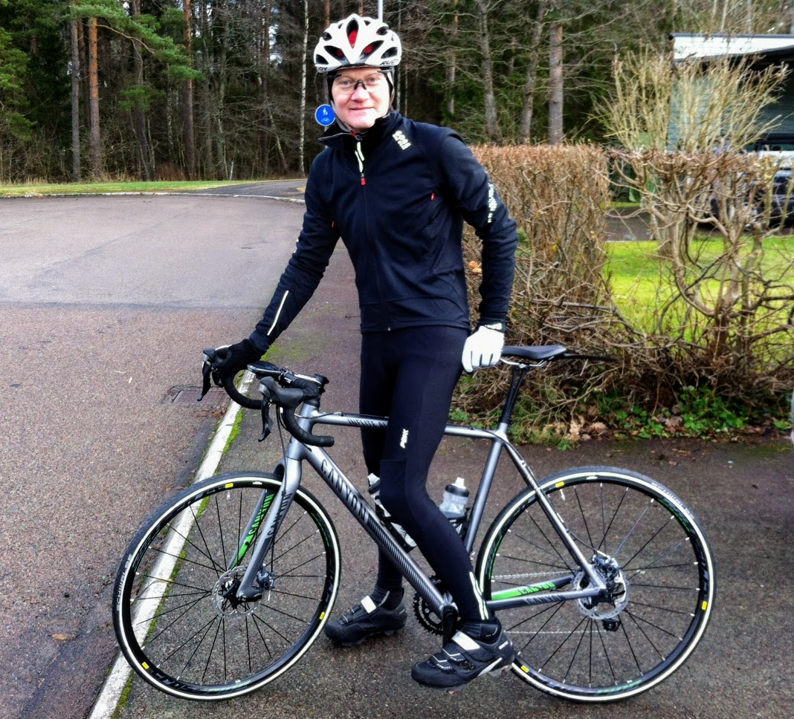*Jungfrufärd i Nybro julen 2013 📸 Malin*

Efter ett par vintrar hade jag tröttnat på den tiodelade Shimano 105-gruppens framväxel som konstant var ihopbeckad och skulle sparkas på under färd i händelse av att behöva komma ned på lillklingan. Hade något år tidigare fått smak på Di2 och tänkte att motorn fram skulle klara skånska vintrar och beställde en Rose Team DX Cross Di2 (som trots sitt namn egentligen är vad man idag skulle kalla _gravel/adventure bike_ med gott om fästen för väskor och skärmar).

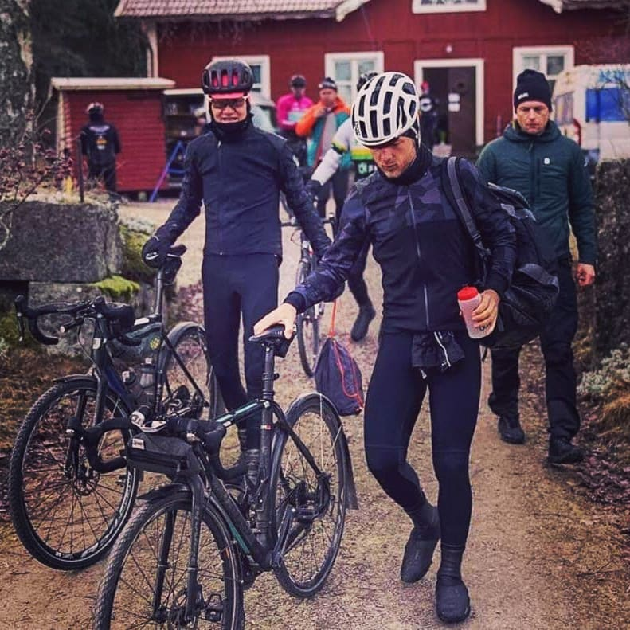*ABLOC Winter Challenge AKA Vintervättern 2019 med självaste Richard Larsén 📸 ABLOC*

Inflite:ns framväxel pillades bort och en oval och N/W absoluteBLACK-klinga monterades och cykeln skulle nu tjäna som lyxpendlare. Lite väl lyxig då den blev stulen inom ett par veckor :'( Rose:ns framväxel gick samma öde till mötes då jag hade fel angående dens motståndskaft mot slask och salt och när GRX-bakväxeln dök upp med sitt omfång och _clutch_ blev det en dylik. Tappade faktiskt kedjan med N/W aB-klinga under Century CX i Mönsterås 2019 och monterade GRX-bakväxeln dagen innan Vintervättern samma år. 

Nu tjänar Rose:n som förstföddes lyxpendlare då mitt löfte till honom om han valde att gå på tekniskt gymnasium i Vellinge var att han skulle få den. Tur att jag inte plockat bort skärmarna sedan den långa, iskalla turen från fotot ovan. 

Men nu hade jag ju ingenting att busa med vid sidan om de asfalterade allfartsvägarna...

Det har förekommit en del Rose i hushållet genom åren och då precis lanserade  Backroad GRX 1x Di2 skulle kunna landa i farstun för 40 papp. I-landsproblemet var bara runt ett halvårs leveranstid. Av en slump hör frugans kusin av sig då han tröttnat på att bli avhängt i skogen trots kvick BMC-MTB. Naturligtvis av kvicka gruscyklister. Vi bollar idéer fram och tillbaka och budgeten trissas upp till en nivå där min drömgrussmiskare skulle kunna bli aktuell - 3T Exploro. Han slår till på en mycket vacker blå med mekanisk GRX 1x till bra pris.

Av en slump får jag i Google-flödet upp en rasande tjusig 3T Exploro Team-ram till salu kraftigt nedsatt hos JEDI Sports som jag sommaren 2019 köpte en Cervélo S3 Disc Di2 hos och genom åren haft en bra relation med.

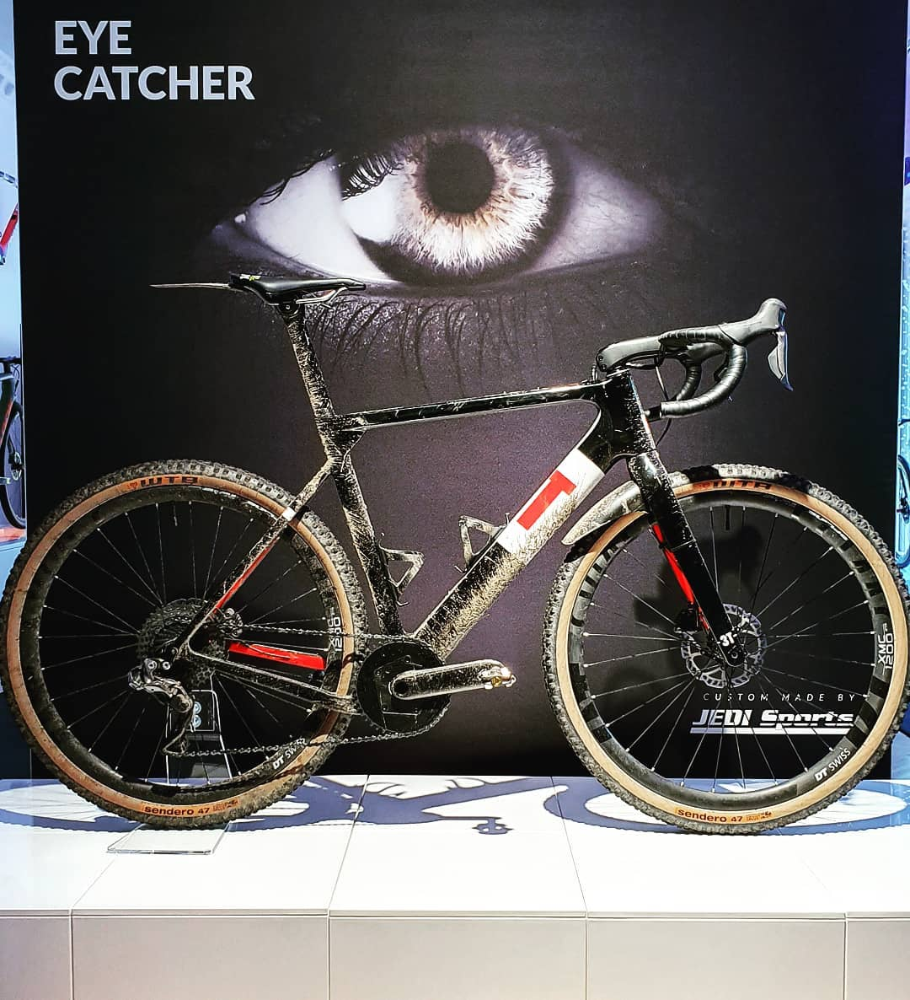*3T Exploro Team-ramen som den var byggd hos JEDI Sports 📸 JEDI Sports*

Väl medveten om _over-engineering_-kritiken Vroomen ofta får motta, men mitt civilingenjörshjärta bultar alltid extra hårt för uppfinningsrika ingenjörer som går sina egna vägar och står upp för sina skapelser. Kommer till insikt att om jag använder mina billiga DT Swiss-hjul som bara skräpar så landar ett bygge runt 40 papp precis som Rose:n. [Att Vroomen till skillnad från mig inte gillar att äta banan](https://blog.3t.bike/2019/09/11421/gravel-tech-shimano-grx/) och därmed inte fixat fäste för Di2-batteri avhåller inte mig från att bygga cykeln 3T och Vroomen IMHO borde erbjuda färdig. 

Vi snackar maj 2020 och föga anar jag då att 3T och Vroomen någon vecka senare ska släppa RaceMax, men det ändrar inget i sak då 40 lakan för en ram ändå är långt mer än jag har tänkt mig för en kul grusbuscykel jag inte ska tävla med. Har lovat min bättre hälft att både köpa och ett lusthus innan cykelprojektet påbörjas, så med sen höst/tidig vinter i kikarn p.g.a. det och maxad cykelsäsong (trots kinesiskt virus) läggs ramen i ide.

Efter ytterligare försening då jag fattade tycke för en trevlig Vitus-räser som införskaffades × 2 till då trettonåriga nästfödde söner och som inte inte endast grävde stort hål i cykelbudgeten, men även skulle uppgraderas lite ;-)

## Projektet kör äntligen igång

Två veckors julledighet planerad, men när jag ska börja köpa alla delar i oktober, november upptäcker jag att pandemin påverkar lagerstatus och ledtider tämligen menligt. Särskilt enskilda GRX-komponenter är svåra att få tag i. Beställer för glatta livet allt jag överhuvudtaget kan och samlar i en plastback och håller tummarna för att allt ska gå upp i en högre enhet till slut (som man säger på danska).

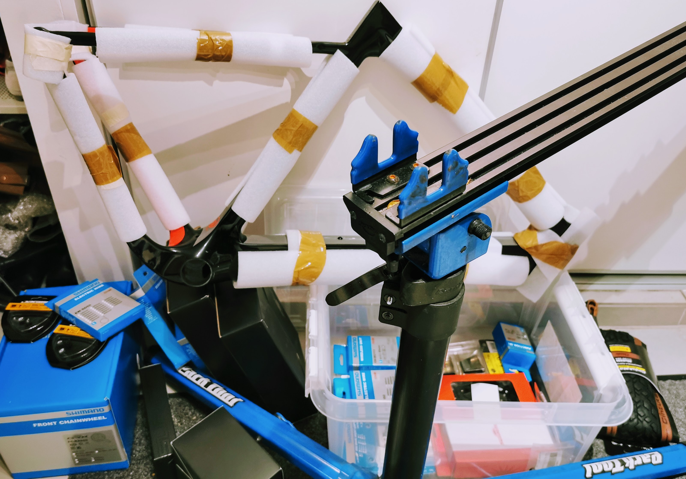*Ramen just uppkliven ur sitt ide 📸 Undertecknad*

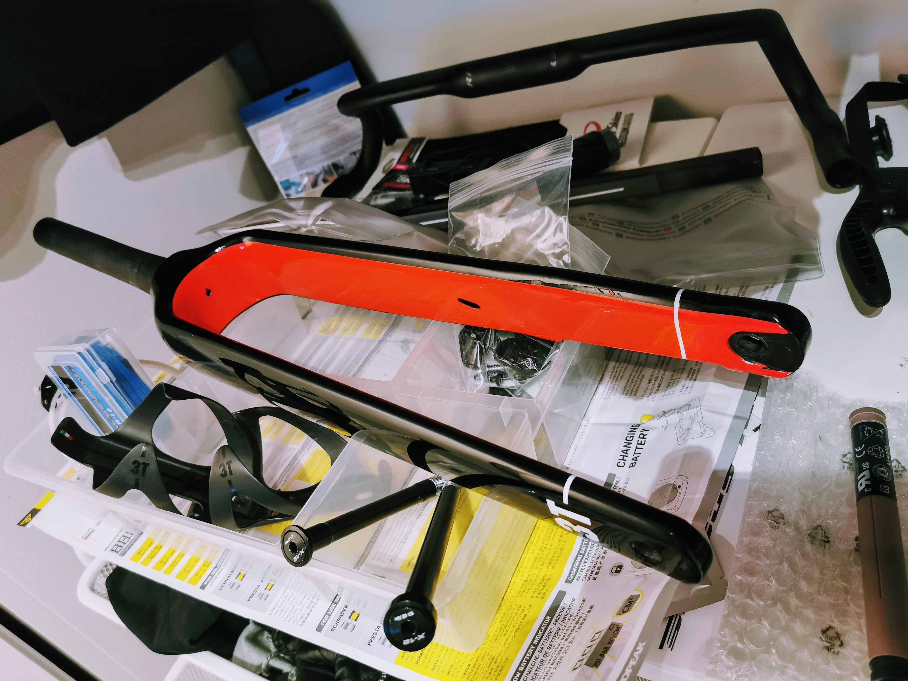*Operationsbordet förbereds 📸 Undertecknad*

### Hjul

Hinner få hjulen innan alla delar anländer och monterar däck, skivor och kassett.

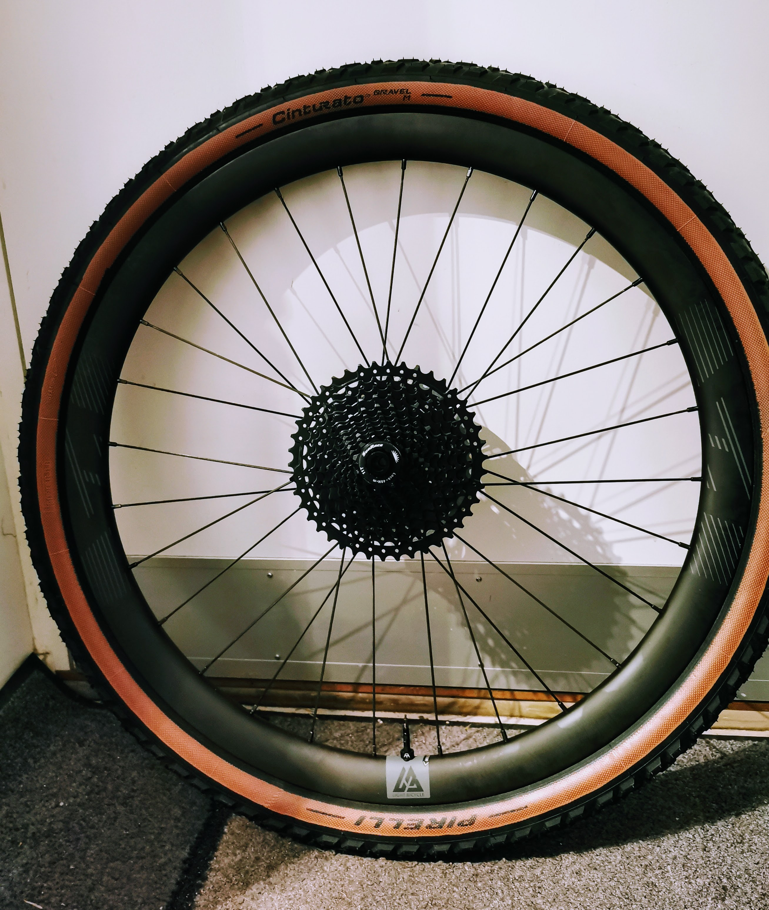*Bakhjul med kassett 📸 Undertecknad*

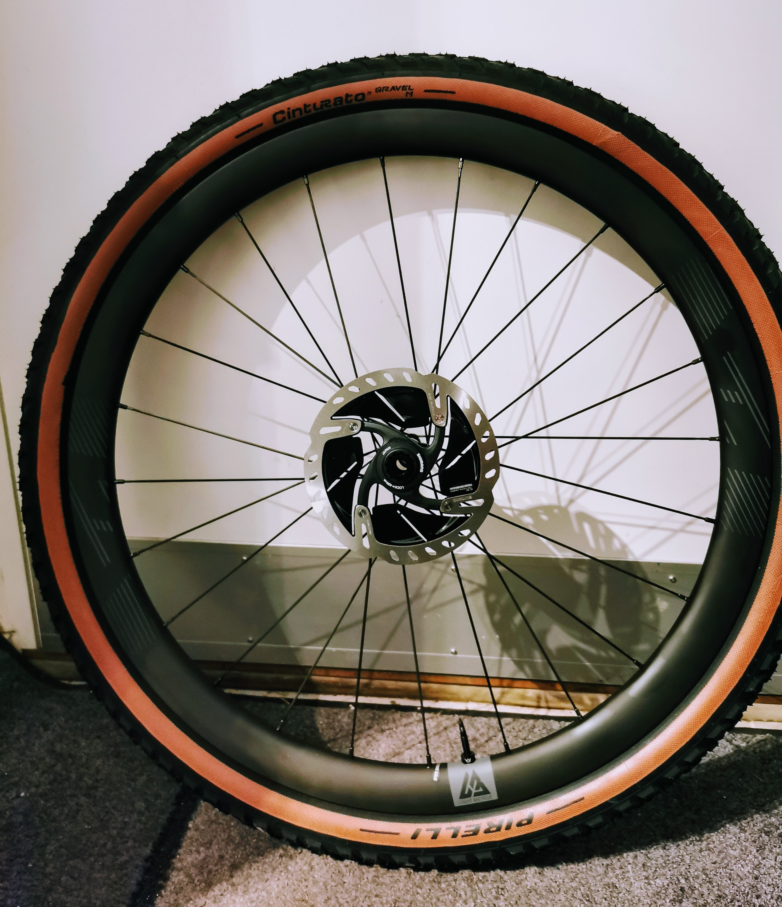*Framhjul med skiva 📸 Undertecknad*

Hjulvalet föll på Light Bicycle AR36 650b Disc. Lätta, breda och med mycket goda möjligheter att speca efter önskemål och budget. Mina som följer:

* Sapim CX-ekrar, 24 fram och 28 bak för tuffa aerotag 
* DT SWISS 350 fram och bak med 54T bak för blixtsnabbt ingrepp
* Mässingnipplar
* Utan ekerhål (för att slippa tejpa för slanglöst)

Valde att annorstädes köpa Peaty's Chris King-ventiler och när däcken, Pirelli Cinturato Gravel M 650b 50mm, dök upp monterades och fylldes de med en rejäl skvätt Orange Seal Endurance Tubeless Sealant och har nästan inte tappat luft sedan dess.

### Bromsar

Hade endast byggt en cykel tidigare och den hade visserligen Di2 men mekaniska fälgbromsar, så Park-Tools IR-1.2 vållade huvudbry och en pinsam fråga på Happyride. Det såg ju så himla lätt ut på YouTube! 😉 

Dutubarna hade dock förberett lite i cykelköket, nämnligen knipsat av änden med ändstiftet så att IR-1.2 lätt kunde skruvas in i plasten. [Nya oliver och ändstift för slang SM‑BH90](https://bikeshop.se/shimano/y8ja98020/shimano-oliv-plus-%C3%A4ndstift-f%C3%B6r-bh90-slang-f%C3%B6r-hydraulisk-bromsslang-bh90) beställdes för säkerhets skull utöver det extra ändstift som följde med.

Nu tog dock två betydligt större problem vid med ramen för lika många bromsslangar!

#### Frambromsen
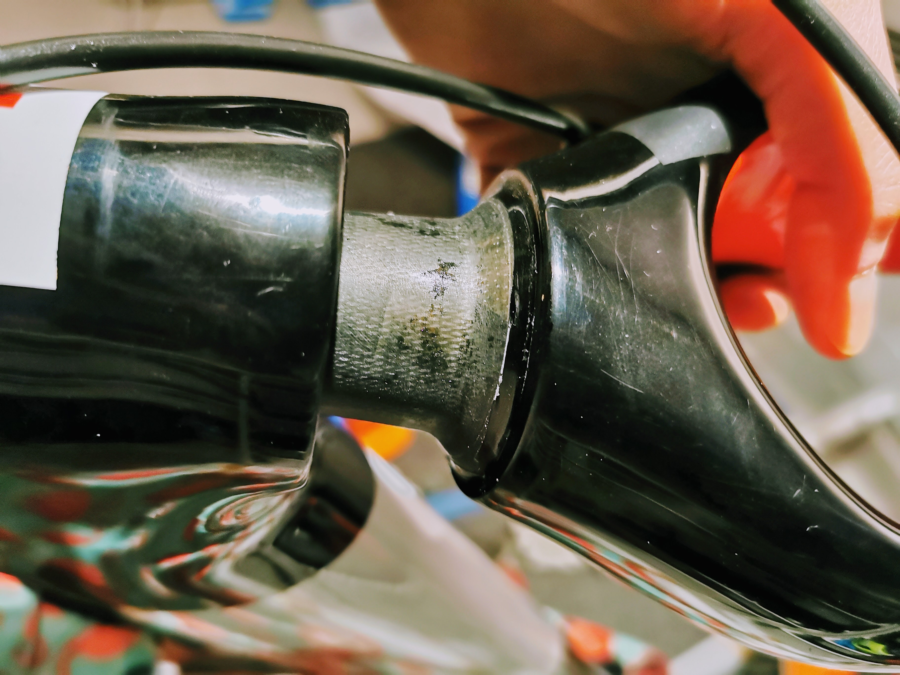*Framgaffel 📸 Undertecknad*

Precis efter ingångshålet för bromsslangen är det en skarp krök. La alldeles för mycket tid på att försöka få förbi den styva Shimano-slangen innan Dremmel plockades fram. Några bråkdels millimeter större diameter och voilá!

#### Bakbromsen

Här fastnade jag ännu längre. Hade läst följande *"Route the hose through the down tube and under the bottom bracket area. It's super difficult to get it through"* på [3T Exploro Build Up @ instructables.com](https://www.instructables.com/3T-Exploro-Build-Up/) och sett följande foto:

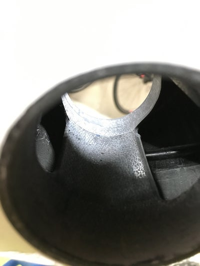*Bromsslangdragning 📸 jeyellis*

Många timmar, svordomar och kolfiberspetor i fingrarna senare gav jag upp och drog den **över** istället. Tog en minut...

(Och japp, det heter speta och inte spåga, sticka eller någonting annat. Punkt.)

### Di2 - äntligen något enkelt

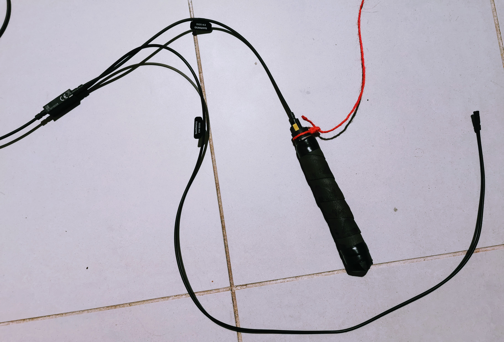*Batteri m.m. 📸 Undertecknad*

Med Park-Tools IR-1.2 var Di2-installationen busenkel. Enda smolket i bägaren är att Vroomen och 3T inte har försett ramen med ett batterifäste. Jag lindade in batteriet i styrlinda och band ett fast ett snöre för att kunna fiska upp det i händelse av problem.

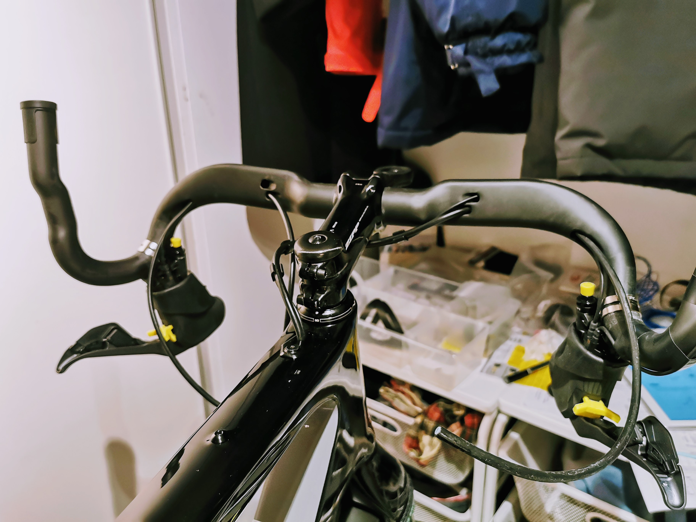*Ritchey VentureMax carbon 📸 Undertecknad*

Även styret var lätt att installera hydraulik och elektronik i, med ett litet undantag då Ritchey har försett VentureMax med en upphöjning i bockarna.

### Övrigt

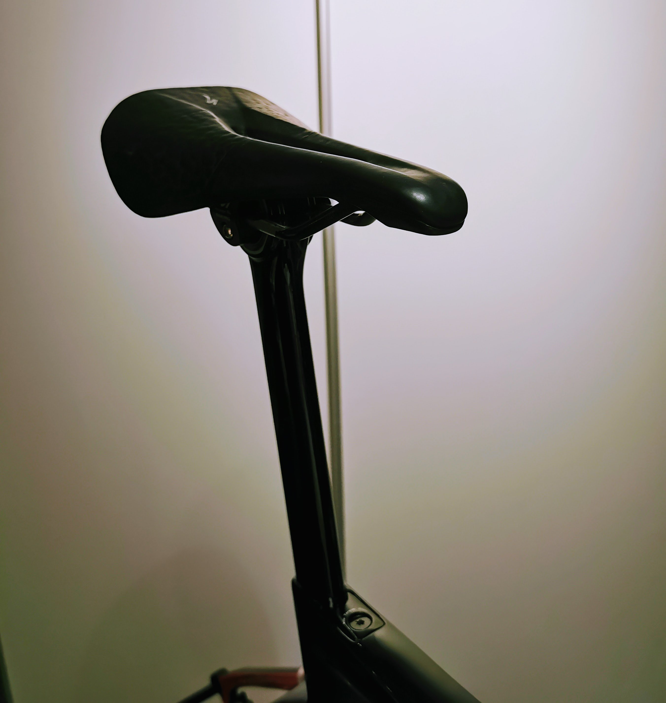*Specialized Power Arc Pro Elaston-sadel 📸 Undertecknad*

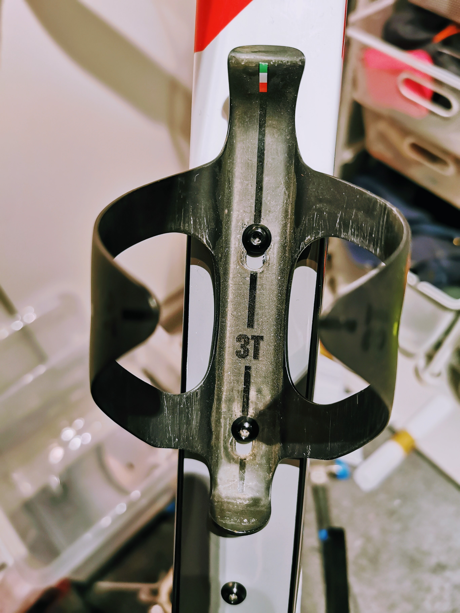*3T kolfiberflaskhållare 📸 Undertecknad*

*Zipp Service Course SL styrpinne och datorföste 📸 Undertecknad*

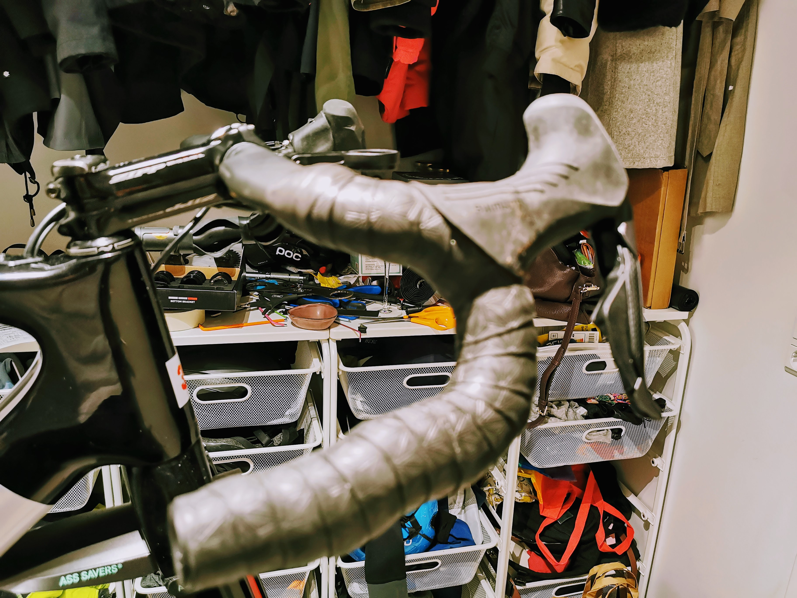*Supacaz Super Sticky Kush-styrlinda 📸 Undertecknad*

Precis som på alla andra cyklar lindades även denna med förträffliga Supacaz Super Sticky Kush-styrlinda, men här med extra linda där man ibland vill "krama" lite extra hårt.

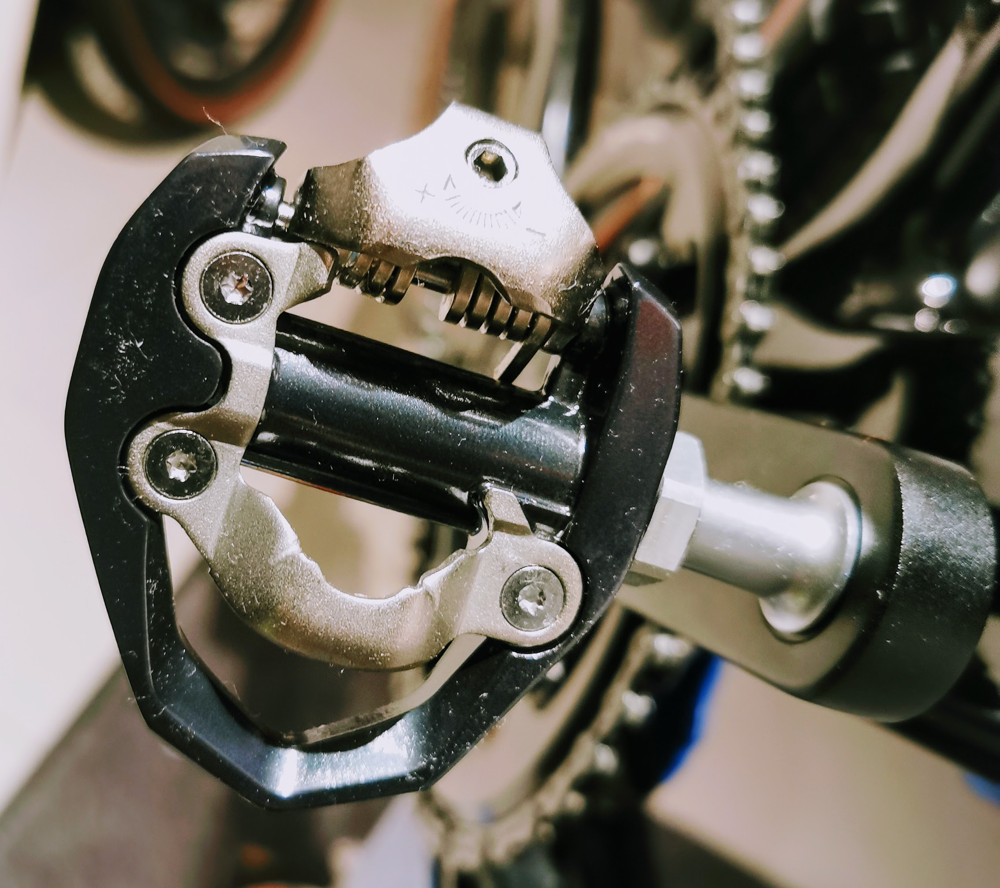*Shimano PD-ES600 SPD-pedaler 📸 Undertecknad*

Hade inte stökig, teknisk terräng i åtanke vid bygget, så pedalvalet föll på Shimano PD-ES600 som jag tidigare testat under en "hygge"-veckända med min bättre hälft då jag önskade cykla i mina Shimano SD-500 p.g.a. värmebölja (lånade förstföddes som har dylika på sin LVG). 

Gillade idén om en nätt, låg LVG-liknande pedal för långa distanspass på grus. Det blir dock lerigt och stökigt ibland, varför jag nu överväger jag deras XTR PD-M9100 och i så fall med -3 mm-axeln för tajtare Q-faktor.

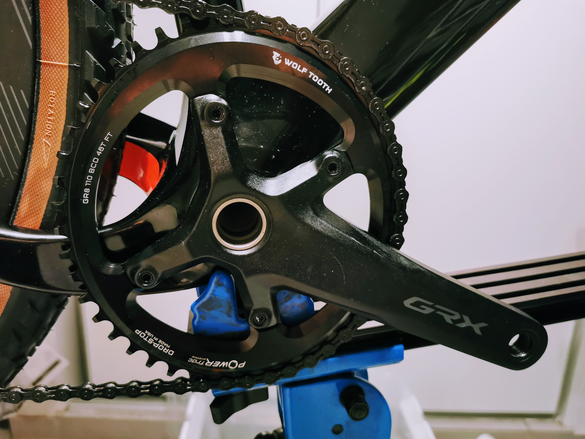*Wolftooth 44t-klinga 📸 Undertecknad*

Är väldigt svag för icke-runda klingor, ovala som asymmetriska. Köpte ett billigt GRX 600-vevparti för att kunna använda en 4iiii 105-effektmätare jag hade liggandes. Med få ovala klingor till GRX blev det en Wolftooth som funkar utmärkt.

## I-landsproblem!

Hade inte läst på ordentligt och därmed helt bommat att vevarmseffektmätare som 4iiii och Stages inte kan monteras på denna typ av grusram då den är optimerad för breda däck med bibehållen Q-faktor som vi känner den från LVG.

Och jag som redan offrat 30 mm-axel för att komma billigt undan med 24 mm-GRX och den effektmätare jag redan hade. Nåväl, det kommer att bli en 46t absoluteBlack-klinga jag har över samt ultracykelns Quarq DFour-effektmätarparti då den ändå ska över på aB:s subkompakta 48/32-klingor och därmed DZero och DUB.

## Epilog

Älskar cykeln! För mig helt "onödig" då den inte fyller några som helst tränings- eller tävlingssyften. Men oj vad kul att köra vinterdistans i skogen istället för på asfalt som omväxling. Det även om ryktet om det bilfria gruscyklandet ibland grusas av hundar, hästar och forgängare som menar att de äger marken de går på. 

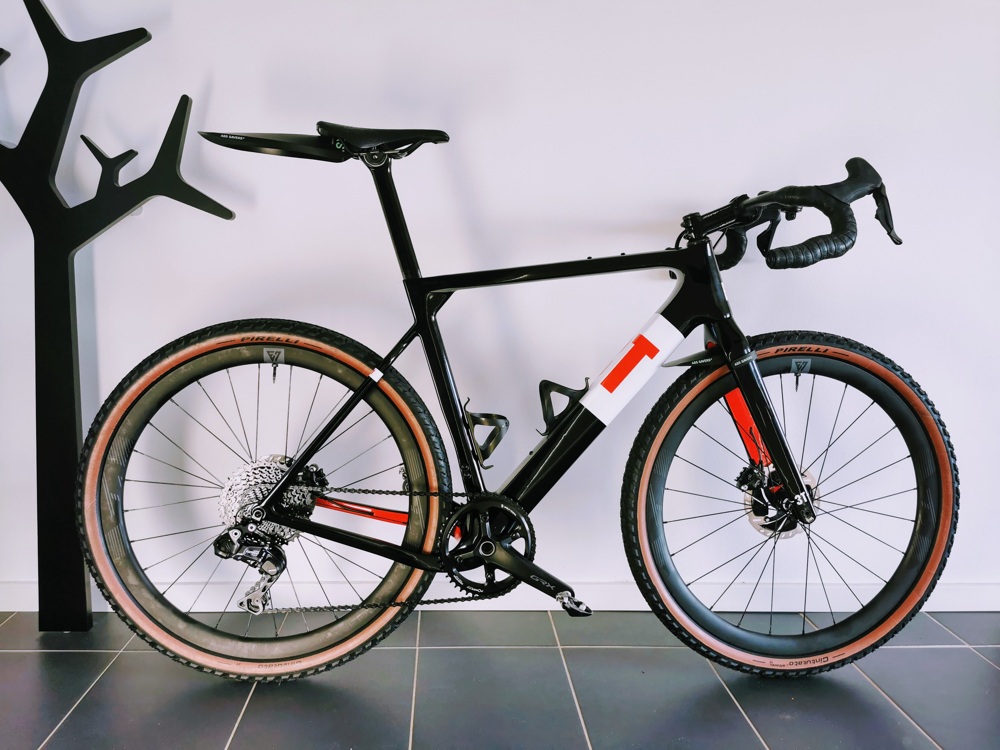*Färdigbyggd :D 📸 Undertecknad*

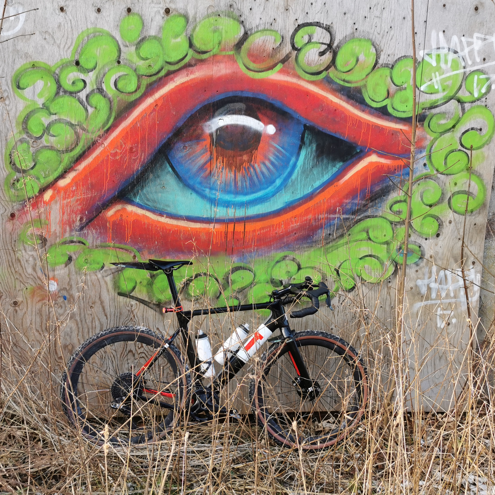*Nu är hon min ögonfångare! 📸 Undertecknad*

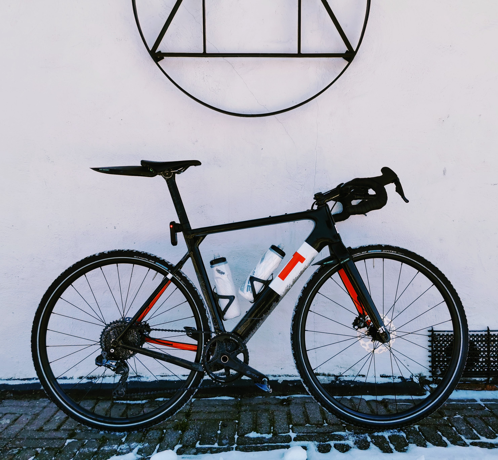*Med dubbdäck i den skånska halkan 📸 Undertecknad*

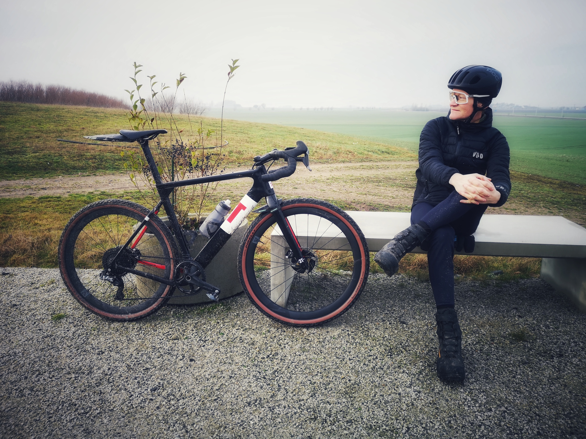*Nöjd vintergruscyklist :) 📸 Malin*

