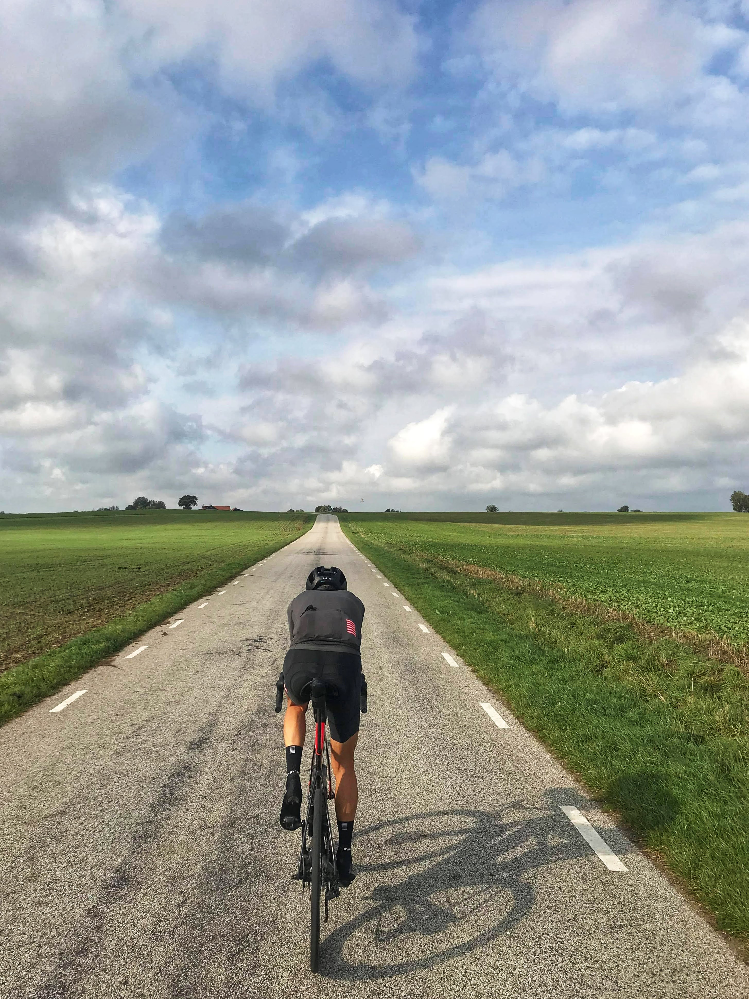
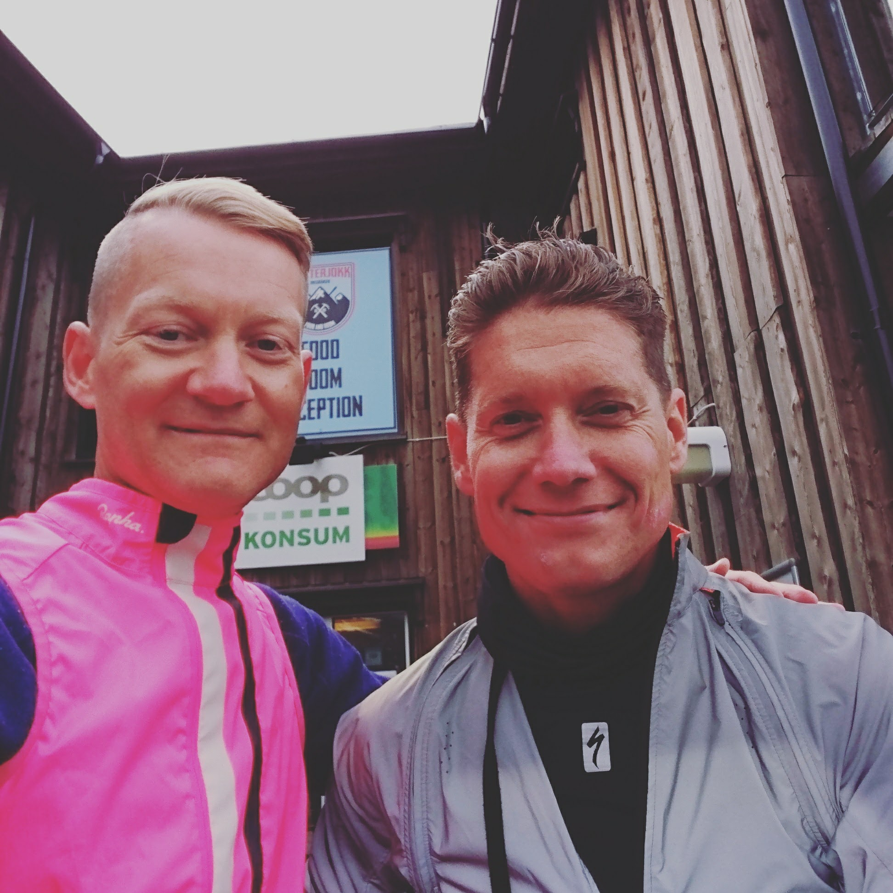
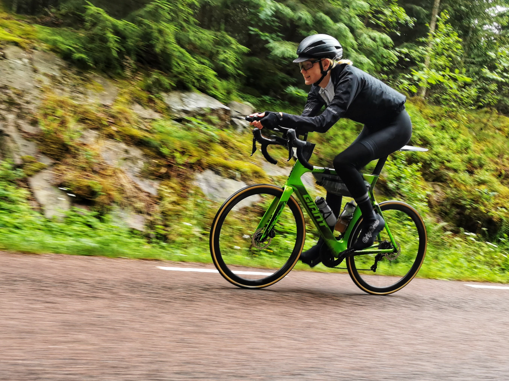
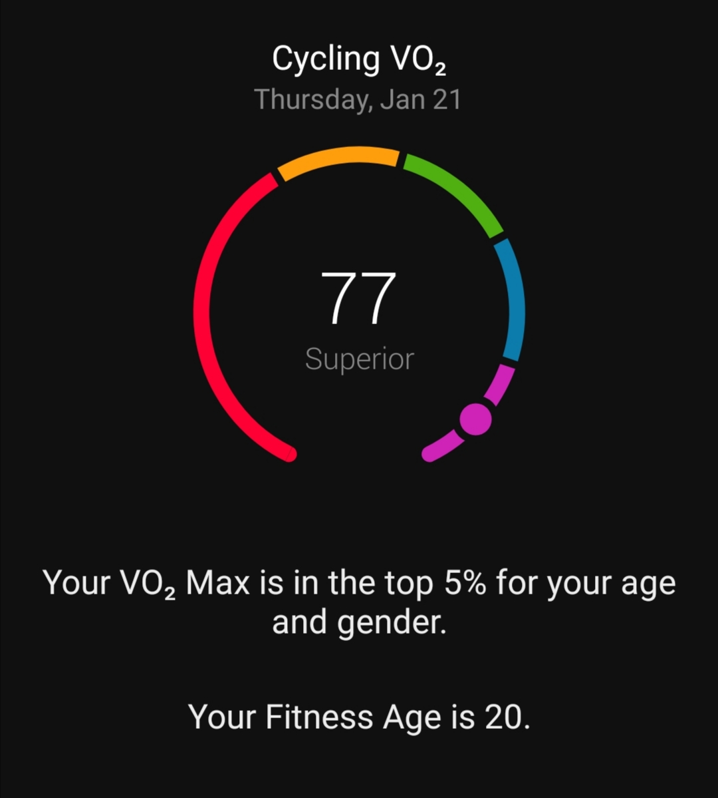
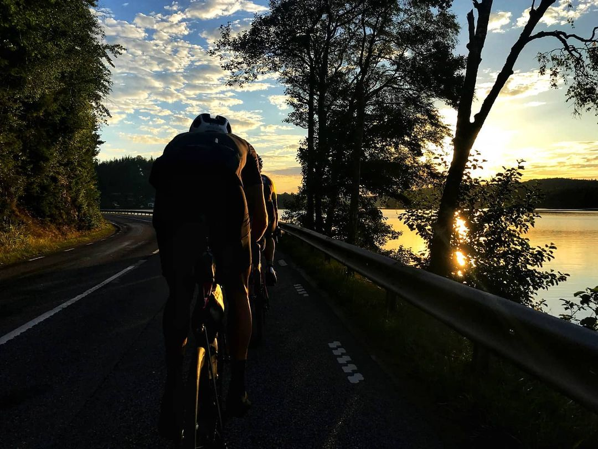

# North Cape 4000
## T minus 6 månader

Bunkeflostrand, 2021-01-24

Härmed tillkännager jag mitt deltagande i årets [North Cape 4000](https://www.northcape4000.com/) för den breda kretsen. Alla val innebär även bortval och anledningen till denna text är att just detta val innebär många bortval och uppoffringar. För mig naturligtvis, men inte minst min familj, släkt och vänner. På förekommen anledning önskar jag nyansera och fördjupa bakgrund och hur jag hamnade här.

*RAD 2020 📸 Atmos*

## Det började på en fyrtioårsfest i Lomma för drygt åtta år sedan

Jag hade börjat uppskatta först pendlingen med min Strida (fällscykel) till jobbet i Nordhavnen i Köpenhamn efter ha slutat bilpendla och små utflykter med min Montague (fällbar MTB). Att cykla "på riktigt" fanns inte ens nästan på radarn och jag hade tänkt unna mig en dyr, fin citycykel (Spot ACME) i fyrtioårspresent till mig själv.

Under sedvanlig ölandssommarvistelse frågar min frus morbror, tillika cykelentusiast och med många års idrottande i kroppen, varför jag inte köper "en riktig" cykel. Det grubblade jag på en dag eller två och hade sedan beställt en Canyon Ultimate CF med elvadelad Campa Chorus-grupp (något vare sig jänkarna eller japsen hade då).  

Visste inte riktigt hur jag bäst skulle bruka denna kolfiberraket, så den hade det bra i en kartong i vardagsrummet. Malin och jag går så på Tobbe och Mickes fyrtioårsfest i Lomma och vår vän Fredrik är där. Han har börjat träna med fokus på multisport och en svensk klassiker. De har en plats över till Vätternrundan och jag har ju en "riktig cykel". Ska inte jag haka på? Har vid tillfället aldrig suttit på en räser och tycker 30 mils cykling med start vid fyrahugget på morgonen är att ta i. Självförtroendet skjuter som regel i höjden exponentiellt korrelerat med promillen och när min bättre hälft också är enig med Fredrik blir till ett ja.

## 30 mil är normalt, rent av kort

Började träna och gick med i klubb (Klubben Cyklisten) för att lära mig klungkörning och övriga grunder. Vättern kom och det var ju hur lätt som helst! Anmälde mig dagen efter till Sjælland Rundt då jag var frustrerad över att jag kunde cyklat fortare. Allt under 30 mil kändes kort, t.o.m. det 21 mil långa Skansentrampen som jag faktiskt lyckades vinna ett år (för att dagen efter cykla hem till Bunkeflostrand från Kalmar). 

Lyckligtvis finns CK Milslukaren för likasinnade, d.v.s. oss som uppskattar distanscykling både i form av randonneuring och ultracykling samt både som tävling och äventyr. Här hittade jag både hem och vänner som Nils, Oscar, Ebbe, Kristian och Fredrik. 

## Sverigetempot - första långloppet

Väl medveten om de riktigt långa loppens existens, men väldigt osäker på både fysiska som psykiska förmåga under dylika anmälde jag mig november 2015 till Length of Sweden/Sverigetempot (LoSS) 2016 (2015 km s.k. brevet, då världens längsta dylika). Var försiktig i överkant och långt i förväg bestämt mig för den mentala modellen "sju vätternrundor på sju dagar (utan depåer)" med bokade hotellnätter längs rutten.

## Hårdare, snabbare! (... men inte längre)

Ökad träningsvolym med bättre struktur. Kontinuerligt byte av cyklar och utrusting för att slipa resultaten. Subgrupper på Vätternrundan med 6:58 som bästa resultat. Superrandonneur varje år. Härliga 1.600 km-brevet-lopp i Italien samt tre 1.600 km långa RAD (Race Around Denmark) med 81 timmar som bästa tid och silver som bästa placering. PBP på under 60 timmar med diskbråck. Sveriges genom tidernas snabbaste 200 km- samt 600 km-brevet-lopp är också inskriberat i ett dammigt, digitalt franskt arkiv.

*Sveriges snabbaste 200 km-brevet i vardande 📸 Oscar*

Ända sedan Sveritempot och de inspirationsfilmer jag såg tillsammans med Malin för att förbereda mig mentalt, inte minst Erik Nohlins [Melons, Trucks, Angry Dogs](https://ertzui.de/TCR), har jag dock drömt om de riktigt långa loppen med lika galet många höjdmeter som kilometer. Erik och Specialized gjorde förresten en film även om LoSS 2016 - [Length of Sweden](https://vimeo.com/ondemand/lengthofsweden/194797540).

*Erik & jag i Katterjokk 2016 under ryttar- och cykelkontroll 📸 Undertecknad*

## Nu har tiden kommit för längre

Efter allsköns stora utmaningar under långa lopp (mekaniskt men inte minst kroppsligt med trasiga knän, magras, sadelsår, diskbråck, ...) kändes det efter senaste RAD att allt "satt". Brukar annars säga till Malin efter målgång att min gräns nog går vid 200 mil trots allt. Bestämde mig så i maj ifjor (RAD går alltid av stapeln Kristi himmelsfärd) att 2021 skulle bli året för mitt första deltagande i *riktigt långt lopp*™. Efter noggranna överväganden under lång tid bestämde jag mig för att placera fingret på avtryckaren i samma sekund anmälan öppnade för North Cape 4000 (NC4K). Påminnelse i kalendern månader i förväg, frenetiskt F5-tryckande tills... Ja, plats bokad och betald 1 december 2020!

400 deltagare helt utan support. 400 mil från Gardasjön till Nordkapp. I år går rutten genom öst och jag är nästan lika taggad på att se och uppleva Baltikum och Finland som att göra bra ifrån mig. ([Erik har naturligtvis cyklat även NC4K](https://theradavist.com/2018/07/swot-and-the-north-cape-4000-erik-nohlin/) ;-))

## Uppoffringar

... är anledningen till att jag skriver detta. Då NC4k innebär betydligt större uppoffringar än vad mina nära och kära är vana vid och det inte är lätt att som utomstående förstå vad det innebär att elitsatsa som 48-årig löntagande trebarnsfar.

Den absolut vanligaste frågan jag får med anledning av mitt idrottande är hur jag hinner. Många av er vet att jag alltid svarat att man ska ha världens bästa fru. Och det är sant och det har jag <3 Det längre svaret jag nu vill ge är att även ska ha världens bästa familj i stort (barn, mor, syskon, svärföräldrar) och inte minst världens bästa vänner som accepterar att man har satt upp långsiktiga mål och inte med kort varsel kan dyka upp på skojigheter. Vad värre är med tidskrävande träning och lopp av denna karaktär (själva loppet vinns nog runt tio dygn, varför två veckor måste räknas med plus logistik) är de vid planeringstillfället okända stora begivenheter man går miste om och känslan av svek av nära och kära. Det kan vara fester för att fira jämna födelsedagar, dop och bröllop.

Den bästa analogi jag funnit är att dessa lopp är mitt firande och min manifestation av tusentals timmars träning under, hundratusentals kronor, ändlösa timmar i cykelverkstaden och ännu fler i filmer, böcker och artiklar om kost, nutrition, träning, loppstrategi, etc. Mitt (eld)dop.

Jag ber med andra ord om er förståelse för att jag nu går in lite djupare än vanligt i min cykelbubbla som dessutom är hermetiskt stängt från 22 juli och cirka tre veckor framåt.

## Inte bara offer!

I ljuset av alla avkall kan det ju låta som om man är fulltidsmasochist, men inget kunde vara längre från sanningen. Att jag började med cykelsport har medfött att hela familjen har blivit "cykelfamilj" och vi cyklar massor av MTB, grus och inte minst landsväg tillsammans. Jag är coach åt resten som har sina träningsscheman och utmaningar med ungarnas sommarutmaningar som grädden på moset.

*Skåne Runt 600 km - förstföddes sommarutmaning 2020 📸 Undertecknad*

Vi lär oss massor tillsammans om kropp, hälsa, träning, kost och inte minst hur det påverkar ens kognitiva förmågor och skolresultat. Har inte A/B-testat trots enäggstvillingar ;-), men teorierna verkar stämma :-)

Ens fåfänga tycker dessutom om att Garmin tycker att man har en tjugoårings kropp ;-)

*Senaste V̇O2 max-uppdatering från Garmin*

## Varför dessa hemska lopp och inte nöja sig med träningen?

När George Mallory fick frågan varför bestiga Mount Everest svarade han ju som bekant "för att det är där". Det är delvis en förklaring också för mig med ganska svår FOMO. 

Det aningen mer nyanserade svaret är att jag behöver den typen av lopp och deadlines för att kunna motivera mig, älskar både cykling, tävling och äventyr som de ju kombinerar och inte minst en stor nyfikenhet på mina fysiska och psykiska begränsningar.

Extrem hetta, hård kyla, svår sömnbrist, energi- och vätskebrist, hallucinationer och alla sorters åkommor låter ju onekligen som tortyr men utan att ha utfört djupare analys finner man ju mindre behagliga riter i många religioner och sammanhang.

Sist men sannerligen inte minst sker denna typ av cykling ibland i grupp och ett otroligt kamratskap kan uppstå när man delar upplevelsen och hjälper varandra.

*Kamratskapande under fjolårets 1.200 km-brevet Falkenberg-Södertälje-Falkenberg 📸 Oscar*
